การแข่งขัน Cyber Hero Nakorn Chiangrai CTF 2026 โดยทีม **Don't Know Everything** ในระดับอุดมศึกษา

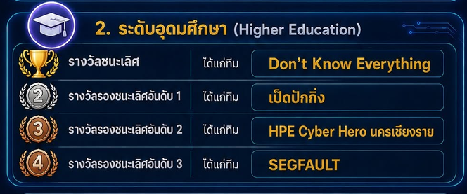

เวทมนต์ครับ 13 -> 1

**Team**

- [@noonomyen](https://github.com/noonomyen)
- [@c0ffeeOverdose](https://github.com/c0ffeeOverdose)
- [@boom51zx](https://github.com/boom51zx)

# Challenges

<details>
<summary><b>รายชื่อ Challenges ทั้งหมด</b></summary>

- **Welcome**
  - **Welcome Flag**
- **Red Team**
  - **CYBER HERO Corp. - Careers & HR**
  - **CYBER HERO Corp. - Legal & Compliance**
  - **CYBER HERO REDTEAM_v5 - Confusing Permission**
  - **CYBER HERO REDTEAM_v5 - Crackable User #1**
  - **CYBER HERO REDTEAM_v5 - Hidden bug**
  - **Overpost**
  - Faultline Ledger
  - Signet Registry
  - **Sudoers**
  - **Dropzone**
- **Blue Team**
  - **Operation Cascade - The Ghost in the Machine**
  - Operation Cascade - The Whisper of Time
  - **Operation Cascade - The New Identity**
  - Operation Cascade - The Vault of Secrets
  - Operation Cascade - The Final Signal
  - **Blynk blynk blynk - Trojan**
  - **Blynk blynk blynk - Malicious**
  - **Find ME**
  - **X3_step**
  - **Cyber_hero**
- **Miscellaneous**
  - **CII Black Box**
  - **Pieces of the Past**
  - Read me bro?
  - **Silent Control Panel**
  - **The Lost Temple of Chiang Rai**
  - **Capture The Flower**
  - **Capture The Hill**
  - **Factory Incident**
  - Hacker Mail
  - Lucky Hashing

</details>

โดย blog นี้จะมี write up เพียง 10 ข้อของ [@noonomyen](https://github.com/noonomyen) โดยย้ายจาก write up pdf มาเขียน blog จากทั้งหมด 22 ข้อ

# Welcome

## Welcome Flag

> ขอยินดีตอนรับเข้าสู่การแข่งขัน เพื่อเป็นการทดสอบความเข้าใจ
> ระบบจะมี Welcome flag ให้อยู่ในคลิปพิธิเปิด ขอให้น้องๆ ตั้งใจดูพิธิเปิดนะครับ
>
> และคำตอบจะอยู่ในรูปแบบ ดังนี้
> Flag Format: CYBERHEROCTF{this_is_the_flag}

ชื่อย่อหน่วยงานตัวอังกฤษ

Flag `CYBERHEROCTF{NCSA}`
<!-- # Red Team

## CYBER HERO Corp. - Careers & HR

> บริษัท CYBER HERO Corp. บริษัทยักษ์ใหญ่ด้านเทคโนโลยี ความมั่นคงปลอดภัยไซเบอร์และกฎหมายระดับโลก กำลังเปิดบ้านต้อนรับคนรุ่นใหม่ไฟแรงที่มีใจรักในเทคโนโลยีเข้าร่วมงาน
> แต่ดูเหมือนว่า... ฝ่าย IT ประจำบริษัทจะรีบร้อนเปิดใช้งานระบบไปหน่อยทั้งที่ยังตรวจสอบช่องโหว่ไม่ดีพอ ในฐานะ Red Team ฝีมือดี ภารกิจของคุณคือยึดครองระบบที่มีปัญหานี้ให้สำเร็จ
>
> โจทย์ 2 ข้อใช้ VM เครื่องเดียวกัน
> คำแนะนำในการเริ่มทำแลป
> ดำเนินการดังนี้
>
> 1. กด Start ที่เครื่องที่ต้องการ แล้วรอจนไฟขึ้นเป็นสีเขียว
> 2. ค้นหาเครื่องเป้าหมาย 2 เครื่องในเครือข่ายเดียวกับที่คุณอยู่
> 3. ต้องยึดเครื่องเป้าหมายให้ได้สำเร็จถึงจะได้ flag
> 4. เขียน writeup ส่งกรรมการ
>
> ชื่อไฟล์โจทย์ VM: CYBER HERO Corp.zip

## CYBER HERO Corp. - Legal & Compliance

> บริษัท CYBER HERO Corp. บริษัทยักษ์ใหญ่ด้านเทคโนโลยี ความมั่นคงปลอดภัยไซเบอร์และกฎหมายระดับโลก กำลังเปิดใช้งานระบบสำหรับผู้ใช้บริการทางด้านกฎหมายกับบริษัท
> ฝ่าย IT ประจำบริษัทกำลังดำเนินการปรับปรุงระบบหลายๆ ส่วน แต่ไม่สามารถหยุดให้บริการก่อนได้ทำให้เกิดช่องโหว่ที่ไม่คาดคิดในฐานะ Red Team ฝีมือดี ภารกิจของคุณคือยึดครองระบบที่มีปัญหานี้ให้สำเร็จ
>
> โจทย์ 2 ข้อใช้ VM เครื่องเดียวกัน
> คำแนะนำในการเริ่มทำแลป
> ดำเนินการดังนี้
>
> 1. กด Start ที่เครื่องที่ต้องการ แล้วรอจนไฟขึ้นเป็นสีเขียว
> 2. ค้นหาเครื่องเป้าหมาย 2 เครื่องในเครือข่ายเดียวกับที่คุณอยู่
> 3. ต้องยึดเครื่องเป้าหมายให้ได้สำเร็จถึงจะได้ flag
> 4. เขียน writeup ส่งกรรมการ
>
> ชื่อไฟล์โจทย์ VM: CYBER HERO Corp.zip

## CYBER HERO REDTEAM_v5 - Confusing Permission

> คำอธิบาย: privilege escalation and find foothold
> access challenge at `ssh user@<IP> -p 2222` with password "user"
>
> ชื่อไฟล์โจทย์ VM: CYBERHEROCTF_REDTEAM_v5_v2.zip

## CYBER HERO REDTEAM_v5 - Crackable User #1

> คำอธิบาย: find foothold in admin dashboard
> access challenge at `http://<IP>:8080`
>
> ชื่อไฟล์โจทย์ VM: CYBERHEROCTF_REDTEAM_v5_v2.zip

## CYBER HERO REDTEAM_v5 - Hidden bug

> คำอธิบาย: find bug in this webapp and gain foothold
> access challenge at `http://<IP>:8081`
>
> ชื่อไฟล์โจทย์ VM: CYBERHEROCTF_REDTEAM_v5_v2.zip

## Overpost

> เซิร์ฟเวอร์ภายในของ CYBERHERO Corp เปิดพอร์ทัลให้พนักงานฝากไฟล์ ทีมพัฒนายืนยันว่า “กันไฟล์อันตรายไว้หมดแล้ว” จึงวางใจให้มันรันอยู่ด้วยสิทธิ์ที่ไม่ได้จำกัด
>
> คุณมองหา: รอยรั่วที่ทำให้ “ไฟล์ที่ไม่ควรรันได้” กลับรันได้ แล้วต่อยอดจากที่ยืนอยู่ ให้ไปถึงบัญชีที่คุมทั้งเครื่อง - คำตอบสุดท้ายเก็บไว้ในที่ที่มีแต่เจ้าของเครื่องเปิดได้
>
> ชื่อไฟล์โจทย์ VM: VM-Overpost.7z

## Sudoers

> พอร์ทัลให้ทีมงานเรียกดูไฟล์สำรองของระบบ แต่คนที่ตั้งค่าเครื่องรีบร้อนจนวางไฟล์และสิทธิ์ต่าง ๆ ไว้ผิดที่หลายจุด
>
> คุณมองหา: ไฟล์ที่พอร์ทัลไม่ควรให้เห็น แต่กลับเรียกดูได้ถ้าถามให้ถูกวิธี ในนั้นอาจมีกุญแจสู่การเข้าเครื่อง - แล้วมองต่อว่าบัญชีนั้น “ได้รับอนุญาต” ให้ทำอะไรเกินตัวบ้าง
>
> ชื่อไฟล์โจทย์ VM: VM-Sudoers.7z

## Dropzone

> พื้นที่รับอัปโหลดไฟล์ของทีม รับเฉพาะรูปและเอกสาร (ตามที่ระบบอ้าง) และมีฟีเจอร์ “เปิดดู” ไฟล์ที่อัปโหลดเข้ามา
>
> คุณมองหา: ช่องว่างระหว่าง “สิ่งที่ระบบบอกว่ากัน” กับ “สิ่งที่มันกันจริง” เมื่อเข้าไปอยู่ในเครื่องได้แล้ว ของที่ตามหาถูกซ่อนไว้สักมุมของระบบ ต้องเดินหาเอง
>
> ชื่อไฟล์โจทย์ VM: VM-Sudoers.7z -->

# Blue Team

## Find ME

> ท่านได้รับไฟล์น่าสงสัย ขอให้ทางจงหาคำตอบ
> Flag format: CYBERHEROCTF{xxxxxxxxxx}

หลังจากใช้ ghidra analyze แล้วใน main function เราจะพบกับข้อความ "Try harder!" แต่ตรง asm กลับมีการจอง stack 48 bytes แล้วทำการสร้าง data ลง stack บน runtime จาก instruction

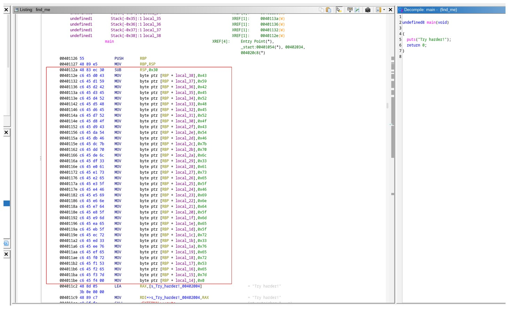

เมื่อเราทำการใช้ pwndbg break ไปก่อนที่จะ call puts ซึ่งอยู่หลังจากสร้าง data ลง stack แล้วทำการอ่านด้วย string จะได้ flag

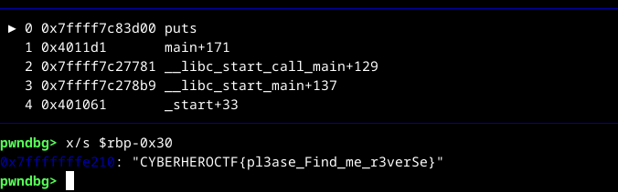

Flag `CYBERHEROCTF{pl3ase_Find_me_r3verSe}`

## Operation Cascade - The Ghost in the Machine

> ก่อนทีทุกอย่างจะดับสูญ เครืองจักรได้ทิง "ลายเซ็น" สุดท้ายของตัวมันเอง ไว้ในห้วงความทรงจำ
> จงค้นหาข้อมูลพืนฐานของระบบทีถูกโจมตี เพือเป็นก้าวแรกของการไขคดี
>
> Flag Format:
> `CYBERHEROCTF{<kernel-version>}`
>
> ชื่อไฟล์โจทย์ VM: Operation Cascade.zip

อย่างแรก ไฟล์นี้เป็น mem dump จาก linux และการจะใช้ volatility ในการ analysis จำเป็นต้องใช้ Intermediate Symbol Files (ISF) ซึ่งถือเป็นก้าวแรกด้วยเช่นกัน คือ kernel version ซึ่งเราสามารถได้จากการใช้ vol3 ดู banner

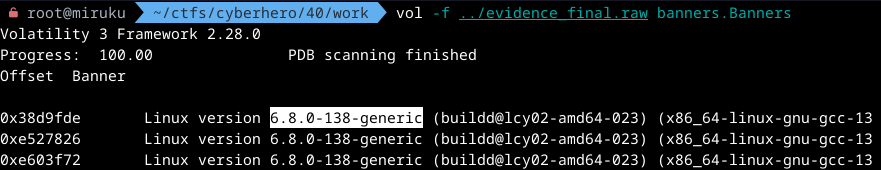

Flag `CYBERHEROCTF{6.8.0-138-generic}`

## Operation Cascade - The New Identity

> ผู้บุกรุกไม่เพียงแต่เข้ามาในระบบ แต่ยังสร้าง "ตัวตน" ใหม่ขึนมาเพือสิทธิในการเข้าถึงทุกสิงจงค้นหาชือและหมายเลขประจําตัวของบุคคลลึกลับนี
>
> Flag Format: `CYBERHEROCTF{<username>, <uid>}`
> (ตัวอย่าง: `CYBERHEROCTF{secretuser, 1078}`)
>
> ชื่อไฟล์โจทย์ VM: Operation Cascade.zip

- Submit: [@boom51zx](https://github.com/boom51zx)
- Write-up: [@noonomyen](https://github.com/noonomyen)

ต่อจาก write up **Operation Cascade - The Ghost in the Machine** ที่เราทราบ version ของ kernel `6.8.0-138-generic` เป็น ubuntu ซึ่งมีแหล่งที่แจกอยู่ [Abyss-W4tcher/volatility3-symbols](https://github.com/Abyss-W4tcher/volatility3-symbols)

โดยไฟล์ที่เราใช้คือ `Ubuntu_6.8.0-138-generic_6.8.0-138.138_amd64.json.xz` เรานำไฟล์ที่ load เก็บลงใน `./linux` และเราจะกู้ filesystem จาก page cache ใน memory dump จาก `evidence_final.raw` ไปไว้ใน `cascade`

```bash
vol --parallelism off -s linux -o cascade -f ../evidence_final.raw linux.pagecache.RecoverFs
```

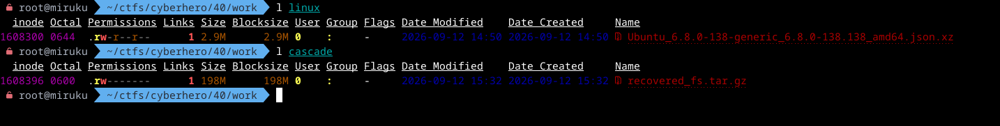

เมื่อได้ไฟล์แล้วเราก็ทำการแยก

```bash
tar -xzf cascade/recovered_fs.tar.gz -C cascade-fs
```

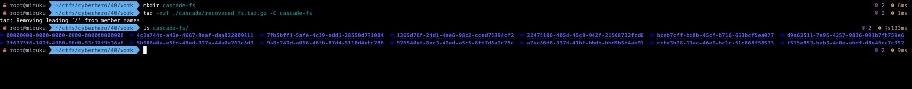

chall ถามหาคนที่สร้าง user ขึ้นมาใหม่ แน่นอนว่ามันจะถูก add ไปที่ `/etc/passwd` แต่ disk มีหลาย uuid สามารถใช้ fzf หาได้ง่ายๆ แล้วพบที่ `7fb5bff1-5afe-4c39-add1-28550d771084/etc/passwd` ซึ่ง user ล่าสุดคือ `svc_monitor` และมี uid คือ `1008`

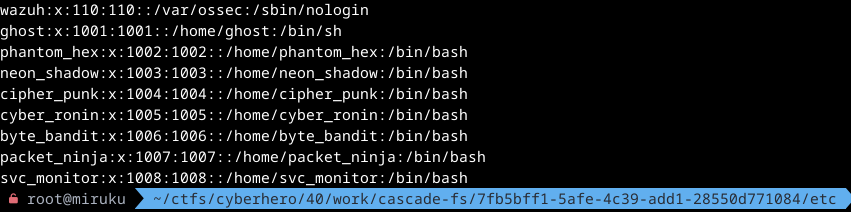

Flag `CYBERHEROCTF{svc_monitor, 1008}`

## X3_step

> ท่านได้รับไฟล์น่าสงสัย ขอให้หาคำตอบ
> Flag format: CYBERHEROCTF{xxxxxxxxxx}

Hex ปริศนา

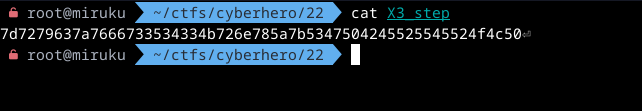

เมื่อใช้ from hex เราก็เจอ readable string

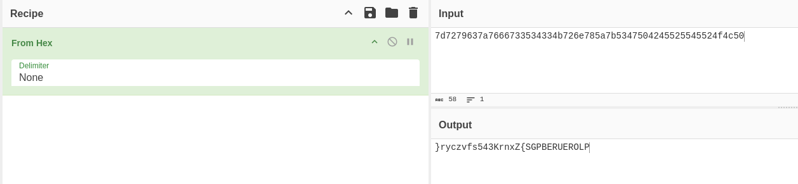

reverse แล้ว format เริ่มใช่ น่าจะ ROT13

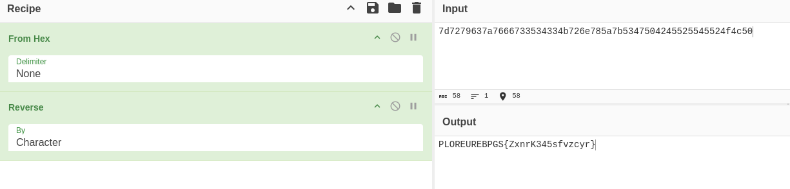

From Hex -> Reverse -> ROT13 ครบ 3 step

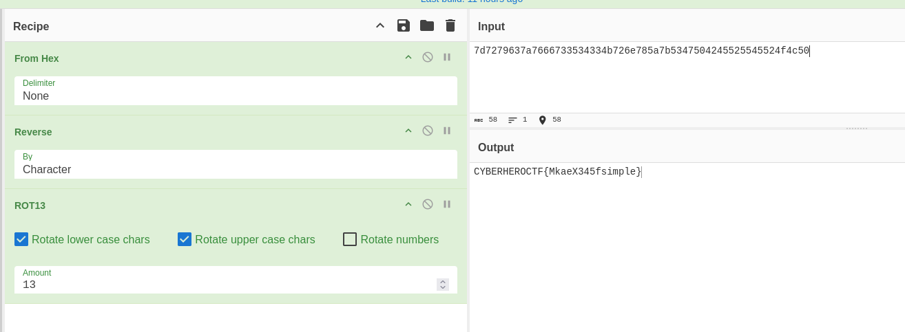

Flag `CYBERHEROCTF{MkaeX345fsimple}`

## Blynk blynk blynk - Trojan

> ท่านได้รับไฟล์ APK ที่น่าสงสัยจากผู้บังคับบัญชาว่าได้ดาวโหลดมาติดตั้ง แต่พบว่าหลังติดตั้งเครื่องทำงานช้าลง และมีปริมาณการใช้อินเตอร์เน็ตมากผิดปกติ ขอให้ท่านวิเคราะห์ไฟล์ดังกล่าว
> Flag format: CYBERHEROCTF{Trojan name}

เป็นไฟล์ apk blynk ซึ่งเรายังไม่ได้ทดลองบน emu เราเลือกที่จะ strings ดูก่อนแล้วพบกับ flag format ดังกล่าว แต่ยังไม่ถูกต้องเพราะ format จริงๆให้ตอบ trojan name

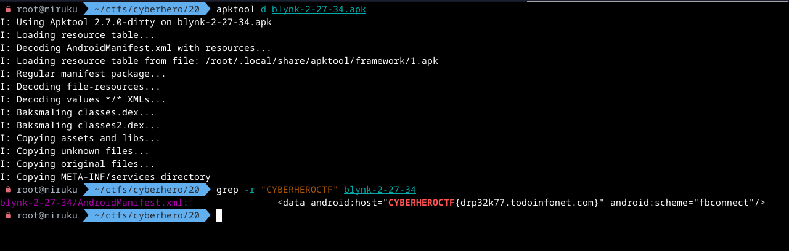

เราจึงนำ domain ไปค้นหาแล้วพบว่าเป็น Pegasus

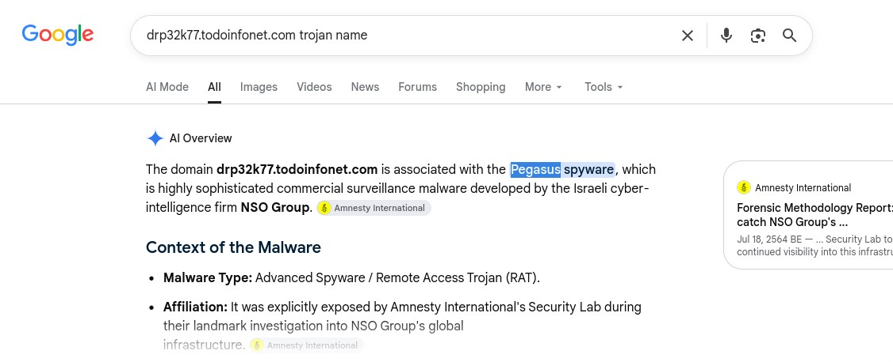

Flag `CYBERHEROCTF{Pegasus}`

## Blynk blynk blynk - Malicious

> ท่านได้รับไฟล์ APK ที่น่าสงสัยจากผู้บังคับบัญชาว่าได้ดาวโหลดมาติดตั้ง แต่พบว่าหลังติดตั้งเครื่องทำงานช้าลง และมีปริมาณการใช้อินเตอร์เน็ตมากผิดปกติ ขอให้ท่านวิเคราะห์ไฟล์ดังกล่าว
> Flag format: CYBERHEROCTF{Malicious domain}

ไฟล์เดิมกับข้อ **Blynk blynk blynk - Trojan** แต่รอบนี้ flag คือ `android:host` ตรงๆไม่ต้องหาเพิ่ม

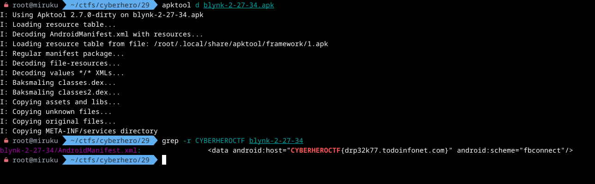

Flag `CYBERHEROCTF{drp32k77.todoinfonet.com}`

## CII Black Box

> ผู้เล่นได้รับไฟล์บันทึกเหตุการณ์จากระบบตรวจจับภัยคุกคามในรูปแบบเฉพาะ NCBF โดยไม่มีโปรแกรมของผู้ผลิตสำหรับเปิดอ่าน เป้าหมายคือวิเคราะห์โครงสร้าง Binary ตรวจสอบความถูกต้องของ Record และกู้ Recovery Token ซึ่งถูกแบ่งเป็นหลาย Fragment
>
> Flag format: CYBERHEROCTF{XXXX_XXXXX_XXXX}

เราได้ไฟล์มา 4 ไฟล์โดย README ได้แจ้งว่า:

- `incident_archive.ncbf` คือ data ที่เราต้อง parsing
- `sample.ncbf` ใช้ valid ว่าที่เรา parsing ถูกต้อง
- `format_notes.txt` file structure สำหรับวิธีอ่านไฟล์

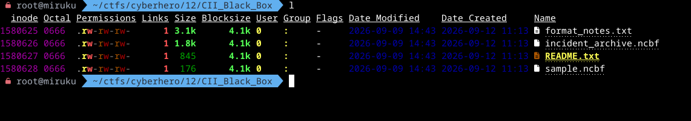

focus ที่ไฟล์ `incident_archive.ncbf` เริ่มจากดึงค่า header ที่ต้องใช้ออกจากไฟล์เพื่อเริ่ม loop โดย pos จะเป็น position แรกในการเริ่ม count จำนวน record และ file id ที่ใช้ในการคำนวณ key

โดยแต่ละ record จะมี sync marker `D3 91` เสมอ เราจะทำการ parsing เอา data ของ record ที่ประกอบไปด้วย record type, flag, id, seq, original len, stored len, payload, crc เมื่อแยกเสร็จเราก็จะทำการ valid record ด้วย offset +2 จาก record หรือก็คือ ตั้งแต่ record type จนถึง stored payload (ไม่รวม sync marker) แล้วเทียบกับ crc ใน record ว่าตรงไหม

ในการ loop หาเราจะสนใจไปที่ `0x42` (Recovery fragment) และ record flag ต้อง bitwise ไม่มี bit ที่ตำแหน่ง `0x08` (Deleted record; ignore its logical content) ซึ่งจะเหลือ flag ที่เราต้อง decode คือ `0x01`, `0x02`, `0x04` โดย:

- `0x01` - zlib decompress
- `0x02` - reverse stored byte order
- `0x04` - xor โดย key ได้จาก `(file id + record id + seq) & 0xff`

เมื่อได้ data ที่ decode แล้วเราจะแยก payload อีกรอบ คือ number, total fragment, len, และที่เหลือคือ content ถึงจุดนี้เราสามารถอ่านได้แล้ว โดยการเอา content ที่ได้มาต่อกันตาม number ที่ได้ เพื่อความรวดเร็วเราจึงใช้ ai ในการเขียน code อ่าน fragment

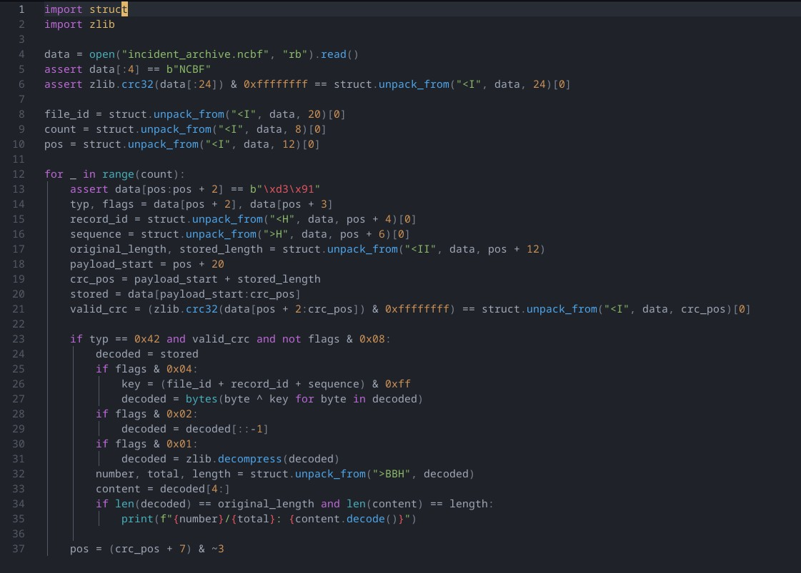

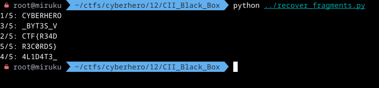

เมื่อรวมกันตาม number จึงได้ flag

Flag `CYBERHEROCTF{R34D_BYT3S_V4L1D4T3_R3C0RDS}`

## Cyber_hero

> ท่านได้รับไฟล์น่าสงสัย ขอให้หาคำตอบ
> Flag format: CYBERHEROCTF{xxxxxxxxxx}

เป็นภาพ Cyber Hero ที่ไม่มีอะไร


เราได้ทดสอบทั้งเครื่องมือต่างๆและพบที่ stegseek เป็น passphrase เปล่า `""`

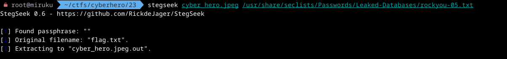

สามารถใช้ steghide ถอดได้เช่นกัน

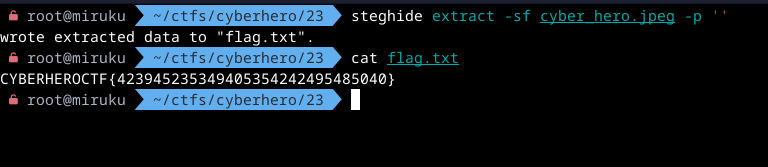

Flag `CYBERHEROCTF{423945235349405354242495485040}`

# Miscellaneous

## Silent Control Panel

> ระบบควบคุมการเข้าออกของศูนย์ข้อมูลหยุดทำงานอย่างกะทันหัน หน้าจอของแผงควบคุมเสียหายและบันทึกเหตุการณ์ภายในระบบไม่สามารถเปิดอ่านได้ อย่างไรก็ตาม ทีมตรวจสอบสามารถกู้ไฟล์ที่บันทึกสถานะขา GPIO ระหว่างไมโครคอนโทรลเลอร์กับแผงควบคุมไว้ได้ก่อนที่อุปกรณ์จะดับลง
> เชื่อว่ารหัสสำคัญถูกส่งผ่านสัญญาณชุดนี้ แต่ Capture มีทั้งสัญญาณรบกวน ข้อมูลควบคุม และเฟรมที่อาจเสียหาย ผู้เล่นต้องวิเคราะห์ไฟล์ gpio_capture.csv เพื่อค้นหารูปแบบการส่งข้อมูล ประกอบข้อมูลกลับตามลำดับเวลา และกู้ Flag ที่ผ่านการตรวจสอบความถูกต้อง
> Flag format: CYBERHEROCTF{XXXX_XXXXX_XXXX}

แน่นอนว่ามันยากอยู่ที่จะ blinding แบบนี้ เราจึงใช้ ai ในการ analyze:

- Four adjacent pins form a parallel data group. - เป็น data
- One control signal is active-low. - เป็น control
- Data is sampled on a clock edge. - เป็น clock
- The parity scheme produces an even number of asserted bits. - เป็น parity

เมื่อได้ hint แล้วสรุปได้ว่า มี GPIO 4 ตัวเป็น data, clock 1, control 1, parity 1 และเมื่อ ai ทำการ analysis เสร็จจึงจับคู่ได้ว่า:

- GPIO 0-3: data 4 bits
- GPIO 4: clock
- GPIO 5: byte strobe
- GPIO 6: control
- GPIO 7: parity

parsing โดยเริ่มจาก map ให้ค่าเป็น bool (แต่ถูกใช้กับ `<<` sum จึงกลายเป็น int)
สร้าง function สำหรับช่วยอ่านค่า:

- `b` สำหรับอ่าน bit ที่ n, row ที่ i
- `nib` (nibble) คือ ข้อมูล 4 bits ใน GPIO 0-3 โดยทำการ bit shift แล้ว sum เราจะได้ข้อมูลที่ต้องการส่งขนาด 4 bits (`0xF`)

`edge` เก็บจังหวะที่ต้องอ่านค่า โดย check ที่ clock (GPIO 4) หาก row ก่อนหน้าเป็น 0 แล้ว row ปัจจุบันเป็น 1 จะเก็บว่า row ที่มี data
แบ่ง block ตาม control (GPIO 6) อ่านเพิ่มว่าจังหวะนั้น GPIO 6 เป็น 0 ไหม (active-low) เก็บลง frames แล้ววน pair เพื่อสร้าง byte พร้อมกับตัด block ใหม่เมื่อเจอ control โดย byte เกิดจากการเอา nibble 2 ตัวมาต่อกันจาก 4 bits จึงเป็น 8 bits ถือเป็น 1 byte

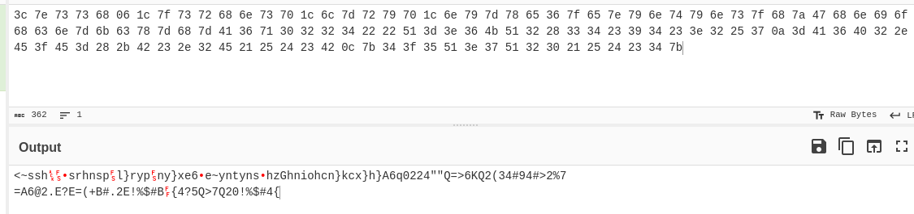

แน่นอนว่าเราก็ได้ข้อมูลที่ยังอ่านไม่ได้ ซึ่งได้ analyze เพิ่มแล้วพบว่าจริงๆคือ XOR โดยเรารู้ key ได้จากการทำ known plaintext attack จาก flag format โดยการ loop หา offset ที่ใช้ถอด จึงได้ data 2 ช่วงคือ:

- `offset 27`: `key = 0x3c` -> `7f657e796e74796e737f687a47`
- `offset 69`: `key = 0x71` -> `32283334233934233e3225370a`

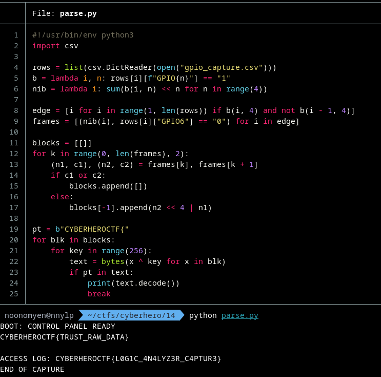

Flag `CYBERHEROCTF{L0G1C_4N4LYZ3R_C4PTUR3}`

## The Lost Temple of Chiang Rai

> อาจารย์ท่านหนึ่งได้ไปเที่ยวถ่ายภาพสถานที่สำคัญในจังหวัดเชียงรายเก็บไว้ แต่ปรากฏว่าไฟล์ดังกล่าวถูกบีบอัดและล็อกรหัสผ่านเอาไว้ แถมไฟล์ภาพด้านในยังเกิดความเสียหายจนเปิดไม่ได้ เหล่านักรบไซเบอร์ฮีโร่ช่วยกันแกะรอยและกู้คืนความลับที่ซ่อนอยู่ทั้งหมดออกมาให้สำเร็จ

เป็นไฟล์ zip ที่ไม่ทราบ password แต่เราสามารถ crack ได้ด้วย rockyou wordlist

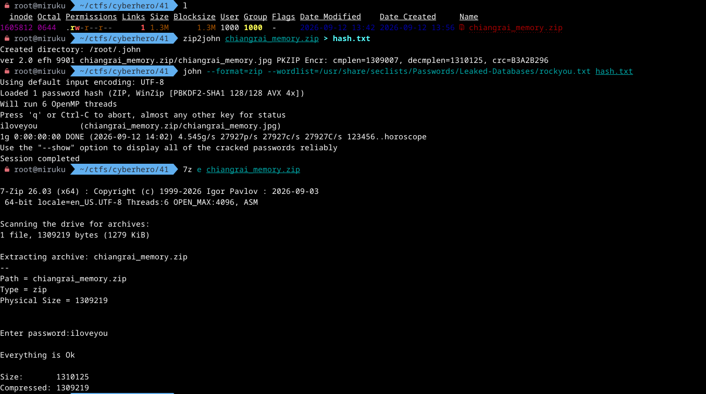

ซึ่ง password ก็คือ `iloveyou`

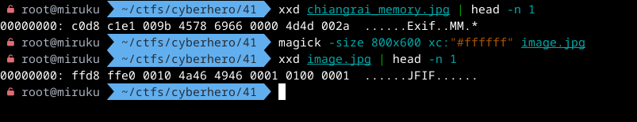

แต่กลับเปิดไม่ได้ จากที่ดูส่วนหัวชี้ชัดว่าเป็นไฟล์ภาพแต่มี 2 bytes ไม่ถูกต้อง (offset 0 และ 2)
เราจึง fix ส่วนหัวโดยใช้ python patch

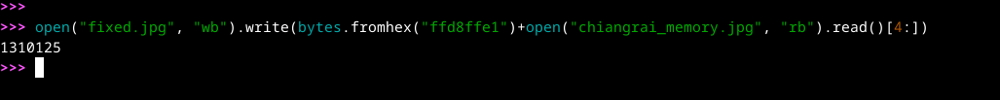

เมื่อเปิดเราจะเจอ base64

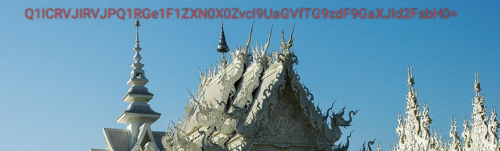

ถอดได้

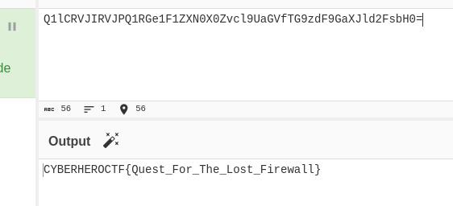

Flag `CYBERHEROCTF{Quest_For_The_Lost_Firewall}`
<!-- ## Pieces of the Past

> ระบบตรวจพบ Artifact ปริศนาที่หลงเหลือจากโปรเจกต์ซึ่งถูกยกเลิกไปแล้ว ไม่มีใครรู้ว่าข้อมูลนี้ถูกทิ้งไว้เพื่ออะไร และดูเหมือนว่าสิ่งที่พบจะเป็นเพียงเศษเสี้ยวของบางอย่าง
> ข้อความอาจถูกซ่อน อดีตอาจยังคงหลงเหลือ และชิ้นส่วนเพียงชิ้นเดียวอาจไม่มีความหมาย
> จงตามรอยข้อมูลที่ถูกทิ้งไว้ ค้นหาชิ้นส่วนทั้งหมด และประกอบมันกลับคืนมาเพื่อค้นหา Flag ที่แท้จริง
>
> Format Flag: CYBERHEROCTF{…}

## Capture The Flower

> ได้ยินยอมพร้อมใจกันสืบเสาะแลค้นหา จนเป็นที่ประจักษ์ชัดแจ้งแก่สายตาแล้วว่า ภาพถ่ายบุปผาชาติดอกนี้ ได้ถูกรังสรรค์และบันทึกไว้โดยบุคคลผู้ทรงคุณวุฒิ ซึ่งดำรงตำแหน่งเป็นอาจารย์สังกัดมหาวิทยาลัยเกษตรศาสตร์ อันเป็นสถานศึกษาชั้นนำฝ่ายเกษตรกรรม
>
> อนึ่ง เมื่อได้มีการสืบสวนและตรวจพิสูจน์ถึงโครงสร้างสารบบข้อมูลทางอิเล็กทรอนิกส์แห่งวัตถุนั้น กลับปรากฏข้อเท็จจริงอันเป็นประเด็นแห่งคดีว่า ข้อมูลคอมพิวเตอร์ประเภทภาพถ่ายอันเป็นมูลกรณีแห่งการพิจารณานี้ หาได้ปรากฏร่องรอยแห่งการประทับตรา หรือการฝังชุดคำสั่งอันแสดงรายละเอียดจำเพาะทางเทคนิคเกี่ยวกับข้อมูลภาพถ่าย ไว้แต่ประการใดไม่ อันเป็นเหตุแห่งความเคลือบแคลงสงสัยและเป็นอุปสรรคอย่างยิ่งยวดต่อการพิสูจน์ทราบถึงแหล่งกำเนิด ตลอดจนจุดพิกัดภูมิศาสตร์อันเป็นสถานที่สถิตแห่งวัตถุพยานในรูปคดีนั้น
>
> กระนั้นก็ดี เมื่อได้พิเคราะห์เจตนารมณ์อันเป็นมูลฐานแห่งบุคคลผู้รังสรรค์ผลงาน ซึ่งมีความประสงค์อันแน่วแน่ในการแสวงหาและพิสูจน์ทราบข้อเท็จจริงถึงพิกัดภูมิสถานอันแท้จริงแห่งการบันทึกภาพพฤกษชาติดังกล่าว อาศัยพฤติการณ์อันเป็นเหตุแห่งการนั้น บุคคลผู้อยู่ในฐานะนักวิชาการดังกล่าวจึงตกอยู่ในภาระจำยอมที่จะต้องดำเนินกระบวนพิจารณาและสืบเสาะหาพยานหลักฐาน เพื่อชี้ชัดถึงจุดพิกัดทางภูมิศาสตร์ อันประกอบด้วยค่าแห่งเส้นรุ้ง แลค่าแห่งเส้นแวง ให้ปรากฏแจ้งชัดและสิ้นสงสัย ทั้งนี้ ก็เพื่อเป็นคุณประโยชน์ในการนำข้อเท็จจริงแห่งพิกัดภูมิศาสตร์อันถึงที่สุดแล้วนั้น ไปผนวกเข้าเป็นสารัตถะอันเป็นองค์ประกอบสำคัญแห่งการจัดทำและเผยแพร่วรรณกรรมทางวิชาการ หรือปริทัศน์งานวิจัยของตน เพื่อให้บังเกิดความสมบูรณ์ครบถ้วนตามแบบแผนและระเบียบวิธีวิจัยสืบไป
>
> จงตอบแบบไม่มีเว้นวรรคในรูปแบบ CYBERHEROCTF{x,x}

## Capture The Hill

> พิเคราะห์แล้ว ข้อเท็จจริงรับฟังเป็นยุติได้ว่า ผู้ทรงคุณวุฒิทางวิทยาศาสตร์ได้ประจักษ์แจ้งถึงการมีอยู่แห่งพฤกษชาติสกุลหม้อข้าวหม้อแกงลิงอันมีรูปพรรณสัณฐานวิปริตผิดแผก โดยปรากฏประจักษ์พยานแห่งรูปกายว่ามีขอบโอษฐ์ หยักแหลมดุจซีทนต์ ประกอบกับมีกระเปาะดักจับสีแดงชาด อันมีปริมาตรมหึมาเกินวิสัย ซึ่งมีข้อจำกัดด้านภูมิลำเนา ปรากฏอยู่โดยจำเพาะเจาะจงแต่เพียงภายในราชอาณาจักร มาเลเซียเท่านั้น ทั้งยังปรากฏข้อเท็จจริงสืบเนื่องว่า พืชพรรณดังกล่าวถือเป็นพฤกษชาติข้างเคียงที่ดำรงชีพร่วม อาณาบริเวณเดียวกับพฤกษชาติสกุลหม้อข้าวหม้อแกงลิงอีก สายพันธุ์หนึ่ง อันมีพฤติการณ์แห่งการบริโภคมูลสัตว์เป็น ภักษาหาร อีกทั้งยังมีพยานหลักฐานอันควรเชื่อได้ว่าพฤกษชาติทั้งสองได้มีนิติสัมพันธ์ในการผสมข้ามสายพันธุ์ทางธรรมชาติจน บังเกิดเป็นสายพันธุ์ลูกผสมขึ้นอีกโสดหนึ่งด้วย อนึ่ง ใน ประเด็นแห่งการแสวงหาข้อยุตินั้นไซร้ บรรดาตัวเลขมาตรวัด แห่งจุดสูงสุดบนยอดศิบรินทร์ของบรรพตอนเป็นถิ่นฐานที่ ตั้งดังกล่าวนั้น รวมตลอดถึงรายละเอียดแห่งค่าทศนิยม ให้ปรากฏแจ้งชัดและสิ้นสงสัย ทั้งนี้ ก็เพื่อเป็นคุณประโยชน์ ให้ถือเอาเป็นมูลกรณีแห่งคำวินิจฉัยชี้ขาดอันเป็นที่สุดในคดีนี้
>
> จงตอบในรูปแบบ CYBERHEROCTF{ตัวเลข}

## Factory Incident

> ทีม SOC ของโรงงานตรวจพบความผิดปกติในระบบ และดึงข้อมูลแพ็กเก็ตจากทั้งเครือข่าย IT และ OT มาให้คุณวิเคราะห์ มีบางอย่างเกิดขึ้นกับระบบควบคุมความปลอดภัยของโรงงาน และดูเหมือนว่าจะมีข้อมูลบางอย่างหลุดออกไปด้วย หน้าที่ของคุณคือไล่เรียงเหตุการณ์ทั้งหมดตั้งแต่ต้นจนจบ ระบุว่าเกิดอะไรขึ้นกับระบบจริงๆ และกู้คืน flag ที่ผู้โจมตีทิ้งไว้เป็นหลักฐาน (หมายเหตุ ในไฟล์นี้มีข้อความที่หน้าตาเหมือน flag ปะปนอยู่จำนวนมาก โปรดตรวจสอบให้ดีก่อนส่งคำตอบ) -->

---

# ช่วงบ่นท้าย post ครับ

ก็จบกันไปสำหรับ post นี้ ยังไม่มั่นใจว่าจะกลับมา update ข้อที่เหลือไหม เพราะอีก 12 ข้อคือเพื่อนเขียน และก็ write up เองก็ไม่ได้ละเอียด เพราะตอน submit เราลงรายละเอียดมากไม่ได้ เพราะต้องทำความเข้าใจลึกสุดๆเพื่ออธิบายครบทุกมุมจะเสียเวลาเปล่าครับ write up เลยออกแนวเขียนให้รู้ concept ซะมากกว่า ชนิดกรรมการมองแล้วเข้าใจว่าเราจะสื่ออะไร

สำหรับงานนี้ผมวนๆเวียนๆแค่ misc กับ blue เลยยังไม่รู้ว่า red เป็นไง ปล่อยให้ [@c0ffeeOverdose](https://github.com/c0ffeeOverdose) เขา solve ไป ซึ่งงานนี้มีการใช้ write up ในการประเมินคะแนน ซึ่งหากไม่มี write up ในข้อนั้นๆจะถือว่าไม่ได้คะแนน เหมือนงานรอบคัดเลือก worldskills ครับ ซึ่งเขาก็ไม่ได้ห้าม ai แต่ก็ยํ้าเสมอว่าใช้อย่างมีสติ

แน่นอนว่าผมเองที่เขียน write up มานานพอจะเข้าใจอยู่บ้างครับว่าควรสื่ออะไรลงไปใน write up ไม่ควรทำอะไร ผมเลยจะเล่าในสิ่งที่ผมรู้สึกได้จากการเขียน write up งานนี้ครับ

อย่างแรก เราต้องเข้าใจเจตนารมณ์ของผู้จัดครับ ผู้จัดกล่าวว่าต้องการให้ผู้เข้าแข่งขันแสดงศักยภาพของเราออกมา ซึ่งในงานนี้ออกมาทาง write up ครับ โดยผู้ตรวจจะเป็นกรรมการและผู้ออกโจทย์ แสดงว่า write up นี้จะถูกประเมินโดยผู้สร้างโจทย์

หลักๆ กฎเหล็กครับ

- ต้องมี screenshot เสมอ สื่อว่าเราเจอคำตอบด้วยตัวเองจริงๆมาแล้ว ไม่ใช่แค่ ai เอาให้
- ห้ามใช้ ai เขียน เป็นการบังคับให้เรา ใช้ทักษะความสามารถในการทำความเข้าใจโจทย์และสื่อมันออกมาว่าต้องทำอย่างไรให้ได้คำตอบมา

สิ่งที่เราต้องสื่อลงไปเลยเป็น วิธีถึงแนวคิดและสิ่งที่ทำมากกว่าการสอนให้รู้หรือเข้าใจครับ มันเลยสั้นและกระชับพอตัว

เอาละแล้วมีอะไรอีก? กับดักครับ ใช่ครับ ต้องบอกว่า chall หลายตัวเข้าขั้นง่ายสำหรับ ai ครับ สำหรับคนเองก็สามารถ solve ได้ง่ายๆเช่นกันในบางข้อ แต่ความต่างของมันอยู่ที่ เราจะเข้าใจสิ่งที่ chall ต้องการให้เราทำจริงๆหรือเปล่า เพราะบ่อยครั้ง ai มักมองหาวิธีที่ได้มาซึ่งคำตอบโดยง่ายครับ

ยกตัวอย่างที่ผมเห็นชัดเจนเลยคือกลุ่ม **Operation Cascade** ใน Blue Team ครับ เอาจริงผมใช้เวลากับมันน้อยไปหน่อย แถมโดนเกรียน description ตัว html tag ไม่ sanitize อีกทำให้งงกับ format ของ flag อีก เอาเถอะ ในข้อแรกของกลุ่มนี้คือถามหา kernel version ครับ ก็ปกติดี แต่เห็นตรง description ไหมครับ เขาจะเอา kernel version ไปทำอะไร เบิกทางอะไร? เอาไว้ใช้หา ISF ครับ (Intermediate Symbol Files) โดยเครื่องมือ volatility 3 จำเป็นต้องใช้มันเพื่ออ่านข้อมูลจาก memory dump ซึ่งทำให้เราทำข้อถัดไปได้ครับ ในข้อนี้ไม่ได้มีอะไรน่ากลัวครับ หากให้ string grep อาจพออนุโลมได้

แต่ๆ ในข้อที่เหลือจะให้เราหาข้อมูลใน file system กัน ซึ่งจุดพลาดเกิดเมื่อ คุณได้คำตอบจากการ string grep ครับ เพราะ ai สามารถเดาสภาพแวดล้อมของ linux ถึงสิ่งที่จะหาได้ครับ เช่น ถามหา user ที่ถูก add แน่นอนเราจะมุ่งไปที่ /etc/passwd กัน แต่ ai สามารถใช้ string grep ไปที่ user ที่มีอยู่ใน /etc/passwd เพื่อมองหา string ข้างๆได้ครับ ซึ่งมันจะเจอ user ที่ add มาใหม่แน่นอน วิธีนี้จะทำให้ได้คำตอบจริงครับ แต่คุณจะใช้วิธีนี้ในการหาหลักฐานการเกิดเหตุจริงๆนะหรอ!?!? จริงๆ volatility สามารถกู้ fs จาก page cache กลับมาอ่านได้ครับ ด้วยวิธีนี้จะทำให้เราเห็น file system ทั้งหมดที่อยู่ใน memory อย่างถูกต้องและชี้เป้าหมายได้ถูกต้องครับ

และมีข้อที่ต้อง analyze นานๆด้วยครับ แน่นอนว่าในช่วงเวลาแข่งที่จำกัดคงปฎิเสธการใช้ ai ในการ analyze คงไม่ได้ สิ่งที่เขาจะวัดเราอีกด้านคือ เรากล้าที่จะบอกหรือไม่ว่าเราได้มาซึ่งคำตอบได้อย่างไร และเข้าใจในสิ่งที่ได้มาหรือไม่ เขาไม่ห้ามเราใช้ ai แก้ chall ครับ แต่เราจะอธิบายได้หรือเปล่า ซึ่งมันอยู่ที่ความสามารถของคนๆนั้นด้วยครับ

มีแม้กระทั่งโจทย์ที่อยากให้เราติดต่อกรรมการแทนการถาม ai เหลือจะเชื่อครับ (ผมเห็น 0 solve เลยเอาเวลาไปทำข้ออื่นฮะ)

เอาเป็นว่าเป็นความคิดเห็นส่วนตัวนะครับ คนจัดเขาอาจจะคิดอีกแบบก็ได้

สำหรับงานนี้เราก็ใช้ ai กันตามปกติครับ เวลาส่วนใหญ่เสียไปกับการเขียน write up จบงานกลายเป็น WRITE UP MAN เลยครับ

ก็เดี๋ยวเจอกันงานหน้าฮะ BYE
